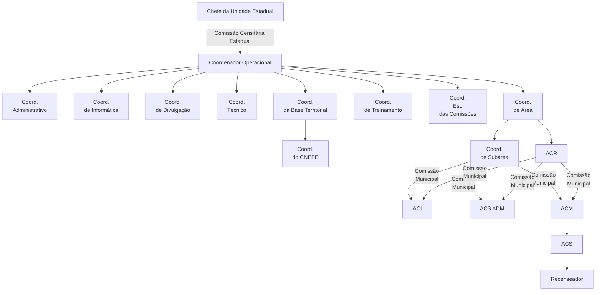
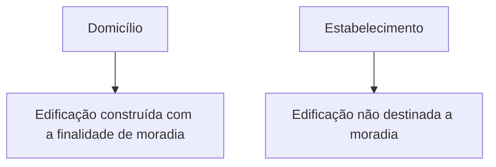
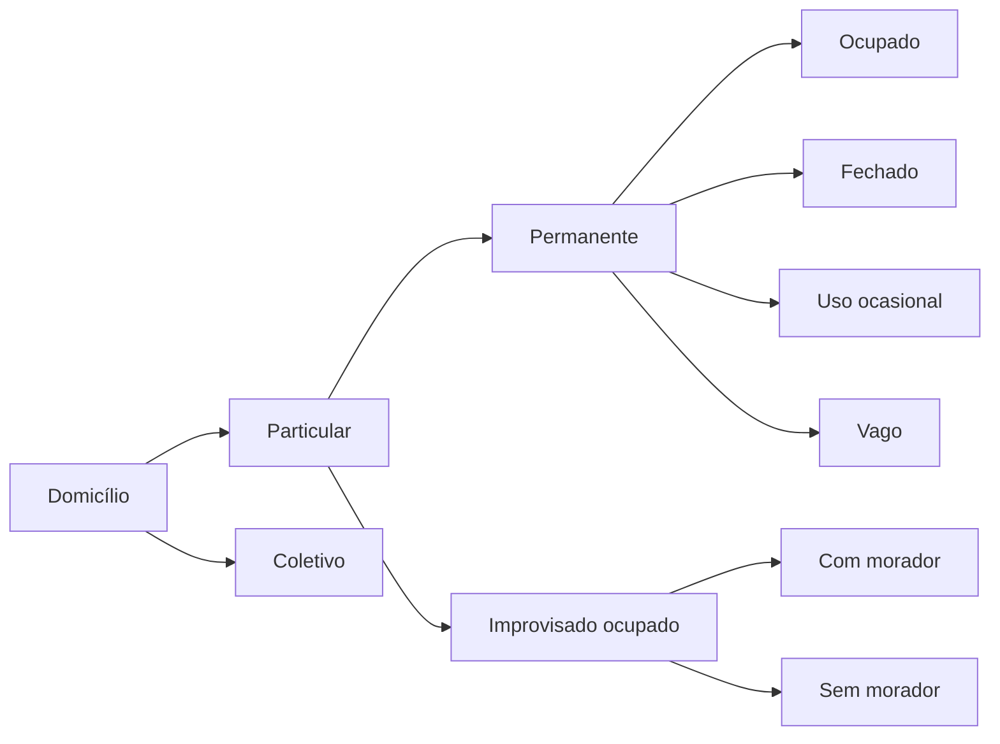
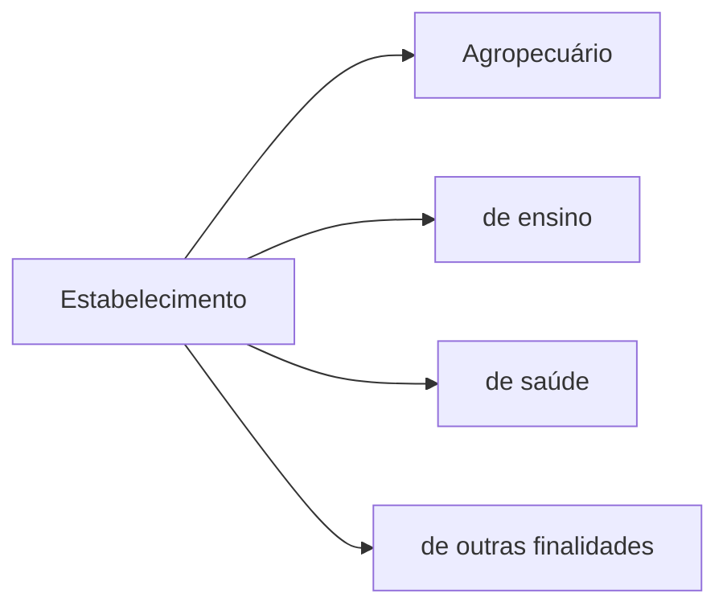

# Censo Demográfico 2010 - Manual do Recenseador - CD-1.09


## Fonte de dados

Ministério do Planejamento, Orçamento e Gestão
Instituto Brasileiro de Geografia e Estatística -- IBGE

Censo Demográfico 2010
Manual do Recenseador
CD - 1.09

Rio de Janeiro
2010

## Identificação do Recenseador

Nome do Recenseador: 
Endereço Completo: 
Telefone do Recenseador: 
Nome do Supervisor: 
Telefone do Supervisor: 
Endereço e Telefone do Posto de Coleta: 
Nome do ACM: 
Agência do IBGE: 
Endereço e Telefone da Agência: 

## Treinamento Presencial 

Data: 
Local:
Horário: 

## Apresentação do IBGE

O Instituto Brasileiro de Geografia e Estatística - IBGE se constitui no principal provedor de dados e de informações do País, que atendem às necessidades dos mais diversos segmentos da sociedade civil, bem como dos órgãos nas esferas governamentais federal, estadual e municipal.

O IBGE oferece uma visão completa e atual do País, através do desempenho de suas principais funções:

- produção, análise, coordenação e consolidação de informações estatísticas;
- produção, análise, coordenação e consolidação de informações geográficas;
- coordenação do sistema estatístico nacional; e 
- participação na coordenação do sistema cartográfico nacional.

O IBGE é uma instituição da administração pública federal, vinculada ao Ministério do Planejamento, Orçamento e Gestão e possui quatro diretorias e dois outros órgãos centrais:
- Diretoria Executiva - DE;
- Diretoria de Pesquisas - DPE;
- Diretoria de Geociências - DGC;
- Diretoria de Informática - DI;
- Centro de Documentação e Disseminação de Informações - CDDI; e
- Escola Nacional de Ciências Estatísticas - ENCE.

Para que suas atividades possam cobrir todo o Território Nacional, esta Instituição possui uma rede nacional de pesquisa e disseminação, composta por: 
- 27 Unidades Estaduais (26 nas capitais dos estados e 1 no Distrito Federal);
- 27 Setores de Documentação e Disseminação de Informações (26 nas capitais dos estados e 1 no Distrito Federal); e 
- 538 Agências de Coleta de Dados nos principais municípios.

O Censo Demográfico é a mais longa e complexa operação estatística que um país pode empreender, quando são cobertos todos os domicílios do Território Nacional, das áreas urbana e rural, e todo o universo da população é recenseado.

Percorrendo os cerca de 8 milhões de Km2 de um território heterogêneo e, muitas vezes, de difícil acesso, o IBGE irá obter informações sociodemográficas para todos os 5 565 municípios  brasileiros, que serão disponibilizadas inclusive para áreas menores nos municípios de grande porte.

## Prezado Recenseador

Este manual tem a função de apresentar a você o desenvolvimento de seu trabalho e será sua fonte permanente de consulta e orientação para o Censo Demográfico 2010. A descrição de instruções e procedimentos a serem adotados por você nas atividades referentes ao seu trabalho consta neste manual.

Para que tudo chegasse até você da melhor forma possível, equipes de técnicos e profissionais estiveram envolvidas na elaboração deste manual, de forma a reunir as diretrizes necessárias à coleta de informações.

O manual estará com você durante todo o trabalho censitário para ser consultado, especialmente, em ocasiões nas quais você não poderá recorrer prontamente ao seu Supervisor para tirar dúvidas. Portanto, nunca será demais observar alguns cuidados:
- guarde-o com carinho e zele por sua integridade;
- leia atentamente cada Unidade Temática, sublinhando os pontos merecedores de enfoque especial. Se surgir qualquer dúvida, anote-a para conversar com o Instrutor no momento do seu treinamento presencial ou com o seu Supervisor; e
- faça as anotações que achar necessárias nas páginas que se encontram ao final do seu manual.

Você deve estar atento aos conceitos apresentados neste manual, pois eles precisarão ser utilizados a todo momento, a fim de que os dados sejam coletados com muita atenção e cuidado. Lembre-se ainda de que você responderá ao Roteiro de Estudos com base nesses conceitos, da seguinte forma: após grupos de temas apresentados neste manual, haverá uma indicação fazendo referência aos exercícios sobre esses assuntos e suas respectivas páginas no Roteiro de Estudos. Você preencherá a folha de Teste Inicial (Folha de Resposta) e entregará ao seu instrutor no treinamento presencial.

Pensando no seu melhor aproveitamento, foram criados alguns recursos que o ajudarão a estudar e a compreender melhor o conteúdo apresentado. 
Veja abaixo como eles se apresentam. 
- **Importante!** - surgirá sempre que alguma informação ou conceito relevante for apresentado.
- **O que é?** - empregado para apresentar o significado dos termos. Esses termos estarão em negrito no texto para que se perceba que remeterão ao que estará escrito em destaque.
- **Você sabia?** - empregado para apresentar alguma curiosidade sobre o IBGE ou sobre o Censo Demográfico 2010 e que tenha relação com o assunto existente no conteúdo.
- **Atenção!** - empregado para alertar que tal informação é indispensável ao estudo; você deverá dar uma parada e ler atentamente. Ou seja, serão apresentados conceitos fundamentais à sua prática. 
- **Relembrando!** - tem a função de reunir os principais assuntos que foram estudados ao longo de uma unidade com a intenção de não serem esquecidos. Poderá aparecer ao final de um conjunto de conteúdos ou ao final de cada Unidade.
- **Agora é com você!** - tem a função de apresentar um desafio e/ou atividade que deverá ser resolvido(a) por você.
- **Computador de mão** - sinaliza a explicação de algum procedimento de registro no computador de mão.

Os símbolos **Importante!**, **Relembrando!** e **Agora é com você!** vêm acompanhados de certos personagens. Além desses personagens, serão encontrados outros ao longo do seu estudo. Eles aparecerão ilustrando situações, apresentando questionamentos e dialogando com você.

**E por que os personagens?**

Os personagens foram criados para representar a diversidade de tipos físicos do brasileiro e aproximar você dessa realidade, a realidade de um Brasil diversificado.

> **ANDRÉ**
> Olá, eu sou o André, um Recenseador como você!

Este manual será o seu “guia mais próximo”, oferecendo-lhe diretrizes claras e precisas para a execução do trabalho de coleta. Cuide bem dele!

**Bons estudos!**


## Sumário

- [Unidade I - Conhecendo o IBGE e o Censo Demográfico](#unidade1)
  - O que é o Censo Demográfico?
  - Desde 1872, o Brasil vem realizando os seus Censos Demográficos
  - E como será o Censo Demográfico 2010?

- [Unidade II - O Recenseador no Censo Demográfico 2010](#unidade2)
  - Como é o trabalho do Recenseador no Censo Demográfico 2010?
  - Instrumentos de Coleta
  - Posto de Coleta

- [Unidade III - Aprendendo os Conceitos Fundamentais para o Censo Demográfico 2010](#unidade3)
  - Divisão Política do Brasil
  - Setor Censitário
  - Endereço
  - Data de Referência
  - Morador
  - Espécie da Unidade Visitada
  - Percurso do Setor Censitário
  
- [Unidade IV - Executando a Coleta de Dados](#unidade4)
  - Reconhecimento Prévio
  - Cobertura do Setor
  - Utilizando o aplicativo do Censo
  - Conduzindo a entrevista
  - Conhecendo e Preenchendo os Questionários - Básico e da Amostra

- [Unidade V - Situações Especiais](#unidade5)
  - Setor Rural
  - Setor de Aglomerado Subnormal

- [Anexo](#anexo)

# Unidade I - Conhecendo o IBGE e o Censo Demográfico {#unidade1}

O Instituto Brasileiro de Geografia e Estatística - IBGE é o órgão coordenador e produtor de informações estatísticas e geográficas do Brasil, constituindo-se como o principal provedor de dados do nosso País.

Para que a realização de todos os seus trabalhos seja feita com sucesso, o IBGE tem sua missão muito bem definida.

> **MISSÃO**
> Retratar o Brasil com informações necessárias ao conhecimento da sua realidade e ao exercício da cidadania.

O IBGE, entre suas múltiplas atividades e pesquisas, oferece uma visão completa e atual do Brasil:
- identifica, mapeia e analisa o território;
- conta a população;
- mostra como a economia evolui através do trabalho e da produção das pessoas; e
- revela como a população vive.

Entre as pesquisas feitas pelo órgão, encontra-se a realização do Censo Demográfico. Ele produz informações imprescindíveis para a definição de políticas públicas federal, estadual e municipal e para a tomada de decisões de investimento, sejam provenientes da iniciativa privada ou de qualquer nível de governo.

**O que é o Censo Demográfico?**

Censo Demográfico é o processo de contar e obter informações sobre as características dos habitantes de um país.

Quase todos os países fazem, com regularidade, os seus censos demográficos em cada década: contam seus habitantes e obtêm informações que permitem identificar as suas características (sexo, idade, cor, religião, migração, educação, trabalho, entre outras), conhecer em detalhes as condições em que vive a população e os seus níveis de desenvolvimento socioeconômico, assim como traçar um retrato abrangente e fiel da realidade nacional.

Os resultados do Censo Demográfico são utilizados, entre outros objetivos, para tomar decisões que afetam cada município, cada estado, ou seja, o País inteiro. Entidades das três esferas de governo (federal, estadual e municipal), empresas, universidades, centros de estudo, organizações e associações comunitárias estão entre os muitos grupos que utilizam as informações do Censo Demográfico para propor e definir políticas públicas e planejar serviços que beneficiam toda a população.

Os resultados do Censo Demográfico são utilizados, principalmente, para:
- subsidiar cálculos que definem os recursos financeiros a serem transferidos do Governo Federal para cada estado e cada município;
- determinar a representação política dos estados no Congresso Nacional; 
- conhecer a estrutura da força de trabalho em cada município; e 
- subsidiar políticas públicas de saúde, educação e habitação, determinando, por exemplo, onde os hospitais, centros de saúde, escolas e moradias são necessários.

**Desde 1872, o Brasil vem realizando os seus Censos Demográficos**

Os primeiros censos, realizados de 1872 a 1900, se preocuparam basicamente com a contagem da população. Já o Censo de 1920 incorporou outras questões, como, por exemplo, perguntas sobre portadores de deficiência, rendimento, etc.

Em 1936, foi fundado o IBGE, que passou a ser o responsável pela realização dos Censos Demográficos no País. 

A partir de 1940, os censos decenais, em processo contínuo de aperfeiçoamento, têm conferido maior nitidez ao retrato do Brasil.

O aprofundamento da investigação, bem como a inserção de novos temas de interesse do País, tem se constituído em fato constante nas operações censitárias. Por outro lado, a busca permanente por aprimoramento na qualidade dos dados e na velocidade em que os resultados são oferecidos à sociedade também pode ser percebida ao longo dos censos. Assim, no Censo Demográfico 2000, o IBGE, utilizando scanners para a leitura de marcas e caracteres, conseguiu executar a etapa de entrada de dados em cerca de 100 dias úteis, o que possibilitou avançar nas tarefas subsequentes de crítica, codificação, tabulação e análise, culminando com todos os dados divulgados em diversas publicações, inclusive o volume com toda a metodologia da operação, entre os anos de 2000 a 2003.

Cada um desses censos refletiu a realidade nacional nos aspectos social, econômico e de ocupação territorial num dado momento no tempo, deixando registradas etapas específicas do desenvolvimento do País e permitindo que hoje, no Século XXI, seja possível a realização de diversos estudos comparativos a partir dos resultados desde então levantados.

**De 1872 a 2010: o que mudou?**

Para confirmar essas afirmações, verifique abaixo algumas evoluções dos censos no decorrer dos anos. Serão mostrados apenas alguns dos anos em que houve o Censo. No Brasil, foram realizados censos nos seguintes anos: 1872, 1890, 1900, 1920, 1940, 1950, 1960, 1970, 1980, 1991 e 2000.

| Ano | Destaque |
| --- | --- |
| 1872 | 1º Censo Geral do País, com apuração manual. |
| 1890 | 2º Censo Geral do País. |
| 1920 | Utilização de máquinas separadoras e tabuladoras. |
| 1940 | 1º Censo sob a administração do IBGE. |
| 1960 | Utilização da técnica de amostragem e do computador. |
| 2000 | Entrada de dados através de scanners para leitura de marcas e caracteres. |
| 2010 | Utilização de computador de mão para a coleta e informatização dos postos de coleta. |

> **VOCÊ SABIA?**
> Em pesquisas censitárias, o computador de mão foi utilizado pela primeira vez no Brasil no Censo Agropecuário e na Contagem da População, ambos realizados em 2007. Até 2000, foi utilizado questionário em papel.

**E como será o Censo Demográfico 2010?**

Em 2010, o IBGE realizará o XII Censo Demográfico, que será um retrato de corpo inteiro do  País com o levantamento do perfil da população e das características de seus domicílios, ou seja, ele nos dirá como somos, quantos somos e como vivemos. 

As questões que serão investigadas no Censo Demográfico 2010 são produtos de amplas consultas e debates com representantes da sociedade brasileira e órgãos técnico-governamentais, sendo o IBGE o articulador deste processo.

O conjunto dos dados coletados e trabalhados estatisticamente permitirá o conhecimento da realidade brasileira nos seguintes aspectos:

- tamanho e composição da população;
- situação habitacional;
- características gerais da população;
- movimentos migratórios;
- nível de instrução;
- nupcialidade;
- fecundidade;
- força de trabalho;
- padrões de rendimentos individual e domiciliar, e
- mortalidade. 

Os resultados respondem a questões fundamentais, como:
- Qual é o total da população do País por sexo e faixa etária e como está distribuída no Território Nacional?
- Qual é a expectativa de vida da população do País?
- Qual é a estimativa de brasileiros que vivem fora do País?
- Qual é o número médio de filhos que uma mulher teria ao final do seu período fértil?
- Qual é o tipo de habitação em que vive a população do País?
- Qual é a proporção da população que tem acesso ao saneamento básico?
- Qual é o nível de instrução da população?
- Quais são as condições de trabalho e o rendimento da população? 

Na realização do Censo Demográfico 2010, serão desenvolvidas duas etapas primordiais de trabalho: a Pré-coleta e a Coleta de Dados.

A Pré-coleta consiste na primeira operação de campo, que tem o objetivo principal de atualizar os mapas e o cadastro nacional de endereços, visando a uma preparação mais precisa para realização da coleta de dados do Censo.

A Coleta de Dados é o levantamento de todos os domicílios, estabelecimentos e edificações em construção, compreendendo também o recenseamento de todos os moradores - na data de referência a noite de 31 de julho para 1º de agosto de 2010 - com a aplicação dos respectivos questionários.

**Qual será a metodologia utilizada para a coleta de dados?**

As informações serão obtidas por meio de entrevista presencial feita pelo Recenseador sendo as respostas registradas em um computador de mão ou pelo preenchimento do questionário via Internet. 

Para a coleta de dados, será usado um dos modelos distintos de questionário: **Básico** ou da **Amostra**, em todos os domicílios ocupados do Território Nacional. 

O Censo Demográfico 2010 constitui uma grande operação estatística, mobilizando milhares de pessoas desde a fase de planejamento até a divulgação dos resultados. Alguns dados relativos a esse Censo mostram a complexidade da operação: cerca de 200 milhões de pessoas serão pesquisadas em aproximadamente 60 milhões de domicílios, localizados em 5 565 municípios. 

Cerca de 230 mil pessoas serão contratadas temporariamente para os trabalhos de pré-coleta, coleta de dados, supervisão, apoio administrativo, informática e apuração dos resultados.

# Unidade II - O Recenseador no Censo Demográfico 2010 {#unidade2}

Na Unidade I, você conheceu um pouco da história do IBGE e entendeu o quanto o Censo Demográfico é importante para o Brasil. 

Na Unidade II, que você começa a estudar agora, será apresentada uma visão geral das suas principais atribuições como Recenseador e a descrição dos instrumentos que você utilizará para a execução do seu trabalho. Você conhecerá também os profissionais que trabalharão com você na operação censitária e o local de apoio de toda a equipe.

**Como é o trabalho do Recenseador no Censo Demográfico 2010?**

A atividade do Recenseador consiste basicamente em percorrer uma determinada área de um município, para fazer o levantamento de todos os endereços (domicílios, estabelecimentos e edificações em construção) e realizar entrevistas com os moradores. 

Após o treinamento, você irá escolher a área de trabalho onde irá realizar a coleta dos dados em seu município e receberá um mapa. Primeiro, deverá ser feito o reconhecimento prévio desta área, ou seja, irá reconhecer as ruas e os limites da área, para conferir a realidade com o mapa. 

Feito esse reconhecimento, você dará início a sua atuação em campo, fazendo o levantamento de todos os endereços e realizando as entrevistas para obter as informações sobre as características dos domicílios e da população brasileira. 

Veja abaixo quais são as suas principais atribuições como Recenseador do Censo Demográfico 2010:

- Fazer o reconhecimento prévio de sua área de trabalho acompanhado pelo seu Supervisor;
- Respeitar rigorosamente os limites de sua área de trabalho;
- Registrar todas as unidades existentes na área de trabalho;
- Realizar as entrevistas seguindo rigorosamente as instruções, para o preenchimento do Questionário Básico ou da Amostra;
- Registrar todos os moradores dos domicílios ocupados existentes na sua área de trabalho;
- Comunicar sempre ao seu Supervisor os problemas encontrados na realização do trabalho;
- Consultar os diversos relatórios de acompanhamento da coleta no computador de mão e sanar as eventuais pendências registradas;
- Acompanhar e tomar as providências relativas às unidades registradas como domicílios fechados e espécies pendentes e aos questionários pendentes;
- Usar corretamente o computador de mão e zelar pela sua conservação;
- Transferir as informações armazenadas no computador de mão para o laptop do Posto de Coleta, **no mínimo duas vezes por semana**; e
- Fazer backup (cópia de segurança) **todo dia** para salvar as informações que já foram coletadas.

## Instrumentos de Coleta

Para executar essas atribuições, você terá três instrumentos de coleta disponíveis para serem utilizados durante todo o seu trabalho:

**Manual do Recenseador**

É o guia de trabalho do Recenseador. Nele estão contidos os conceitos, as definições, os procedimentos e as orientações necessárias ao desempenho de suas atividades e ao registro das informações.

**Mapa e Descrição do Setor**

São apresentados em papel e orientam o Recenseador no setor de trabalho, mostrando graficamente a área a ser recenseada e a descrição de seus limites.

**Computador de Mão**

É o equipamento que disponibilizará o aplicativo de coleta para registrar e armazenar as informações coletadas. 

Nele estarão contidos:

- **Mapa do Setor**: representação gráfica do setor no computador de mão.
- **Lista de Endereços**: são todas as informações referentes aos endereços das unidades levantadas na Pré-coleta, pertencentes à área de trabalho.
- **Questionário Básico**: é o questionário com menor número de quesitos, onde serão registradas as características do domicílio e de seus moradores na data de referência, e será aplicado na maior parte do Território Nacional.
- **Questionário da Amostra**: é o questionário com maior número de quesitos, onde serão registradas as características do domicílio e de seus moradores na data de referência, e será aplicado apenas nos domicílios selecionados para a amostra.
- **Formulário de Domicílio Coletivo**: é o instrumento utilizado para registrar os dados de identificação do domicilio coletivo e listar as unidades com morador.
- **Relatórios de acompanhamento**: resumo com listagem de informações da coleta e de questionários com pendências.

> **ATENÇÃO**
> Haverá setores em que não estarão disponíveis o Mapa do Setor e a Lista de Endereços no computador de mão. Mais adiante, você será orientado como proceder quando acontecer essa situação.

## Posto de Coleta

Como você já sabe, seu trabalho será realizado em campo, coletando os dados do Censo. Entretanto, você terá um ponto de apoio, um local onde deverá comparecer com frequência: o Posto de Coleta. 

O Posto de Coleta é a unidade de trabalho à qual está vinculado o conjunto de setores censitários de um município. Funciona como sede da equipe censitária. Nele serão recebidas, armazenadas e transmitidas as informações coletadas pela equipe de recenseadores. 

Veja o que o André tem a nos dizer sobre isso:

> **ANDRÉ** 
> Durante a coleta de dados, nós devemos comparecer ao Posto de Coleta no mínimo duas vezes por semana, nos dias combinados com o nosso Supervisor. Nessas ocasiões será feita a transferência dos dados, que coletamos, do nosso computador de mão para o sistema do Posto de Coleta, que posteriormente será transmitido para a Central de Recebimento de Dados do IBGE.


> **IMPORTANTE**
> É fundamental que a frequência de comparecimento ao Posto de Coleta, para transferência de dados, seja respeitada, porque esse procedimento é a garantia de que não haverá perdas de dados e, consequentemente, retrabalho para o Recenseador, gerando atrasos nos prazos do Censo. 

Você também deve comparecer ao Posto de Coleta quando tiver dúvidas sobre qualquer procedimento ou conceito utilizado no Censo. Lá, você sempre poderá contar com o ACS (Agente Censitário Supervisor) e/ou ACM (Agente Censitário Municipal). Esses profissionais estarão presentes no seu dia a dia de trabalho. O ACS é o Supervisor da equipe de recenseadores da qual você faz parte. Ele será seu principal apoio durante seu trabalho no Censo. Por exemplo: em caso de dúvidas quanto aos limites do seu Setor Censitário ou quanto à sua atuação em campo, você deverá recorrer, prioritariamente, a ele.

O Recenseador André, por exemplo, tem como Supervisora a Luíza.

É o Supervisor que fornecerá a você e aos demais recenseadores a ele vinculados os instrumentos para o trabalho, o apoio técnico e as instruções necessárias à coleta das informações.

Durante o andamento da coleta, seu trabalho será acompanhado e avaliado pelo seu Supervisor.
Esta avaliação se dará através de sistemas informatizados criados especialmente para indicar eventuais inconsistências nos dados e emitir pedidos de supervisão. Nestes pedidos, serão feitas a verificação da cobertura do percurso e reentrevistas pelo Supervisor, para comparar os dados coletados por você. Caso haja indicação de eventuais inconsistências nos dados, ele poderá solicitar a você que volte a campo para confirmar algumas informações ou refazer algumas entrevistas.

É importante que você saiba que algumas tarefas, mesmo realizadas no computador de mão do Recenseador, serão executadas pelo ACM e/ou pelo ACS:
- restaurar cópia de segurança;
- reabrir o Setor;
- transferir questionário dentro do setor;
- paralisar Setor em andamento; e
- passar o Setor paralisado para em andamento.

O Supervisor também irá acompanhar a sua produção, assim como as providências tomadas, por você, para a resolução de pendências apontadas nos relatórios com o objetivo de garantir o fechamento do setor dentro do prazo previsto.

O ACM é o gerente do Posto de Coleta ao qual você e o seu Supervisor estarão vinculados. Entre as principais atribuições dele, estão:
- Realizar a contratação dos recenseadores e adotar as providências necessárias para prorrogação de contratos;
- Coordenar todas as atividades censitárias em seu município ou área de atuação, obedecendo às instruções técnicas, operacionais, administrativas e de informática estabelecidas nos manuais e normas vigentes;
- Supervisionar o desenvolvimento dos trabalhos dos supervisores e recenseadores em seu município ou área de atuação, mantendo a equipe atualizada quanto aos procedimentos e normas vigentes; e 
- Zelar pelo andamento e prazo dos trabalhos e pela qualidade dos dados coletados.

Você trabalhará diretamente com o ACM e o Supervisor. Porém, existem ainda outros profissionais envolvidos na operação censitária do seu município, que são: Coordenador de Área e Coordenador de Subárea / Agente Censitário Regional.

O Coordenador de Área é o responsável pela execução da operação censitária, em todos os seus aspectos, de um grupo de municípios dentro do estado. 

O Coordenador de Subárea / Agente Censitário Regional é o responsável pela execução da operação censitária de um subgrupo de municípios ou de parte de município de grande porte dentro de uma área.

**Organograma da operação censitária nas unidades estaduais**




- Chefe da Unidade Estadual
	- Comissão Censitária Estadual
	- Coordenador Operacional
		- Coordenador Administrativo
		- Coordenador de Informática
		- Coordenador de Divulgação
		- Coordenador Técnico
		- Coordenador de Treinamento
		- Coordenador Estadual das Comissões
		- Coordenador da Base Territorial
			- Coordenador do CNEFE
		- Coordenador de Área
			- Comissão Municipal de Geografia e Estatística
			- Coordenador de Subárea e ACR -- Agente Censitário Regional
				- ACI -- Agente Censitário de Informática
				- ACS -- ADM -- Agente Censitário Supervisor Administrativo 
				- ACM -- Agente Censitário Municipal
					- ACS -- Agente Censitário Supervisor
						- Recenseador

> **ANDRÉ**
> Você conheceu algumas informações sobre seu trabalho no Censo e já deve ter notado que foram utilizados termos como setor censitário, endereço, domicílio, estabelecimento, entre outros. Nas próximas unidades deste Manual, você aprenderá o significado de cada um, assim como a aplicação deles no seu dia a dia.


# Unidade III - Aprendendo os Conceitos Fundamentais para o Censo Demográfico 2010 {#unidade3}


Nesta unidade, vamos ver os conceitos fundamentais para que você possa executar seu trabalho.

Muitos deles fazem parte do dia a dia de todos nós, Recenseadores ou não, como por exemplo: endereço, morador, logradouro, domicílio. Outros, você conhecerá só agora. Sejam os conceitos mais conhecidos, sejam os novos, todos são muito importantes para que você desenvolva o seu trabalho corretamente.

## Divisão Política do Brasil

Para começar, vamos relembrar alguns dados sobre o nosso País.  Politicamente, o Brasil está dividido em unidades territoriais, como descritas a seguir:

- **Unidades da Federação** - são os estados, criados por lei federal, e o Distrito Federal;
- **Municípios** - dividem integralmente os estados em áreas menores, criados por legislação estadual;
- **Distritos** - dividem integralmente os municípios em áreas menores, criados por legislação municipal. Todo município tem pelo menos um distrito;
- **Subdistritos** - dividem os distritos em unidades menores, criadas por legislação municipal. Geralmente, são estabelecidos apenas em algumas grandes cidades para subdividir distritos de grande população ou extensão.

O mapa a seguir apresenta essas unidades territoriais e o número de cada uma delas no País. Veja:

```
[IMAGEM OMITIDA NA P. 26] 
```


Além disso, o território de cada município é separado em duas áreas distintas definidas por lei municipal:
- área urbana - área interna ao perímetro urbano de uma cidade ou vila. Para as cidades ou vilas onde não existe legislação que regulamente essas áreas, é estabelecido um perímetro urbano para fins da coleta censitária, cujos limites são aprovados pelo prefeito local; e
- área rural - área externa ao perímetro urbano. Alguns poucos municípios não possuem área rural, sendo, portanto, integralmente urbanos.

Na operação censitária, as unidades territoriais brasileiras são respeitadas. Porém, para facilitar as pesquisas, o IBGE subdivide essas unidades em áreas ainda menores, chamadas de **Setor Censitário**.

## Setor Censitário

Setor Censitário é a unidade de controle cadastral formada por área contínua, integralmente contida em área urbana ou rural, cuja dimensão, número de domicílios e de estabelecimentos permitem ao Recenseador cumprir suas atividades em um prazo determinado, respeitando o cronograma de atividades.

> **ANDRÉ**
> O Setor Censitário é a área de trabalho do Recenseador.

Observe o exemplo do Setor Censitário, abaixo:

```
[IMAGEM OMITIDA NA P. 27] 
```

Cada Setor Censitário respeita todos os limites territoriais legalmente definidos, ou seja, um setor está, **sempre**, integralmente contido em um único município, um único distrito, um único subdistrito e em uma única situação (urbana ou rural). Todos os setores censitários estão representados graficamente através do Mapa do Setor.

> **O QUE É?**
>
> **O que é Mapa do Setor?**
>
> Mapa do Setor é a representação gráfica da área geográfica a ser recenseada, auxiliando a localização durante o trabalho de campo.

Você receberá do seu Supervisor, um mapa do setor, em papel, com a descrição dos limites e poderá contar, também, com uma versão do mapa armazenada no seu computador de mão. Para realizar corretamente seu trabalho, você terá que utilizar frequentemente o mapa em papel do seu setor. Mas para isso é necessário que você conheça bem esse mapa. Em primeiro lugar, considere que um mapa é sempre um modelo muito simplificado da realidade. Para produzir um mapa é necessário deixar de lado muitos detalhes. No entanto, apesar da simplicidade, um bom mapa pode ajudá-lo muito em seu trabalho. Veja nas figuras, a seguir, esta simplificação. 


Imagem de um setor onde pode ser identificado o arruamento, a arborização e detalhes das edificações.

```
[IMAGEM OMITIDA NA P. 29] 
```

```
[IMAGEM OMITIDA NA P. 30] 
```


Mapa do mesmo setor apresentando apenas o arruamento. 

Como você viu na figura anterior, o Mapa do Setor que você receberá também será uma representação simplificada da realidade. Para a realização do seu trabalho, é essencial que você identifique com facilidade sua posição no mapa e certifique-se de que está localizado dentro dos limites do setor. Para isso, é necessário que você interprete corretamente o seu mapa. Ou seja, é preciso que você:

- reconheça os logradouros que fazem parte dele;

- identifique os limites do setor, através de sua descrição; e

- identifique os acidentes topográficos caso existam.

Observe, atentamente, nas próximas páginas, como é a descrição do perímetro do mapa do setor que você irá utilizar:

```
[IMAGEM OMITIDA NA P. 32] 
```

Modelo de descrição do perímetro do setor

```
[IMAGEM OMITIDA NA P. 33] 
```

Exemplo de Mapa de Setor Urbano

Como você pode observar o mapa contém:

- A numeração do setor censitário;

- Os logradouros;

- As quadras e faces; e

- Os limites do setor e sua descrição.

Vamos conhecer cada um desses elementos.

### Número do Setor Censitário

Para que sejam identificados e diferenciados, todos os setores censitários recebem um **número**. 

O número do setor é a designação utilizada para identificá-lo em relação a outros. Tem como objetivo permitir a referência de diversas informações por Setor Censitário, como: Unidade da Federação, município, distrito, subdistrito e setor. Veja, na tabela, o exemplo do número do setor:

| UF | Município | Distrito | Subdistrito | Setor |
| :--: | :-: | :-: | :-: | :-: |
| 15 | 07003 | 05 | 00 | 0001 |

Além de constar no rodapé dos mapas, essa numeração também aparece no canto superior direito da **Descrição do Perímetro do Setor**, como você verá mais adiante.


### Logradouro

```
[IMAGEM OMITIDA NA P. 35] 
```

Você conhece a música “Sampa”, do cantor e compositor Caetano Veloso? Em alguns versos, são mencionadas duas famosas avenidas da cidade de São Paulo: a Avenida Ipiranga e a Avenida São João. 

Essas avenidas são consideradas **logradouros**, assim como ruas, travessas, praças, becos, ou seja, **são áreas públicas de circulação de pessoas,  veículos e mercadorias, reconhecidas pela comunidade e, na maioria das vezes, associadas a um nome de conhecimento geral.** 

> **IMPORTANTE**
> Para as pesquisas do IBGE, deve prevalecer sempre o **nome oficial** do logradouro, reconhecido pela Prefeitura do município.
>
> Por exemplo: no Rio de Janeiro, a Avenida Dom Hélder Câmara (nome oficial) é mais conhecida como Avenida Suburbana, o nome anterior desse logradouro. 
> 
>E na sua cidade? Existe algum caso semelhante?

 Um logradouro pode ser formado por até três componentes:

- **Tipo** - indica a natureza da construção do logradouro. Exemplos: rua, avenida, travessa, praça, etc.;
- **Título** - indica a patente, a profissão, o título de nobreza do homenageado. Exemplos: professor, general, barão, etc.;
- **Nome** - descreve a denominação essencial do logradouro. No entanto, existe também o logradouro sem denominação - que deve ser representado pelo termo SEM DENOMINAÇÃO.


> **VOCÊ SABIA?**
>
> A Avenida São João e a Avenida Ipiranga são nomes oficiais de logradouros.


Observe atentamente os exemplos de logradouros no quadro a seguir:

| Exemplos | Tipo | Título | Nome |
| --- | --- | --- | --- |
| Rua General Canabarro |Rua| General |Canabarro|
| Avenida Brasil | Avenida |  | Brasil |
| Travessa Santa Rosa |Travessa|Santa|Rosa|
| Rua Pintor Jordão de Oliveira | Rua | Pintor | Jordão de Oliveira |


### Quadra e Face

**Quadra** é, geralmente, um trecho retangular bem definido de uma área urbana ou aglomerado rural com quarteirões fechados ou abertos, limitado por ruas e/ou estradas. Entretanto, pode ter forma irregular e ser limitado por elementos como estradas de ferro, cursos d’água ou encostas. Em alguns locais a quadra é chamada de quarteirão. 

**Face** é cada um dos lados da quadra, contendo ou não domicílios ou estabelecimentos. 

Veja abaixo o exemplo de uma quadra com quatro faces.


```
[IMAGEM OMITIDA NA P. 37] 
```


No desenho da página anterior temos um exemplo de quadra **fechada**.

A quadra será considerada **aberta** quando faltar uma ou mais faces de fechamento de seus limites.

### Limites do setor e sua descrição

O mapa do setor virá acompanhado da Descrição do Perímetro do Setor, isto é, de um texto que define todo o limite da sua área de trabalho: o **perímetro do setor**. Portanto, o mapa do setor e a descrição de seus limites definem o Setor Censitário onde você irá atuar. 


> **O QUE É?**
>
> **Descrição do Perímetro do Setor Censitário** é a relação de acidentes topográficos naturais ou artificiais, arrolados de forma sequencial, que  definem a linha imaginária do contorno da área do setor.


```
[IMAGEM OMITIDA NA P. 38]
```


> **IMPORTANTE**
> **Esteja sempre atento aos limites do seu Setor Censitário**. Esses limites foram definidos, preferencialmente, por pontos de referência estáveis e de fácil identificação no local. Assim, evita-se que um Recenseador faça, indevidamente, a coleta em Setor a cargo de outro Recenseador, ou que deixe de fazer a coleta em toda a área sob sua responsabilidade.

> **ANDRÉ**
> Lembre-se! Os limites do Setor, **em nenhuma hipótese**, podem  ser alterados pelo Recenseador.

Em algumas situações, a realidade do setor pode ter sofrido modificações depois da elaboração do mapa e da Pré-coleta, como: troca de nome de logradouros, aparecimento ou desaparecimento de faces ou de quadras inteiras. Se durante o seu trabalho de campo você identificar alguma modificação, é essencial que você as indique no mapa em papel e comunique ao seu Supervisor.

Os setores são definidos levando-se em conta dois critérios: o número de unidades construídas nele existentes e sua extensão territorial. Deste modo, em áreas muito densamente povoadas um setor pode restringir-se a umas poucas quadras, a uma única quadra ou até mesmo a uma única edificação.  Como no caso de prédios residenciais com grandes quantidades de unidades.

Já em áreas pouco habitadas, o setor pode possuir menor número de unidades  construídas de modo a limitar sua extensão a uma área viável ao trabalho de um  único Recenseador.


> **AGORA É COM VOCÊ!**

```
[IMAGEM OMITIDA NA P. 40]
```

> 1. Segundo o mapa, a Rua Regente Bráulio está totalmente contida no setor 0002? E a Travessa do Portinho?
>2. O endereço Rua Sete de Setembro nº 52 está contido no setor 0002? E a Rua das Crioulas nº 127?
> 3. A agência do banco Bradesco está contida no setor 0002? E o mercado Central?
> 4. Identifique, agora, os limites do setor partindo do ponto indicado pela seta e percorrendo-o no sentido horário.


## Endereço

Agora que você já sabe, como interpretar o Mapa do Setor e quais os seus elementos, vamos aprender um conceito que é fundamental para a execução do seu trabalho: o **Endereço e seus componentes**. 

Fique atento a todas as informações sobre o **endereço**, pois elas serão registradas em seu computador de mão durante a coleta de dados que você fará em sua área de trabalho. 

**O endereço e seus componentes**

O endereço é um texto que permite identificar de forma adequada, dentro de um município, uma unidade construída, ou seja, uma casa, um prédio, um apartamento, um estabelecimento, etc. Ele possui vários componentes que são: **número, modificador, ponto de referência, complemento, localidade** e **CEP**. 

Veja um exemplo:

| Logradouro | Número | Complemento | Localidade | CEP |
| --- | --- | --- | --- | --- |
| Travessa Clarisse Lispector |16|casa 2, fundos|Bairro da Felicidade|22222-222|

Certamente você conhece a maioria desses componentes, pois o endereço do local onde você mora possui alguns deles. Mas para o seu trabalho **no** 
**Censo**, é importante entender cada um destes componentes mais detalhadamente.

Você já aprendeu anteriormente, que logradouro é uma área pública de circulação de pessoas, veículos e mercadorias, reconhecida pela comunidade 
e, na maioria das vezes, associada a um nome de conhecimento geral, e é composto por tipo, título e nome.

Porém quando não for possível definir adequadamente um logradouro em um endereço, considere o nome da **propriedade rural** ou o **nome do povoado** (arraial, vila, povoado, etc) como logradouro, como no exemplo abaixo:

| Logradouro | Modificador | Ponto de Referência |
| --- | --- | --- |
| Fazenda São Benedito | SN | terceira casa no lado direito da Igreja de São Benedito |

### Número e modificador

**Número** é o valor numérico que indica a posição da edificação no logradouro. 

**Modificador**, que pode existir ou não, está associado à informação do número, sendo sempre alfabético.

| Endereço               | Logradouro     | Número | Modificador |
| ---------------------- | -------------- | ------ | ----------- |
| Avenida Brasil, 1367 B | Avenida Brasil | 1367   | B           |

Neste exemplo, temos a informação do número, 1367 B, que é utilizado para indicar a posição relativa de uma unidade no logradouro Avenida Brasil. É um campo geralmente sequencial e pode ser formado por número e, opcionalmente, por um texto. Nesse caso, o texto será denominado Modificador. 

O modificador é encontrado, por exemplo, em estabelecimentos comerciais pertencentes a uma única edificação subdividida em lojas. 

**Mas, como saber qual é o número no logradouro?** 

O número no logradouro deverá ser obtido através de placa, ou de outro recurso visual para informação pública ou ainda indagando o entrevistado.

**Existência de identificação** é o registro visual do número, independentemente da qualidade de seu material. Ou seja, mesmo identificações feitas 
em tinta, giz ou carvão devem ser levadas em conta na operação censitária.

A identificação pode estar localizada em um muro, portão ou em uma parede internada construção, desde que possa ser vista pelo lado de fora. Assim, no caso de apartamentos ou de casas localizadas nos fundos, considere apenas a numeração do acesso à unidade. 

O número identifica um endereço em um terreno, como:

- uma única unidade - caso a unidade tenha mais de um número, considere o primeiro número encontrado, na ordem do percurso;

- a entrada de um conjunto de casas em vila particular ou condomínio, mais os complemento(s) para cada uma de suas unidades;

- um único número para o estabelecimento constituído de vários prédios, como quartel, fábrica, hospital, etc.;

- o número da entrada principal dos prédios que ocupem uma quadra inteira ou deem fundos para outros logradouros; e

- um único número para edifícios de apartamentos ou casa de cômodos, mais o(s) complemento(s) para cada uma de suas unidades. 

No caso de setores rurais, quando não houver numeração, deve ser registrada alguma identificação para os domicílios listados. Por exemplo: para km 35 de alguma rodovia, registre **35** no número e **km** no **modificador**.

Quando não houver numeração oficial e for encontrada uma identificação de um órgão público, como **157 FUNASA**, utilize esta identificação, considerando o número, como o **157** e o modificador, como **FUNASA**. 

Nas unidades que não tiverem numeração e quando o endereço estiver localizado em barracas, tendas, veículos, etc., o **modificador** será **SN** (sem 
numeração), porém é obrigatório a informação de um **Ponto de Referência**, para facilitar a identificação da unidade. 

E o que é Ponto de Referência?

### Ponto de Referência

O Ponto de Referência é uma informação descritiva muito utilizada para identificar uma unidade visitada, quando não é possível registrar adequadamente um endereço. Ocorre principalmente na área rural e nos aglomerados subnormais em áreas urbanas. 

Exemplo: primeira casa após a ponte do Rio Pedra Linda.

### Complemento: elemento e valor

Vamos rever o exemplo anterior, observando uma nova informação: 

Você já é capaz de identificar aí o logradouro e o número (nesse caso, com modificador). O elemento novo - **loja 3** - é o que chamamos de 
**complemento**.

| Endereço               | Logradouro     | Número | Modificador | Complemento|
| ---------------------- | -------------- | ------ | ----------- |--|
| Avenida Brasil, 1367 B, loja 3 | Avenida Brasil | 1367   | B           | loja 3 |

Muitas vezes, ao chegar a um número em um logradouro, observamos a existência de várias unidades compondo uma edificação associada a esse número. O **complemento** é utilizado para identificar, corretamente, cada unidade nessa edificação. 

São exemplos de complemento: bloco, apartamento, casa, fundos, sobrado, etc. 

De modo geral, a informação de complemento é formada por **elemento** e **valor**. Observe: 

| Endereço                                 | Complemento    | Elemento | Valor | Elemento |
| ---------------------------------------- | -------------- | -------- | ----- | -------- |
| Rua Castro Pimentel, 374, casa 1, fundos | casa 1, fundos | casa     | 1     | fundos   |

Ou seja: 

O **elemento** é o tipo de complemento, indicando se ele se refere a uma casa, a uma entrada principal, a uma quadra, etc. 

O **valor** pode existir ou não e será representado por números ou letras. Representa o valor atribuído ao elemento. 

Veremos mais exemplos e como eles estão distribuídos, por elemento e valor, na tabela a seguir:

| Exemplos      | Elemento | Valor | Elemento | Valor | Elemento | Valor | Elemento |
| ------------- | -------- | ----- | -------- | ----- | -------- | ----- | -------- |
| Casa 1 fundos | casa     | 1     | fundos   |       |          |       |          |
|Entrada 1 bloco A apartamento 304| entrada | 1 | bloco | A | apartamento | 304 | |
| quadra 11 lote 20 casa 1 fundos | quadra | 11 | lote | 20 | casa | 1 | fundos |
| Loja C | loja | C | | |  |
| Cômodo 1 | cômodo | 1 | | | |


Sabendo o que é número, modificador, complemento e suas partes, veja exemplos mais completos na tabela a seguir:

| Exemplos | Número | Modificador | Complemento - Elemento | Complemento - Valor |
| --- | --- | --- | --- | --- |
| No 135 A loja 1 | 135 | A | loja | 1 |
| No 135 B loja 2 | 135 | B | loja | 2 |
| km 3 casa 1 | 3 | km | casa | 1 |
| km 3 casa 2 | 3 | km | casa | 2 |

### Localidade

É o nome pelo qual é conhecido o local ou a região onde está situado o logradouro. Nas áreas urbanas, em geral, a localidade assemelha-se ao bairro, enquanto nas áreas rurais indica a área ou região do município onde se situa o endereço. 

Veja os exemplos, de acordo com o tipo de área, no quadro a seguir:

| Tipo de Áreas | Localidade | Exemplo |
| --- | --- | --- |
| **Urbana** | Assemelha-se ao bairro |Bairro da Saudade|
|**Rural** | É a região do município onde se situa o endereço |Povoado de Barra Grande|

**CEP - Código de Endereçamento Postal**

O **CEP** - é um cadastro de áreas de endereçamento mantido pela Empresa Brasileira de Correios e Telégrafos - **ECT**. Pode corresponder à totalidade do município, quando em áreas de menor demanda. Em áreas de alta movimentação, um CEP pode estar associado somente a um bairro, um logradouro, um trecho do logradouro ou, em casos muito particulares, a um único prédio - o CEP especial. Nos setores urbanos divididos em quarteirões, cada mudança de face de quarteirão ou de Código de Endereçamento Postal de CEP pode representar um logradouro.

> **AGORA É COM VOCÊ!**

```
[IMAGEM OMITIDA NA P. 49]
```


> **RELEMBRANDO!**
> **Setor Censitário** é uma área contínua, contida em área urbana ou rural, cuja dimensão, número de domicílios e de estabelecimentos permitem ao Recenseador cumprir suas atividades em um prazo determinado, respeitando o cronograma de atividades. Logo, o **Setor** **Censitário é a área de trabalho do Recenseador**.
>
> **Quadra** é um trecho geralmente retangular de uma área urbana ou aglomerado rural, fechado ou aberto, limitado por ruas e/ou estradas.
>
> **Face** é cada um dos lados da quadra, contendo ou não domicílios ou estabelecimentos. 
>
> **Logradouros** são áreas públicas de circulação, associadas a um nome de conhecimento geral.
>
> **Número** é o número da edificação no logradouro.
>
> **Modificador** está associado à informação do número e é sempre alfabético.
>
> **Complemento** é utilizado para identificar cada unidade em uma edificação com várias unidades. É formado por elemento e valor.
>
> **Elemento** é o tipo de complemento, indicando se ele se refere a uma casa, a uma entrada principal, a uma quadra, etc.
>
> **Valor**, que pode existir ou não, pode ser representado por números ou letras. Representa o valor atribuído ao elemento.
>
> **Existência de identificação** é o registro visual do número, independentemente da precariedade de seu material.
>
> **Endereço** é a identificação completa da unidade visitada.
>
> **Ponto de referência** é a informação descritiva utilizada para identificar adequadamente uma unidade visitada quando não for possível registrar um endereço.
>
> Os bairros ou regiões de cada município são chamados de **localidades**.

> Agora que você foi apresentado a esses conceitos, resolva com muita atenção os exercícios de 1 a 8 do seu Roteiro de Estudos.
> 
> Sempre que necessário, consulte novamente o conteúdo deste manual.

Agora que você já conhece os componentes de um endereço e sabe como identificá-los corretamente, é fundamental que você aprenda os demais conceitos para que você possa realizar o seu trabalho com qualidade no Censo 2010.


**Data de Referência**

> **ANDRÉ**
>
> É importante que você não se esqueça da data de referência do Censo Demográfico 2010: **a noite de 31 de julho para 1o de agosto de 2010**.


## Morador

**Morador** é a pessoa que: 

- tem o domicílio como local habitual de residência e nele se encontrava na data de referência; 

- embora ausente na data de referência, tem o domicílio como residência habitual, desde que essa ausência não seja superior a 12 meses em decorrência dos seguintes motivos:

  -  viagem a passeio, a serviço, a negócios, de estudos, etc.;
  - internação em estabelecimento de ensino ou hospedagem em outro domicílio, pensionato, república de estudantes, visando facilitar a frequência a escola durante o ano letivo;
  - detenção sem sentença definitiva declarada;
  - internação temporária em hospital ou estabelecimento similar; e
  - embarque a serviço (militares, petroleiros).

  

> **ATENÇÃO**
> Em todas essas situações, é importante certificar-se de que a ausência não ultrapassou 12 meses, período considerado até a data de referência - a noite do dia 31 de julho para 1O de agosto de 2010.

Independentemente do período de afastamento do domicílio de origem, a pessoa será considerada como moradora no local onde se encontrava na
data de referência, em decorrência das seguintes situações:

- internada permanentemente em sanatórios, asilos, conventos ou estabelecimentos similares;
- moradora em pensionatos e que não tinham outro local habitual de residência;

- condenada com sentença definitiva declarada; e

- migrou para outras regiões, em busca de trabalho, e lá fixou residência.

> **IMPORTANTE**
> O empregado doméstico, médico, enfermeiro, militar, trabalhador agrícola sazonal ou outro qualquer profissional que permanecer na data de referência no seu local de trabalho apenas por conveniência ou obrigação, deverá ser recenseado no seu local de residência habitual.


**E quem deve ser recenseado?**

Devem ser recenseadas todas as pessoas que moravam no domicílio na data de referência - noite de 31 de julho para 1 o de agosto de 2010.

De acordo com esse critério:
- as pessoas que **nasceram depois de 31 de julho de 2010 não serão recenseadas**, ou seja, estão excluídas do Censo Demográfico 2010; e
- as pessoas que **faleceram depois de 31 de julho de 2010 devem ser recenseadas**, pois faziam parte do domicílio na data de referência e, portanto, estão incluídas no Censo Demográfico 2010. 

**Existe, ainda, o caso de pessoas que ocupam duas ou mais residências. O que fazer nesse caso?** 

Será necessário que você investigue, com a pessoa entrevistada, qual era sua residência principal **na data de referência**, pois ela **não pode ser considerada moradora em duas residências ao mesmo tempo**. 

**Mas qual é o critério para determinar a residência principal?** 

Faça o seguinte, respeitando esta ordem:

- peça ao entrevistado que indique qual a sua residência habitual (residência principal);

- se o entrevistado não puder indicar, deve ser considerado morador na residência em que passa a maior parte do ano; e

- caso a pessoa ocupe duas residências em períodos iguais durante o ano, deve ser considerada moradora na residência que possui há 
  mais tempo.

A residência que não foi considerada principal será registrada como **Domicílio de Uso Ocasional**.

## Espécie da Unidade Visitada

No seu dia a dia de trabalho, você poderá encontrar nos endereços, que irá registrar, três tipos de edificações:

- as exclusivamente constituídas por unidades domiciliares;

- as exclusivamente constituídas de estabelecimentos; e

- as mistas, com unidades domiciliares e estabelecimentos.

A espécie caracteriza a finalidade que se faz da unidade associada ao endereço. 

As espécies das unidades visitadas se classificam de forma geral em: 




Vamos vê-las em detalhes, a seguir.

### Domicílio

```
[IMAGEM OMITIDA NA P. 55]
```

O texto anterior, da poetisa e contista goiana Cora Coralina, faz referência à casa onde ela morou a maior parte de sua vida. Nele, a escritora descreve seu **domicílio**, levantado em “pedra, madeirame e barro”.  

Da mesma forma, para exercer sua função, você precisará entender os detalhes da caracterização de **domicílio**, seus conceitos e categorias. Conheça-os a seguir. 

> **VOCÊ SABIA?**
> Segundo o Censo 2000, existiam, no Brasil, cerca de 54 milhões de domicílios.

**Domicílio** é o local com finalidade de residência ou moradia. A maior parte das pessoas reside em um apartamento ou em uma casa, mas pode-se encontrar um domicílio em um local aparentemente não destinado a moradia: um cômodo em um prédio exclusivamente comercial ou nos fundos do terreno de uma loja ou fábrica, por exemplo. 

Portanto, a identificação de um domicílio vai depender da aplicação correta do seu conceito. Veja: 

> Domicílio é o local estruturalmente separado e independente que se destina a servir de habitação a uma ou mais pessoas, ou que esteja sendo utilizado como tal.

Os critérios essenciais para definir a existência de **mais de um domicílio** em uma **mesma** propriedade ou terreno são os de **separação** e **independência**. 

Veja as características de cada um: 

> **Separação**
>
> Este critério é atendido quando o local de habitação é limitado por paredes, muros ou cercas e coberto por um teto. Permite que as pessoas 
> que nele habitam se isolem das demais para dormir, preparar e/ou consumir seus alimentos e proteger-se do meio ambiente, arcando **total** 
> **ou parcialmente com suas despesas de alimentação ou moradia**.
>
> **Independência**
>
> Este critério é atendido quando o local de habitação **tem acesso direto** que permite aos seus moradores **entrar** e **sair** sem necessidade de passar por locais de moradia de outras pessoas.

Só se caracteriza corretamente a existência de mais de um domicílio quando forem atendidos, **simultaneamente**, os critérios de separação e independência, que devem ser aplicados para unidades domiciliares  localizadas em uma mesma propriedade ou terreno.

Os quartos providos de entrada independente e as construções anexas à principal, utilizados por moradores do domicílio, inclusive empregados domésticos, devem ser considerados partes integrantes do domicílio desde que não fique caracterizado o critério de separação.

> **ATENÇÃO**
>
> Verifique sempre a existência de outros domicílios no mesmo terreno, nos fundos, bem como residências de porteiro ou zelador e outras moradias nos subsolos dos edifícios de apartamentos e de caseiros em casas de veraneio.

> **AGORA É COM VOCÊ!**
> Pensando nessas premissas, vamos ver alguns exemplos práticos, que você pode, de fato, encontrar no dia a dia do seu trabalho como Recenseador. Reflita e responda quantos domicílios você contaria em cada um deles.
>
> **a)** Em uma edificação de dois andares residem duas famílias, uma em cada andar. Cada família tem local para preparar ou consumir seus alimentos, arcando parcialmente com suas despesas de alimentação. Além disso, o acesso ao local de habitação de uma não é feito por dependências da habitação da outra.
>
> Logo, conta(m)-se **2 domicílios**.
>
> **b)** Em uma propriedade (terreno), existem duas edificações, onde residem duas famílias, uma em cada edificação. Cada família arca com suas despesas de alimentação, e o acesso ao local de habitação de uma das famílias é feito por dependências da habitação da outra. 
>
> Portanto, conta(m)-se **1 domicílio**.
>
> **c) ** Em uma propriedade (terreno), existem duas edificações, onde residem duas famílias, uma em cada edificação. Uma das famílias arca com todas as despesas de moradia das duas famílias. O acesso ao local de habitação de uma das famílias não é feito por dependências da habitação da outra. 
>
> Nessa situação, conta(m)-se **1 domicílio**.
>
> **d)** Em uma propriedade (terreno), existem duas edificações, onde residem duas famílias, uma em cada edificação. Cada família arca com suas despesas de alimentação. O acesso ao local de habitação de uma das famílias não é feito por dependências da habitação da outra.
>
> Nesse caso, conta(m)-se **2 domicílios**.


Agora que você já sabe identificar a existência de um ou mais domicílios, numa propriedade ou terreno baseando-se nos critérios de separação e independência, é importante que você saiba como caracterizá-los.

O domicílio pode ser **particular** ou **coletivo**, existindo, ainda, classificações em cada um desses domicílios. Verifique no esquema abaixo!



#### Domicílio Particular

É a moradia onde o relacionamento entre seus ocupantes é ditado por laços de parentesco, de dependência doméstica ou por normas de convivência. O Domicílio Particular classifica-se em: permanente ou improvisado. Observe!

##### Domicílio Particular Permanente

É o domicílio que foi construído a fim de servir exclusivamente para habitação e, na **data de referência**, tinha a finalidade de servir de moradia a uma ou mais pessoas. 

> **ATENÇÃO**
>
> Lembre-se: a data de referência para o Censo Demográfico é a noite de 31 de julho de 2010 para 1º de agosto de 2010. 

Os apartamentos em edifícios ou apart-hotéis e as habitações em cortiço, casa de cômodos, cabeças de porco, etc., devem ser considerados como Domicílios Particulares Permanentes.

Em estabelecimentos institucionais - hospitais, asilos, mosteiros, quartéis, escolas, prisões e similares - são considerados Domicílios Particulares Permanentes aqueles localizados em edificações independentes e que, na data de referência, estavam ocupados por:

- famílias cujos membros, um ou mais, eram empregados ou donos do estabelecimento;

- famílias cujos membros, um ou mais, faziam parte ou não da instituição, como nas colônias correcionais; 
- famílias cujos membros, um ou mais, faziam parte ou não de estabelecimentos ou zonas militares.

Para o Domicílio Particular Permanente, temos as seguintes espécies:

- ocupado;

- fechado;

- de uso ocasional;

- vago.

Veja cada espécie em detalhes e esteja atento às diferenças entre elas.

##### **Domicílio Particular Permanente Ocupado**

```
[IMAGEM OMITIDA NA P. 62]
```

É o domicílio particular permanente que, na **data de referência**, estava **ocupado por moradores** e no qual **foi realizada a entrevista**. No domicílio particular permanente ocupado, o relacionamento entre seus ocupantes é ditado por laços de parentesco, dependência doméstica ou por normas de convivência.

Conheça os diversos tipos de domicílio particular permanente ocupado:

```
[IMAGENS OMITIDAS NAS PP. 63-65]
```

- **Casa**

  É uma edificação com **acesso direto a um logradouro** (arruamento, avenida, caminho, etc.), legalizado ou não, independentemente do material utilizado em sua construção. Considere como casa a edificação com um ou mais pavimentos que esteja ocupada integralmente por um único domicílio.

- **Casa de vila ou em condomínio**
  - **Casa de vila** é o domicílio localizado em casa que faça **parte de um grupo de casas com acesso único a um logradouro**. Na vila, as casas estão agrupadas umas junto às outras, constituindo-se, às vezes, de casas geminadas. Cada uma delas possui uma identificação de porta ou designação própria. Por exemplo: Rua das Acácias, 34 - Casa 2 - Vila Helena. 
  - **Casa em condomínio** é a casa que faz parte de um conjunto residencial (condomínio) constituído de dependências de uso comum (tais como áreas de lazer, praças interiores, quadras de esporte, etc.). As casas de condomínio geralmente são separadas umas das outras, cada uma delas tendo uma identificação de porta ou designação própria. Por exemplo: Av. das Américas, 7000 - Casa 21.


- **Apartamento**
  - É o domicílio particular localizado em edifício de um ou mais andares, com mais de um domicílio, servidos por espaços comuns (hall de entrada, escadas, corredores, portaria ou outras dependências). Considere também como apartamento o domicílio que se localiza em prédio de dois ou mais andares em que as demais unidades são não residenciais e, ainda, aqueles localizados em edifícios de dois ou mais pavimentos com entradas independentes para os andares.


- **Habitação em casa de cômodos, cortiço ou “cabeça de porco”**

  - É a unidade de moradia multifamiliar, isto é, com várias famílias diferentes, apresentando as seguintes características:	

    - uso comum de instalações hidráulica e sanitária (banheiro, cozinha, tanque, etc.);

    - utilização do mesmo ambiente para diversas funções (dormir, cozinhar, fazer refeições, trabalhar, etc.); 

    - várias habitações (domicílios particulares) construídas em lotes urbanos ou com subdivisões de habitações em uma mesma edificação, geralmente alugadas, subalugadas ou cedidas e sem contrato formal de locação.


- **Oca ou Maloca**

  - Habitação indígena de características rústicas, podendo ser simples e sem parede; pequena, feita com galhos de árvores e coberta de palha ou folhas; ou grande choça (cabana, casebre, palhoça, choupana) feita de taquaras e troncos, coberta de palmas secas ou palha, utilizada como habitação por várias famílias indígenas. 

    


> **ATENÇÃO**
>
> Os tipos, oca ou maloca, serão aplicados somente em terras indígenas e deverão ser considerados como Domicílio Particular Permanente. 
>
> Nenhuma habitação indígena (oca ou maloca) deve ser considerada como Domicílio Improvisado.


##### Domicílio Particular Permanente Fechado

```
[IMAGEM OMITIDA NA P. 66]
```

É o domicílio particular permanente que estava ocupado **na data de referência**, porém não foi possível realizar a entrevista no momento da visita do Recenseador, já que seus moradores estavam ausentes. 

Nesses casos, você, Recenseador, deve recorrer à vizinhança para saber se a ausência é apenas durante o dia, por motivo de trabalho e/ou estudo, ou se os moradores estão ausentes temporariamente, por motivo de viagem de férias, negócios, visita a parentes, internação em hospital, etc. 

Procure descobrir uma hora ou dia em que encontre um morador capacitado a prestar informações sobre todos os moradores. Faça visitas periódicas ao domicílio até o encerramento da coleta no Setor, a fim de verificar se já retornaram, para então realizar a entrevista.

Quando o morador for encontrado e for possível realizar a entrevista, exclua a espécie **Domicílio Particular Permanente Fechado** e inclua a espécie **Domicílio Particular Permanente Ocupado**.

No fechamento do Setor, os Domicílios Particulares Permanentes em que os moradores não foram encontrados durante todo o período da coleta 
continuarão com a espécie **Domicílio Particular Permanente Fechado**.

```
[IMAGENS OMITIDAS NA P. 67]
```


##### Domicílio Particular Permanente de Uso Ocasional

É o Domicílio Particular Permanente que servia ocasionalmente de moradia na **data de referência**, ou seja, era o domicílio usado para descanso de fins de semana, férias ou outro fim, mesmo que, na **data de referência**, seus ocupantes ocasionais estivessem presentes. 

Será considerado também como **Uso Ocasional**, o domicílio que não for considerado como principal, quando o entrevistado declarar que mora em duas residências.


##### Domicílio Particular Permanente Vago

É o Domicílio Particular Permanente que não tinha morador **na data de referência**. 

Exemplos: imóveis que estavam à venda ou para alugar **sem moradores** na data de referência. 

> **ATENÇÃO**
>
> Mesmo que o domicílio tenha sido ocupado durante o período da Coleta do Setor, prevalece a condição de Domicílio Particular Permanente Vago em que se encontrava na data de referência. 

Nós já vimos todas as espécies de Domicílio Particular Permanente, agora veremos a espécie Domicílio Particular Improvisado Ocupado.


##### Domicílio Particular Improvisado Ocupado

```
[IMAGEM OMITIDA NA P. 68]
```

É aquele localizado em uma edificação que não tenha dependências destinadas exclusivamente a moradia (por exemplo, dentro de um bar), como também os **locais inadequados para habitação e que, na data de referência, estavam ocupados por moradores**.

Também no domicílio particular improvisado ocupado, o relacionamento entre seus ocupantes é ditado por laços de parentesco, dependência doméstica ou por normas de convivência. 

São considerados locais inadequados para habitação:

- as construções rústicas da zona rural que não se destinam à habitação, como paióis, cocheiras, abrigos contra a chuva, etc.;
- as edificações anexas à principal destinadas à guarda de veículos, animais e utensílios;
- as construções localizadas em vias públicas ou praças, como bancas de jornal e quiosques destinados à venda de comida, cigarros, bebidas, etc.;
- tendas, barracas, trailers, grutas, etc.; e
- prédios em construção, em ruínas, em demolição, etc.


> **ATENÇÃO**
>
> As edificações abandonadas, sem finalidade de moradia, que foram invadidas e ocupadas por moradores também serão consideradas como domicílio particular improvisado ocupado, quando for realizada a entrevista. 

Os tipos de Domicílio Particular Improvisado Ocupado são:

- Tenda ou barraca - abrigo feito de lona, náilon ou materiais similares de construção leve e facilmente removível;

-  Dentro do estabelecimento - espaço não destinado a moradia ou simplesmente uma acomodação (cama ou colchão) dentro de um  estabelecimento; e

- Outro (vagão, *trailer*, gruta, cocheira, prédio em construção, paiol, etc.) - qualquer dependência que não tenha finalidade exclusiva de moradia, mas que esteja servindo como tal.


#### Domicílio Coletivo

É uma instituição ou estabelecimento onde a relação entre as pessoas que nele se encontravam, moradoras ou não, na data de referência, era restrita a normas de subordinação administrativa. Pode ser **com ou sem morador**. 

```
[IMAGEM OMITIDA NA P. 70]
```

Para o Domicílio Coletivo, temos, portanto, duas espécies:

- Domicílio Coletivo com Morador; e

- Domicílio Coletivo sem Morador. 

  

São tipos de domicílio coletivo:

- asilos, orfanatos, conventos e similares;

- hotéis, motéis, *campings*, pensões e similares;

- alojamento de trabalhadores ou estudantes, repúblicas de estudantes (instituição);

- penitenciária, presídio ou casa de detenção; e

- outros (quartéis, postos militares, hospitais e clínicas - com internação), etc.

  

> **RELEMBRANDO**
> **Morador** é a pessoa que tem o domicílio como local habitual de residência e nele se encontrava na data de referência ou, embora ausente na data de referência, tem o domicílio como residência habitual, desde que essa ausência não seja superior a 12 meses, em decorrência de determinados motivos. 
>
> **Domicílio** é o local separado e independente que serve de habitação a uma ou mais pessoas.
>
> O critério de **separação** é atendido quando o local de habitação é limitado por paredes, muros ou cercas e coberto por um teto. Seus moradores devem arcar, total ou parcialmente, com suas despesas de alimentação ou moradia.
>
> O critério de **independência** é atendido quando o local de habitação tem acesso direto para entrada e saída de seus moradores sem passar por locais de moradia de outras pessoas.
>
> **Domicílio Particular** é classificado em **permanente** ou **improvisado**.
>
> **Domicílio Particular Permanente** é o domicílio que foi construído para servir exclusivamente a habitação e, na data de referência, tinha a finalidade de servir de moradia a uma ou mais pessoas.
>
> **Domicílio Particular Permanente Ocupado** é o Domicílio Particular Permanente que, na **data de referência**, estava **ocupado por moradores** e no qual foi realizada a entrevista. No Domicílio Particular Permanente Ocupado, o relacionamento entre seus ocupantes é ditado  por laços de parentesco, dependência doméstica ou por normas de  convivência.
>
> **Domicílio Particular Permanente Fechado** é o Domicílio Particular Permanente que estava ocupado **na data de referência**, porém no qual não foi possível realizar a entrevista no momento da visita do Recenseador, já que seus moradores estavam temporariamente ausentes. No Domicílio
> Particular Permanente Fechado, a relação entre seus ocupantes, embora ausentes no momento da visita do Recenseador, também é ditada por laços de parentesco, dependência doméstica ou por normas de convivência.
>
> **Domicílio Particular Permanente de Uso Ocasional** é o Domicílio Particular Permanente que servia ocasionalmente de moradia na data de
> referência.
>
> **Domicílio Particular Permanente Vago** é o Domicílio Particular Permanente que não tinha morador na data de referência.
>
> **Domicílio Particular Improvisado Ocupado** é o localizado em uma edificação que não tenha dependências destinadas exclusivamente a moradia, como também locais inadequados para habitação e que, na data de referência, estavam ocupados por moradores. Também no Domicílio Particular Improvisado Ocupado, o relacionamento entre seus ocupantes é ditado por laços de parentesco, dependência doméstica ou por normas de convivência.
> 
>**Domicílio Coletivo** é uma instituição ou estabelecimento onde a relação entre as pessoas que nele se encontravam, moradoras ou não, na data de referência, era restrita a normas de subordinação administrativa. Pode ser com ou sem morador.


### Estabelecimento

Você já sabe como identificar as espécies de domicílio e definir quem são os moradores, de fato, em um domicílio. 

Agora, observe a ilustração a seguir e pense em como você classificaria as unidades representadas. 

```
[IMAGEM OMITIDA NA P. 72]
```

Essas unidades são classificadas como **estabelecimentos**, **ou seja, edificações utilizadas para fins não domiciliares**. Por exemplo: escolas, prédios comerciais, etc. 

Observe o esquema abaixo e veja como são classificados os estabelecimentos: 




Vamos ver o que caracteriza cada um.

#### Estabelecimento agropecuário

É toda unidade de produção, independentemente de tamanho, situação jurídica ou localização (em área urbana ou rural) dedicada, total ou parcialmente, a atividades agrícolas, pecuárias, florestais ou aquícolas. 

Para que a unidade de produção seja classificada como estabelecimento agropecuário, é necessário que, além da atividade agrícola, florestal, aquícola ou de pecuária, essa unidade tenha uma edificação localizada no terreno, como sede, casa de morador, armazém, galpão, curral, etc. 

> **ATENÇÃO**
>
> Não são classificados como agropecuários os estabelecimentos **sem qualquer edificação**, como os de cultivo em várzeas intermitentes, de 
> criação de abelhas, de extração de frutas e lenha de matas nativas, etc.

São consideradas **atividades agropecuárias, florestais ou aquícolas**:

- o cultivo do solo com culturas permanentes ou temporárias, hortaliças, flores, plantas medicinais e ornamentais;

- o cultivo de vegetais em água (hidroponia) e em outros meios;

- a criação, recriação ou engorda de animais de grande, médio e pequeno porte;

- a criação de peixes (os “pesque-pague” só serão considerados quando houver criação de peixes), crustáceos e moluscos;

- a criação de animais silvestres em cativeiro (jacaré, ema, perdiz, capivara, cateto, queixada e outros);

- a criação de animais exóticos (avestruz, faisão, pavão, javali e outros);

- a exploração de matas e florestas nativas ou plantadas.

**Não são consideradas atividades agropecuárias:**

- a criação de animais domésticos, como pássaros, cães, gatos;

- a criação de animais destinados a experiências de laboratórios, produção de soros, vacinas, etc.;

- o confinamento de gado de terceiros, pois é serviço prestado aos produtores rurais; e

- a pesca.

**Não são considerados estabelecimentos agropecuários:**

- os quintais de residências com pequenos animais domésticos e as 
  hortas domésticas.


#### Estabelecimento de ensino

É uma edificação utilizada com a finalidade de ensino/educação para cursos regulares, independentemente de pertencer aos setores públicos, privados ou fundações educacionais, como, por exemplo, escolas de ensino fundamental ou médio, universidades, academias militares, etc.

> **IMPORTANTE**
>
> Não se caracterizam como estabelecimento de ensino as edificações que estejam sendo utilizadas para a prática informal de aulas de reforço ou para cursos de formação profissional, tais como: os de inglês, de informática, de artesanato, etc. Também não estão incluídas nesta categoria as creches que não possuam ensino pré-escolar.

#### Estabelecimento de saúde

É uma edificação utilizada com a finalidade exclusiva de ações na área de saúde. Abrange todos os estabelecimentos de saúde, independentemente de pertencerem ao setor público ou privado, que prestam atendimento a pacientes em regime ambulatorial, clínico, internação, emergência ou serviço de apoio à diagnose e terapia. Deve possuir instalações físicas exclusivas com profissional de saúde para o atendimento de pacientes. 

São exemplos:

- clínicas médicas;

- consultórios;

- postos de saúde;

- clínicas de radiologia, de exames laboratoriais, psicoterápicas, odontológicas;

- prontos-socorros;

- hospitais; e

- outros.

Os **estabelecimentos de saúde com internação** são classificados, também, como **Domicílio Coletivo com ou sem morador**, conforme o caso.

#### Estabelecimento de outras finalidades

É uma edificação utilizada para outros fins que não se enquadrem nas opções anteriores, como oficina mecânica, sapataria, farmácia, escritórios, igrejas, etc.

> **IMPORTANTE**
> A **prática** de atividades econômicas em Domicílio Particular, sem local destinado exclusivamente a esse fim, **não caracteriza a** **unidade** como um estabelecimento de outras finalidades.

#### Tipo de Estabelecimento

O nome do estabelecimento e/ou a sua utilização é o que caracterizamos como **Tipo de Estabelecimento**. Ele identificará se a unidade, por exemplo, é uma escola da rede municipal ou se é uma farmácia. 

Observe os exemplos do Tipo de Estabelecimento:

| Para um estabelecimento: | Registre: |
| --- | --- |
| de ensino | Escola Municipal Barão do Rio Branco; Colégio Santo Inácio. |
| de outras finalidades | papelaria, bar, padaria. |

Quando um estabelecimento não estiver sendo utilizado, registre, por exemplo, **loja vaga**. Isso indicará que existe um estabelecimento que não está sendo utilizado para nenhuma atividade. 

Não utilize expressões genéricas, como “loja”, para um estabelecimento em funcionamento. Dessa forma, você não identificará que tipo de estabelecimento foi registrado. Registre, por exemplo, “Loja de roupa infantil”.

### Indicador de endereço

O indicador de endereço determina se uma mesma espécie ocorre **uma ou mais vezes** em um mesmo endereço. Você utilizará este conceito apenas para as seguintes espécies: estabelecimento de ensino, de saúde e de outras finalidades.

Assim, a espécie poderá ter um indicador de endereço:

- único - quando a espécie ocorre **uma única vez** no endereço considerado; e
- múltiplo - quando a espécie ocorre **duas ou mais vezes** no endereço.


Para que você entenda, observe os exemplos de indicadores de endereço. 

```
[IMAGEM OMITIDA NA p. 79]
```

a) Uma galeria comercial com várias lojas e comum consultório médico.

- O registro para a galeria comercial, que é classificada como estabelecimento de outras finalidades, terá o indicador de endereço **múltiplo**.

- O consultório médico, classificado como estabelecimento de saúde, terá o indicador de endereço **único**. 

b) Um *shopping* com várias lojas comerciais, com vários consultórios médicos e com uma faculdade.

- O registro para o shopping, que é classificado como estabelecimento de outras finalidades, terá o indicador de endereço **múltiplo**. 

- Os consultórios médicos são classificados como estabelecimento de saúde e terão o indicador de endereço também **múltiplo**.

- A faculdade, que é classificada como estabelecimento de ensino, terá o indicador de endereço **único**.

  

Até aqui, vimos **domicílios** e **estabelecimentos** e suas classificações. Agora, vamos dar continuidade, classificando outras duas espécies.


### Edificação em construção

É toda futura edificação, considerada a partir da fundação e com a obra em andamento ou não concluída, desde que **não haja morador na data de referência**. 

Um prédio em construção, caso não haja moradores, deve ser registrado como edificação em construção.

### Pendente de espécie da unidade visitada

É uma edificação **cuja espécie não foi possível identificar** no momento de ser registrada, ou seja, na ordem do percurso do Setor Censitário. 

É muito importante que todas as unidades encontradas sejam registradas. Se forem esgotadas todas as possibilidades de classificação de uma unidade e, ainda assim, você não souber como caracterizá-la, registre-a como pendente de espécie. 

Essa situação deverá ser solucionada até o término da coleta, pois o Setor não será dado como concluído enquanto essa unidade estiver pendente de espécie. 

> **ATENÇÃO**
>
> O sucesso da operação censitária depende da correta **identificação da espécie**, já que isso **determina** se naquele endereço se realizará uma **entrevista** e se nele existe mais de uma espécie.

### Endereço com mais de uma espécie

Em um mesmo endereço poderão existir duas ou mais espécies. 

Por exemplo, este endereço é composto por: 

- Um colégio religioso, uma igreja e um alojamento para os estudantes em regime de internato e para os religiosos da escola. 

Nesse caso, se não for possível fazer uma identificação pelo complemento (elemento e valor) que diferencie cada uma dessas três espécies, você deverá incluir as unidades em cada espécie no mesmo endereço registrado. 

Ou seja, o estabelecimento de ensino (escola), o de outras finalidades (igreja) e o Domicílio Coletivo (alojamento) farão parte de um mesmo endereço. 

Observe que essas três espécies - estabelecimento de ensino, estabelecimento de outras finalidades e domicílio coletivo - estão associadas a um único endereço. 

Para as unidades domiciliares só poderá existir um registro para cada endereço.

> **RELEMBRANDO!**
> **Estabelecimentos** são edificações utilizadas para fins não domiciliares, como escolas, prédios comerciais, etc.
>
> **Estabelecimento agropecuário** é toda unidade de produção, independentemente de tamanho, situação jurídica ou localização, dedicada, total ou parcialmente, a atividades agrícolas, pecuárias, florestais ou aquícolas.
>
> **Estabelecimento de ensino** é a edificação utilizada com a finalidade de ensino/educação para cursos regulares.
>
> **Estabelecimento de saúde** é uma edificação utilizada com a finalidade exclusiva de ações na área de saúde, que prestam atendimento a pacientes em regime ambulatorial, clínico, internação, emergência ou serviço de apoio à diagnose e terapia. 
>
> **Estabelecimento de outras finalidades** é uma edificação utilizada para outros fins que não sejam agropecuários, de ensino ou de saúde.
>
> **Tipo de estabelecimento** é o nome do estabelecimento e/ou a sua utilização.
>
> **Edificação em construção** é toda futura edificação, considerada a partir da fundação e com a obra em andamento ou não concluída, desde que não haja morador na data de referência.
>
> **Pendente de espécie da unidade visitada** é uma edificação cuja espécie não foi possível identificar no momento do seu registro.
>
> O **indicador de endereço** determinará se a espécie encontrada ocorre uma ou mais vezes no endereço registrado.
>
> Para fazer a cobertura do Setor, você deverá identificar e registrar, na **ordem do percurso**:
>
> - os Domicílios Particulares Permanentes Ocupados, Fechados, de Uso Ocasional ou Vagos;
> - os Domicílios Particulares Improvisados Ocupados; 
> - os Domicílios Coletivos com ou sem morador; 
> - os estabelecimentos agropecuários; 
> - os estabelecimentos de ensino;
> -  os estabelecimentos de outras finalidades; e
> - as edificações em construção.


>  Agora que você foi apresentado a esses conceitos, resolva com muita atenção os exercícios de 9 a 17 do seu Roteiro de Estudos. Sempre que necessário, consulte novamente o conteúdo deste manual. E nunca se esqueça de anotar as dúvidas que surgirem, levando-as para o seu instrutor no treinamento presencial.
>
> 

## Percurso do Setor Censitário

Para realizar o seu trabalho e utilizar todos os conceitos já estudados, **você deve aprender a forma correta de percorrer seu Setor Censitário**. 

O **Percurso do Setor** é o procedimento utilizado para andar em uma determinada área, de forma disciplinada e cuidadosa, para que não se deixe de visitar nenhum dos endereços, nem de registrar nenhuma unidade como domicílio, estabelecimento ou edificação em construção. Nesta pesquisa, essa área é o Setor Censitário. 

Vamos entender o passo a passo de realizar o percurso, conforme as características do setor.

### Percorrendo o Setor dividido em quadras e faces

Você com certeza se lembra do Setor Censitário que utilizamos no exemplo de mapa do setor, não é mesmo? É um setor dividido em quadras e faces. Nesta situação, o percurso se baseia na identificação das quadras e faces existentes na parte interna do setor e na movimentação pelas mesmas de forma ordenada. 

Vejamos como esta movimentação deve ser realizada. Para percorrer o setor dividido em quadras e faces, faça o seguinte:

```[IMAGEM OMITIDA NA P. 84]
[IMAGENS OMITIDAS NAS PP. 84-86]
```


**1º) localize a quadra** onde está indicado o ponto inicial na descrição do perímetro do setor; 

**2º) identifique no mapa a face da quadra** que contém o ponto inicial; 

**3º) confira** o nome do logradouro; 

**4º) percorra todas as faces** da quadra selecionada, mantendo sempre a área de trabalho à sua direita (com o ombro direito junto à parede), registrando todos os domicílios, estabelecimentos e edificações em construção encontrados no percurso do setor; 

**5º) percorra, sequencialmente, uma quadra de cada vez**, a partir da face 1 (um) de cada quadra; e

**6º) ao concluir o trabalho da quadra**, escolha outra que lhe seja vizinha para prosseguir o trabalho até a última face da última quadra.

Em algumas situações, mesmo em setores organizados em quadra e face, há a necessidade de **percorrê-los segundo a sequência dos logradouros**. Para entender isto, vamos analisar a figura a seguir, que representa o mapa de um setor.

Ainda fazendo referência a este mesmo setor, veja a sequência de percurso através da numeração das faces. Observe que a face 1 está associada à Rua dos Pires.

Agora, analise a tabela apresentada a seguir. Ela indica a sequência de logradouros associada ao percurso anteriormente indicado. Observe que nas Ruas Ignes Leoni Ramalho e Aparecida Panteri existem duas faces consecutivas, em um mesmo logradouro, uma em cada sentido de percurso e que o muro no final de ambas as faces não deve ser considerado como face. 

**Percorrendo a quadra**

| Face | Tipo | Título | Nome |
| ---- | ---- | ------ | ---- |
|  1   | Rua     |        | dos Pires     |
|  2   | Avenida |        | Mario Garneiro     |
|  3   | Rua     | Conselheiro       | Antonio Prado     |
|  4   | Rua     |        | Helena Fabri     |
|  5   | Rua     |        | Vinicio Corsi     |
|  6   | Rua     |        | Ignes Leoni Ramalho     |
|  7   | Rua     |        | Ignes Leoni Ramalho     |
|  8   | Rua     |        | Vinicio Corsi     |
|  9   | Rua     |        | Aparecida Panteri     |
|  10  | Rua     |        | Aparecida Panteri     |
|  11  | Rua     |        | Vinicio Corsi     |
|  12  | Rua     |        | Vinicio Corsi     |
|  13  | Rua     |        | Helena Fabri     |


Estes percursos descritos anteriormente são os mais utilizados. Entretanto, você poderá trabalhar em um setor que não esteja dividido em quadras. Veja como proceder.

### Percorrendo um setor não dividido em quadras

Para percorrer um setor não dividido em quadras, faça o seguinte: 

1º) Localize o **ponto inicial** indicado na descrição do setor. 

2º) A partir do ponto inicial, **registre** todas as unidades domiciliares, todos os estabelecimentos e as edificações em construção **na ordem encontrada no percurso, rua por rua ou estrada por estrada, percorrendo um lado de cada vez**, mantendo a área de trabalho **sempre à sua direita**; 

3º) Caso haja **logradouros transversais** (ruas particulares, vielas, becos e caminhos), interrompa o levantamento da via principal e registre as unidades situadas nesses logradouros. Reinicie, em seguida, o levantamento do logradouro principal a partir do ponto em que foi interrompido, até percorrer todo o setor.

Observe na figura a seguir o sentido das setas, indicando como você deverá proceder nos **setores não divididos em quadras**. 

```
[IMAGEM OMITIDA NA P. 88]
```


**Ponto inicial:** cruzamento das ruas Azevedo Pimentel com General Barbosa. 

Os setores das áreas rurais apresentam características diferentes, que serão estudadas na Unidade V deste manual. Entretanto, vamos conhecer como será feito o percurso neste setor.

### Percorrendo o Setor Censitário na área rural

Você, Recenseador, deve: 

**1º) Iniciar o percurso do Setor** por um local de mais fácil acesso, desde que situado em algum ponto dos limites do setor, como, por exemplo, uma estrada ou caminho identificado no mapa. Nesse momento, você deverá assinalar, no Mapa do Setor, com um X, o ponto pelo qual iniciou realmente o percurso; 

**2º) Registrar** todas as unidades domiciliares, todos os estabelecimentos e as edificações em construção na ordem encontrada. 

**3º)** Ao concluir a entrevista, **perguntar ao entrevistado** qual a unidade mais próxima, o nome do morador ou o nome do responsável pelo estabelecimento e a forma mais fácil de chegar ao local. Assim, você alcançará as unidades situadas em locais que não podem ser avistadas da estrada ou do caminho principal, **tendo a certeza de que estará cobrindo todo o Setor.** 

**4º) Certificar-se sempre** de que as unidades recenseadas encontram-se na área delimitada pelos limites do Setor; 

**5º) Percorrer o Setor inteiro**, a fim de garantir que localizou e recenseou todas as unidades nele contidas na ordem encontrada no percurso. 


Observe, na figura na página seguinte, como as unidades se distribuem de forma irregular no Setor Rural, o que ressalta a importância de contar com o 
conhecimento dos moradores para percorrê-lo corretamente.

```
[IMAGEM OMITIDA NA P. 90]
```


# Unidade IV - Executando a Coleta de Dados {#unidade4}

Nesta unidade você irá aprender como realizar o seu trabalho em campo e aplicar todos os conceitos que já estudou, utilizando o computador de mão e o aplicativo da coleta do Censo Demográfico 2010. A primeira atividade que você, Recenseador, realizará em campo será o Reconhecimento Prévio do seu setor censitário.

## Reconhecimento Prévio

O **Reconhecimento Prévio** é um procedimento realizado para identificar a sua área de trabalho, **antes de iniciar a coleta de informações**, visando a sanar eventuais dúvidas e conhecer os limites do setor censitário. 

Para tal proceda da seguinte forma: 

- *Antes de ir ao setor:*

  - Analise cuidadosamente seu mapa do setor em papel, bem como a descrição dos limites do setor;


  - Faça o levantamento dos CEPs relativos ao seu setor censitário;


  - Identifique o meio de transporte mais fácil para acesso ao setor; e


  - Tire possíveis dúvidas de localização com seu Supervisor.


- *No seu setor, durante o reconhecimento:*

  -  Identifique a sua área de trabalho, localizando o ponto inicial, as quadras - quando houver - e seus limites; e

  - Percorra todos os limites do setor até retornar ao ponto inicial do percurso, para verificar se as informações constantes do mapa em papel e da descrição do perímetro do setor conferem com as encontradas em campo. 


> **ANDRÉ**
> Nesta etapa do trabalho, você será acompanhado pelo seu Supervisor, para que possa esclarecer as dúvidas com relação ao seu setor. 

Depois de ter se familiarizado com o seu Setor, você executará a Cobertura do Setor.


## Cobertura do Setor

**Cobertura do Setor** é o levantamento de todos os domicílios e de todos os estabelecimentos, compreendendo também o recenseamento de todos os moradores do Setor na data de referência, com a aplicação dos respectivos questionários.

> **ATENÇÃO**
>
> Lembre-se sempre: a data de referência do Censo Demográfico 2010 é **a noite de 31 de julho para 1º de agosto de 2010**. 

 

> **ANDRÉ**
>
> Cobrir o setor é registrar todos os endereços encontrados na ordem do percurso, no aplicativo da coleta do Censo 2010, contido em seu computador de mão, realizando as entrevistas nos domicílios ocupados. 

Ou seja: 

Para fazer a Cobertura do Setor, você deve, a partir do ponto inicial: 

- Caminhar de forma ordenada e disciplinada, mantendo a área de trabalho sempre à sua direita, isto é, realizando o percurso do setor corretamente;

- Identificar e registrar todos os domicílios e todos os estabelecimentos, bem como os locais inadequados para habitação, efetivamente ocupados, na ordem encontrada no percurso;

- Realizar a entrevista, todas as vezes que registrar um Domicílio Particular Permanente Ocupado, um Domicílio Particular Improvisado Ocupado ou um Domicílio Coletivo com Morador, observando **sempre a data de referência - a noite do dia 31 de julho de 2010 para o dia 1 o de agosto de 2010;** e

- Nas edificações com muitas moradias (edifícios de apartamentos, condomínios, etc) e nos domicílios coletivos, entrar em contato com o proprietário, gerente, administrador, síndico, porteiro, para obter melhor identificação do local a ser pesquisado.


> **ATENÇÃO**
>
> Lembre-se de que ao realizar a cobertura do seu setor, você deve respeitar os limites do seu setor.


### Realizando a Cobertura do Setor

No seu computador de mão, estará o aplicativo da coleta - **Censo 2010**, que você utilizará diariamente em seu trabalho de campo para registrar todos os endereços encontrados e todos os dados informados pelos entrevistados ao responderem o questionário. 

É preciso que você conheça bem este aplicativo para utilizá-lo adequadamente e registrar todas as informações. 

Entretanto, antes ainda de iniciarmos este aprendizado, é importante que você saiba que poderá encontrar duas situações distintas em termos de dados existentes no aplicativo do Censo. Esteja alerta para cada uma e os procedimentos que serão realizados. 

**1ª situação:**

- Você poderá trabalhar em um setor onde existe uma lista dos endereços produzida pelo seu Supervisor na Pré-coleta. Em geral, os setores urbanos terão lista de endereços;

- Neste caso, é importante que você saiba que a lista de endereços deverá ser cuidadosamente **verificada** e **confirmada**, ante a realidade de campo; 

- Caso você encontre modificações no campo, deverá realizar as mudanças necessárias, para que a mesma retrate corretamente a realidade do setor. Assim sendo, **inclua** todos os endereços faltantes, se houver, e o aplicativo se encarregará de excluir automaticamente aqueles não confirmados.


**2ª situação:**

- O setor em que irá trabalhar poderá não ter lista de endereços. Os setores rurais, em geral, não terão esta lista; e

- Já neste caso, você deverá registrar, cuidadosamente, todos os endereços encontrados ao percorrer o setor, segundo as orientações de percurso. 

  

>  **ATENÇÃO**
>
> Em ambas as situações, tenha especial atenção aos domicílios menos visíveis, como as casas de fundos, os sobrados, subsolos e outros.


Você deve lembrar, também, que o correto registro do endereço na aplicação depende da identificação correta das seguintes informações: o logradouro, a quadra e a face, o endereço e a espécie. Assim sendo, no aplicativo, você encontrará uma tela específica para trabalhar cada uma destas informações. Quando a espécie implicar na realização de entrevista, o aplicativo identificará o tipo de questionário e apresentará as telas correspondentes para que você registre as informações fornecidas pelo morador. 

Vejamos agora como utilizar o aplicativo do **Censo 2010** existente no computador de mão para realizar a cobertura do setor, ou seja, o registro de todos os endereços, a definição de suas espécies e a coleta das informações dos moradores.

## Utilizando o Aplicativo do Censo

Ao acessar o link do aplicativo da coleta do Censo Demográfico 2010 no seu computador de mão, aparecerá a tela inicial a seguir: 

```
[IMAGENS OMITIDAS NAS PP. 96-98]
```

Automaticamente, será solicitado o **Login de Usuário.** Para identificar-se no sistema, forneça suas informações de **Usuário** e **Senha**. Em seguida, clique em **Entrar**. Conforme tela abaixo: 

**Mas como você digitará as informações nesse campo?** 

Você deverá clicar sobre o campo a ser preenchido e, automaticamente, uma janela com teclado será aberta. 

No teclado, o símbolo < permite apagar o texto digitado a partir da direita, enquanto a tecla **Limpar** apaga todo o texto digitado. Todo o texto será armazenado em maiúsculas (caixa alta) e não serão digitados caracteres acentuados (Ç, Ã, etc.) ou especiais (1º, -). Conforme telas a seguir:

Após a sua identificação no sistema, será exibida a tela principal com as operações possíveis no aplicativo de coleta. Esta tela apresenta, na parte superior, a matrícula e o nome do Recenseador bem como, o número do setor. O ícone, na parte inferior, indica a situação de carga da bateria do computador de mão. No rodapé, é apresentada a versão do aplicativo, a data e a hora.

> **IMPORTANTE**
>
> Para não prejudicar o andamento de seu trabalho, você deverá carregar diariamente a bateria de seu computador de mão e, ao longo do dia, verifique com frequência a situação da mesma.


Os ícones desta tela permitem o acesso a todas as operações necessárias à execução de seu trabalho:

- Coleta - permite o acesso ao registro de endereços e aos questionários.

- Gravar Backup - permite a gravação de cópia de segurança (backup);

- Relatórios - permite o acesso aos relatórios, que descrevem o desenvolvimento do seu trabalho; e

- Funções - permite o acesso a operações restritas conforme o usuário.

Conheceremos cada uma dessas operações nesta unidade, porém não na ordem como se apresentam, mas sim na ordem em que, provavelmente, serão utilizadas.

### Ícone Funções

Neste ícone há um conjunto de funcionalidades definidas de acordo com o **Login do Usuário**: Recenseador, ACS, ACM, Coordenadores de Subárea/Agente Censitário Regional, Coordenador de Área e Coordenador Operacional. Cada um terá acesso a um conjunto de atividades restritas. Verifique nas telas abaixo: 

```
[IMAGENS OMITIDAS NAS PP. 99-101]
```

Diariamente, você deverá verificar se a data e hora do seu computador de mão estão corretas. Caso não estejam, você deverá clicar no ícone **Funções** e selecionar **Ajustar data e hora**, conforme apresentado abaixo:

> **IMPORTANTE**
> Todas as telas apresentarão, na sua parte superior à direita, o ícone Ajuda (representado pelo ponto “?”). Ao selecionar este ícone aparecerá uma explicação resumida sobre as funções disponíveis na tela.


### Ícone Coleta

Este ícone será utilizado por você, Recenseador, diariamente na realização do seu trabalho de coleta de dados em seu computador de mão. 

```
[IMAGENS OMITIDAS NAS PP. 102-103]
```

No seu primeiro acesso ao aplicativo, após clicar na opção **Coleta**, caso exista somente um setor instalado no seu computador de mão, ele será importado e ativado automaticamente. Conforme tela abaixo: 

Caso exista mais de um setor instalado no seu computador de mão, selecione qual você irá trabalhar, depois clique em **Ativar**. Logo após, confirme sua ativação. 

Será, então, exibida a tela **Localização - Quadras/Faces**, que será utilizada para realizar todas as operações relacionadas à face.


### Tela Localização - Quadras/Faces

Esta tela tem a finalidade de **selecionar a face em que você irá trabalhar**. 

Antes de aprender as funções e procedimentos relacionados a esta tela, vamos conhecer os ícones para navegação na tela. 

```
[IMAGEM OMITIDA NA P. 104]
```

**Setas** 

A navegação será feita pelas setas indicadas na parte superior no centro da tela. Após a inclusão e/ou confirmação dos dados, clique sempre no ícone **Avançar** - seta no sentido à direita. Caso seja necessário voltar para a tela anterior, clique no ícone **Retornar** - seta no sentido à esquerda. 

> **ATENÇÃO**
>
> Estas setas aparecem em todas as telas do aplicativo e possuem sempre as mesmas funções. 


**Ícone Opções** 

Ao clicar no ícone, que está localizado na parte superior à esquerda, aparecerá uma lista de funções, que serão utilizadas, conforme a situação a ser trabalhada. Esta tela apresenta as situações utilizadas no tratamento das Faces, Logradouros e do Fechamento do setor. 

```
[IMAGEM OMITIDA NA P. 105]
```


**Combo Situação** 

As faces são agrupadas nos setores, segundo a sua situação de coleta. Ao clicar no combo de **Situação**, será apresentada a lista com as situações das faces na coleta. 

```
[IMAGEM OMITIDA NA P. 106]
```

As situações possíveis que poderá selecionar são:

| Não Iniciada | Faces ainda não coletadas. |
| --- | --- |
| Em Andamento | Face cuja coleta se processa no momento; lembrar que apenas uma face pode estar nesta situação. |
| Em Andamento Pendente | Face cuja coleta foi temporariamente interrompida. |
| Concluída | Faces cuja coleta já foi concluída. |
| Não Encontrada | Faces que, embora existentes no mapa e no Cadastro de Endereços, não foram encontradas no Setor. |
| NAR | Faces onde não se localizou nenhum endereço |


**Lista de Faces** 

Apresenta a relação de logradouros associados à quadra e à face, bem como a numeração da quadra e da face. 

```
[IMAGEM OMITIDA NA P. 107]
```


**Mapa do Setor** 

O Mapa do setor é apresentado em versão simplificada do mapa em papel que você recebeu. Neste mapa, as faces são apresentadas em cores que permitem uma visualização de sua situação em campo. Inicialmente quase todas as faces estarão na cor preta, com exceção da face selecionada, na lista que aparece acima do mapa, que estará na cor vermelha e, durante o andamento dos trabalhos, as faces mudarão de cor, conforme o quadro abaixo:

| Cor | Situação |
| --- | --- |
| Preto | Não iniciada |
| Verde | Em andamento |
| Laranja | Em andamento pendente |
| Azul | Concluída |
| Cinza | Não encontrada |
| Amarela | NAR |

Ao lado direito do mapa, você terá acesso a opções de visualização do mapa, por meio dos quatro ícones nele representados, tais como:

- **Retângulo com seta em verde** - permite que você selecione as opções: 
  - **Zoom Total** - para apresentar toda a área do setor; 
  - **Camadas** - para ligar ou desligar a apresentação de algum elemento: 
  - **Posição Atual** - para indicar no mapa qual é a sua posição;


- **Lupa** - selecionar uma área para visualização em maior detalhe;

  - **Lupa + (mais)** - possibilita visualizar uma área do mapa em maior detalhe (zoom mais); e

  - **Lupa - (menos)** - possibilita visualizar uma área maior do mapa (zoom menos).

    


> **IMPORTANTE**
> A opção **Posição Atual**, do retângulo com seta em verde, possibilita que você veja sua localização em tempo real, através da obtenção de coordenadas pelo receptor de GPS existente em seu computador de mão.
>
> Após clicar nesta opção, aparecerá a tela indicando a captura das coordenadas do local onde você está localizado, que será indicado no  cruzamento de duas retas. Para desabilitar, clique novamente no ícone desta opção. Esta função será muito útil em setores rurais onde  sua localização é, com frequência, de difícil identificação.

```
[IMAGENS OMITIDAS NAS PP. 109-110]
```

Na navegação da tela de **Localização - Quadras/Faces**, você poderá retirar momentaneamente o mapa clicando na seta existente acima da área onde está o mapa. Deste modo, você ficará apenas com a relação de quadras/faces existentes.


> **ATENÇÃO**
>
> Em alguns setores, não haverá a Lista de Faces e o Mapa do Setor apresentará apenas o seu limite, sem a representação das faces, como por exemplo, nos setores rurais.

Agora, que você já sabe navegar na tela **Localização - Quadras/Faces**, vamos aprender a usar as funções relativas a ela, conforme a situação que você
poderá encontrar em campo.

### Trabalhando a Face

Ao iniciar seu trabalho, todas as faces estarão na situação **Não Iniciada**. Porém à medida que for realizando os registros relativos às faces, elas irão mudando de situação.

No combo **Situação**, você abrirá a lista com as situações de coleta das faces e escolherá a situação da face em que irá trabalhar.

```
[IMAGENS OMITIDAS NA P. 111]
```

Ao selecionar uma das opções, aparecerá uma tela com a relação das faces que se encontram na situação selecionada. O exemplo abaixo apresenta as faces em situação “**Não Iniciada**”. 

Para os setores que apresentarem a Lista de Faces, você **sempre selecionará, na lista, a face a ser trabalhada**, seguindo sempre a sequência do percurso e tendo por base o mapa em papel.

Você deverá conferir se o nome do logradouro, a quadra e a face correspondem ao encontrado no setor. Se os dados conferirem, clique em **Avançar** para prosseguir para a tela **Endereços**. 

Se já houver outra face **Em Andamento**, será apresentada uma mensagem informando a existência de uma face nesta situação. Caso opte por continuar com a escolhida face inicialmente, a face que estava **Em Andamento** será transferida para a situação de **Andamento Pendente** e a selecionada assumirá a situação de **Em Andamento**. 

Entretanto, você poderá encontrar situações diferentes da anterior, como por exemplo, **no setor sem Lista de Faces**. Nesta situação e em outras, você utilizará as funções do **ícone Opções**, para que possa prosseguir em seu trabalho. 

Vamos aprender quando e como utilizar cada função relativa à tela **Localização - Quadras/Faces**. 

As opções existentes neste menu são:

```
[IMAGEM OMITIDA NA P. 112]
```


#### Incluir Quadra/Face

Esta função **será utilizada quando** você, Recenseador, **encontrar uma face em campo, que não está relacionada na Lista de Faces** ou, também, quando você estiver trabalhando com **um setor que não possui a Lista de Faces** no computador de mão. 

Proceda da seguinte forma: 

Clique no **ícone Opções** e selecione a função **Incluir Quadra/Face**. 

Aparecerá uma janela com o **título Inclusão de Quadra/Face**. Esta janela contém:

- A relação de logradouros cadastrados no seu setor,

- Campo para inclusão do número da Quadra,

- Campo para inclusão do número da Face,

- Campo para inclusão do nome da Localidade onde se encontra o logradouro; e

- Campo para inclusão do número do CEP do logradouro.

```
[IMAGEM OMITIDA NA P. 113]
```

Se o logradouro existir na relação apresentada, selecione-o e preencha os demais campos com os dados correspondentes.

Preencha no campo Quadra o número da quadra em que está a nova face, conforme seu percurso.

> **ATENÇÃO**
>
> Se a quadra for nova no setor, você deverá clicar sobre o texto Quadra, que obterá automaticamente o número da nova quadra (seguinte à última já existente). 

Para inclusão do número da face, você deverá clicar no texto **Face**, para obter o número a ser associado (seguinte à última existente na quadra). 

Você deverá registrar o nome da localidade e o número do CEP. Caso sejam os mesmos da última face processada, acione o botão **Herdar** para obter automaticamente a informação. 

Ao confirmar a inclusão, a face será adicionada à lista das faces em situação **Não Iniciada**. Então, selecione-a e clique no ícone **Avançar** para prosseguir seu trabalho. 

```[IMAGEM OMITIDA NA P. 113]
[IMAGEM OMITIDA NA P. 114]
```

**Caso o logradouro não esteja relacionado na lista apresentada**, será necessário, incluir o novo logradouro, antes de incluir os dados referentes à face. Você deverá retornar à tela **Localização - Quadras/Faces** e selecionar **Incluir Logradouro.**

Será apresentada a tela para você preencher os campos **Tipo, Título e Nome**, conforme a realidade encontrada em campo. Após a confirmação da gravação, o novo logradouro será acrescentado à relação dos logradouros existentes no Setor. Clique no ícone **Opção** e selecione **Incluir Quadra/Face**, e proceda ao preenchimento dos dados relativos à face. 

Caso a face incluída esteja representada por uma linha no mapa do seu computador de mão, você deverá, na tela de **Localização - Quadras/Faces**, selecionar a linha no mapa e depois selecionar a opção **Associar face a registro**. Uma vez associada ao mapa, a face poderá ser colocada na situação **Em Andamento.** Somente depois disso poderão ser incluídos todos os seus endereços com suas respectivas espécies.


#### Excluir Quadra/Face

Esta função será utilizada quando você não encontrar em campo a face relacionada na Lista de Faces. 

Neste caso, basta **selecionar a face na Lista**, clicar no ícone **Opções**, selecionar a função **Excluir Quadra/Face**. Será apresentada uma tela para confirmação da exclusão. Certifique-se de que realmente esta face não existe em seu setor e então confirme a exclusão. Esta face mudará para a situação de **Não Encontrada** em seu computador de mão.

```
[IMAGEM OMITIDA NA P. 115]
```


#### Definir como NAR

Esta função será utilizada quando você encontrar uma face que não possui endereços a serem registrados, ou seja, nada há a registrar. 

Nesta situação, basta **selecionar a face na Lista de Faces**, clicar no ícone **Opções**, selecionar a função **Definir como NAR**. Será apresentada uma tela para confirmação desta ação. Certifique-se de que realmente esta face não possui nenhum endereço. Esta face mudará para a situação **NAR** em seu computador de mão. 

```
[IMAGEM OMITIDA NA P. 116]
```


>  **ATENÇÃO**
>
> Para que uma face já existente seja caracterizada como **NAR**, esta não deve possuir endereços associados. Se existentes na lista de endereços, esses endereços serão transformados em **Não Encontrados**, após a face ser confirmada como **NAR**.


#### Concluir Quadra/Face

Esta função será utilizada **sempre que você acabar a coleta** no último endereço da face em trabalho. 

Ao terminar o registro de todos os endereços da face, você deverá retornar à tela de **Localização - Quadras/Faces** **e selecionar a opção Concluir Quadra/Face**. Esta face será automaticamente adicionada à situação de Concluída.

```
[IMAGEM OMITIDA NA P. 117]
```


#### Associar face a registro

Esta função será utilizada quando você, Recenseador, encontrar uma nova face que não está relacionada na lista de faces apresentadas, mas que se encontra representada por uma linha no mapa existente no seu computador de mão. Você deverá selecionar a linha desejada no mapa e aparecerá a sigla **FNA (Face Não Associada) na Lista de Faces**. 

```
[IMAGENS OMITIDAS NA P. 118]
```

Selecione, então, a opção **Associar face a registro**. Logo após aparecerá a tela para que se faça a associação, você deverá selecionar o nome do logradouro onde está localizada a linha e preencher os campos de inclusão de quadra/face, conforme realizado na opção **Incluir Quadra/Face**. 

Após você fazer a associação da linha, a nova face será incorporada as faces existentes na situação de **Não Iniciada**. Você deverá selecioná-la e **Avançar** para a tela Endereços. Por ser uma face nova, você deverá fazer a **inclusão de todos os endereços**.


#### Desassociar face a registro

Esta função será utilizada quando encontrar uma face associada ao logradouro incorreto no mapa existente, no seu computador de mão. Você deverá selecionar a linha no mapa e selecionar a opção Desassociar face a registro, e a seguir confirmar a desassociação. A linha que foi desassociada ficará relacionada na lista de faces como FNA (Face Não Associada). Ao desassociar a face do logradouro incorreto, você deverá associá-la, repetindo o procedimento indicado anteriormente.

```
[IMAGEM OMITIDA NA P. 119]
```


#### Incluir Logradouro

Esta função será utilizada quando for encontrado um logradouro que não esteja relacionado na lista de logradouros apresentada no mapa existente no seu computador de mão e você tiver certeza que ele faz parte do seu setor. Você deverá selecionar a opção **Incluir logradouro**, logo após será apresentada a tela para preenchimento dos dados do novo logradouro. 

```
[IMAGENS OMITIDAS NAS PP. 120-121]
```

Registre o **Tipo, Título (se houver) e o Nome**. Para o registro de tipo, ao selecionar a seta à direita, será apresentada indicação dos três mais comuns (Rua, Avenida e Travessa), caso seja um tipo diferente destes já apresentados, você deverá preencher este campo, digitando. Ao selecionar a letra, a aplicação fornecerá sugestões de texto. Você deverá selecionar o tipo correto. 

Caso o logradouro possua título, você deverá preencher este campo, que também indicará possíveis sugestões na digitação. Você também deverá selecionar a correta. Logo após, você deverá registrar o nome e clicar em OK.

Logo após, você deverá registrar o nome e **clicar em OK**.


#### Alterar Grafia de Logradouro

Os logradouros podem ter sido registrados com erros de grafia no nome. Nessas situações, é necessário realizar a alteração da grafia apenas do nome do logradouro, não podendo alterar o tipo ou o título. 

Selecione a função **Alterar Grafia de Logradouro**, no ícone **Opções** e surgirá uma tela para proceder à correção. Note que os campos **Tipo** e **Título** não estão habilitados, já que a alteração de grafia se restringe apenas ao nome do logradouro. Preencha o nome correto, conforme descrito na identificação do logradouro. Clique no botão OK, confirmando a alteração.

> **ATENÇÃO**
>
> Após este procedimento, a alteração será feita em todas as faces deste logradouro.

```
[IMAGEM OMITIDA NA P. 122]
```


#### Troca de Nome de Logradouro

Caso você verifique que o nome do logradouro foi trocado, você deverá selecionar a função **Troca de Nome de Logradouro**, no ícone **Opções** e proceder à trocado nome. 

Na troca de nome, todos os campos de registros estão ativos, já que esta pode implicar na mudança do tipo de logradouro e do título, além do nome propriamente dito. Preencha o nome correto, conforme descrito na identificação do logradouro. Clique no botão Ok, confirmando a troca de nome. 

> **ATENÇÃO**
>
> Após este procedimento, a alteração será feita em todas as faces deste logradouro.

```
[IMAGEM OMITIDA NA P. 123]
```


#### Fechar Setor

Esta função será utilizada somente ao final de **todo** o seu trabalho. Você aprenderá sobre ela mais detalhadamente quando for estudar o **Fechamento do Setor**. 

Agora que você já aprendeu como utilizar a tela **Localização - Quadra/Face**, vamos aprender como trabalhar a próxima tela - **Endereços**.


### Tela Endereços

Esta tela tem a finalidade de selecionar o endereço que você irá registrar. Ela apresenta:

- Um ícone **Opções** no canto esquerdo superior com as opções de trabalho para os endereços;

- As setas de **Avançar** e **Retornar**;

- Um quadro com informação do nome do logradouro e do número da quadra e face que você está trabalhando;

- O combo **Situação**, que apresenta a situação do endereço na face, que pode ser: **Não iniciado; Em andamento, Concluído, Concluído e Enviado, Não encontrado**; e

- Um quadro que apresenta a Lista de Endereços, conforme a situação selecionada.

A tela Endereço funciona em conjunto com a próxima tela Detalhamento do Endereço, ou seja, conforme a operação executada na tela Endereço, abrirá a tela Detalhamento do Endereço para confirmação e/ou preenchimento dos


#### Trabalhando com a tela Endereços

Nos setores onde houve a Pré-coleta, a tela Endereços apresentará a Lista de Endereços da face em que você está trabalhando. Esta lista foi produzida pelo seu Supervisor durante a operação de Pré-coleta. Conforme tela apresentada abaixo: 

```
[IMAGEM OMITIDA NA P. 125]
```

Nestes setores, inicialmente, ao selecionar a situação **Não Iniciado**, será apresentada a Lista de Endereços existente na face que você selecionou. Você deve verificar se o endereço apresentado corresponde com a realidade encontrada em campo. Após verificar que se trata do mesmo endereço, você deverá: 

a) selecionar o endereço desejado; 

b) avançar para a próxima tela **Detalhamento do Endereço** por meio do botão Avançar; 

c) comparar a informação registrada com a existente no campo; e 

d) registrar se existe identificação. 

Este procedimento será efetuado durante todo o percurso da face, até o último endereço existente na mesma. Os endereços existentes na lista, que não 
forem encontrados em campo, na conclusão da face, serão automaticamente marcados como **Não Encontrados.**

Nos setores onde não houve a pré-coleta, não haverá Lista de Endereços. Você terá que incluir todos os endereços encontrados na face em que está trabalhando. A tela inicialmente estará como a apresentada abaixo: 

```
[IMAGEM OMITIDA NA P. 126]
```

> **ATENÇÃO**
>
> Mesmo nas faces com Lista de Endereços, você poderá encontrar endereços que não estão relacionados, isto é, não foram listados na Pré-coleta. Neste caso, você deverá incluí-los. 

A tela Endereços apresenta funções no ícone **Opções**, para que possa reali zar efetivamente seu trabalho. Vamos aprender quando e como utilizar cada uma dessas funções relativa à tela Endereços. 

1. **Incluir Endereço:** 

Caso seu setor não possua Lista de Endereço ou o endereço encontrado em campo não conste da lista existente no computador, será necessário realizar a inclusão do endereço.

Na tela **Endereços**, você deverá clicar no ícone **Opções** e selecionar a opção **Incluir Endereço**. Esta função abrirá a tela Detalhamento do Endereço para o preenchimento dos dados relativos ao novo endereço. 

```
[IMAGEM OMITIDA NA P. 127]
```


2. **Excluir Endereço:** 

Esta função somente poderá ser utilizada quando você incluir um endereço e perceber que realizou uma inclusão indevida. Não será possível excluir um endereço previamente existente. 

Na tela **Endereços**, você deverá selecioná-lo e clicar no ícone **Opções** selecionando a opção **Excluir Endereço**. 

```[IMAGEM OMITIDA NA P. 126]
[IMAGEM OMITIDA NA P. 127]
```

> **ATENÇÃO**
>
> Ao excluir um endereço onde houve o preenchimento do questionário equivalente, você também estará excluindo o questionário. 


3. **Editar Endereço:**

Esta função somente será utilizada, quando for necessário editar um endereço incluído por você anteriormente. Não poderá ser utilizada para endereços previamente cadastrados pelo Supervisor na Pré-coleta. 

Na tela **Endereços**, você deverá selecioná-lo e clicar no ícone **Opções** selecionando a opção **Editar Endereço**. 

```
[IMAGEM OMITIDA NA P. 128]
```


4. **Retornar para não iniciado:** 

Esta função será utilizada quando for necessário retornar um endereço que estava na situação Concluído, para Não iniciado. Você deverá selecionar o endereço desejado que se encontra na tela de endereços na situação Concluído, clicar no ícone **Opções** selecionando a opção Retornar para **Não Iniciado**.

> **ATENÇÃO**
>
> Ao retornar o endereço para não iniciado, os eventuais questionários preenchidos para este endereço serão excluídos. 

```
[IMAGEM OMITIDA NA P. 129]
```

> **ATENÇÃO**
> Os endereços não encontrados em campo serão automaticamente marcados como Não Encontrados, ao concluir a face.


#### Tela Detalhamento de Endereço

Esta tela tem a finalidade de registrar os componentes do endereço. Ela apresenta os campos: número, modificador, referência, elemento, valor e 
uma pergunta sobre a existência de identificação visual do número no endereço.

A figura ao lado apresenta todos os campos da tela Detalhamento de Endereço: 

```
[IMAGENS OMITIDAS NA PP. 130-131]
```

Para os endereços já existentes na Lista de Endereços, esta tela apresentará as informações referentes aos componentes do endereço selecionado, para que você confira as informações e registre se existe identificação do número, antes de prosseguir para a próxima tela. 

A pergunta sobre identificação no endereço é de preenchimento obrigatório. Lembre-se que não estamos avaliando a qualidade do material utilizado na identificação e sim sua existência. 

Quando o endereço não tiver número, o campo modificador apresentará o preenchimento SN. Nesse caso, você deve preencher o campo **Referência** obrigatoriamente, e o sistema irá retirar automaticamente a pergunta sobre a existência de identificação do número. 

Neste campo, ao clicar na seta à direita, será exibida uma relação de modificadores, considerados os mais comuns, conforme tela ao lado: 

O campo **Referência** também deverá ser preenchido, para todo endereço que você julgar de difícil acesso para que uma segunda pessoa retorne àquele local. 

Nos setores onde você terá que incluir os endereços, você deverá registrar todos os campos de identificação do endereço. 

Para os endereços que possuem mais de um complemento, após a inclusão de cada registro de elemento, será apresentado automaticamente, um novo conjunto de elemento e valor em branco. Para escolher o elemento desejado, você deverá clicar na seta, localizada à direita.

Após a conferência e o preenchimento dos campos ativos desta tela, clique no botão Avançar, para que o aplicativo apresente a tela **Cadastramento de Espécie.**

> **ATENÇÃO**
>
> * Nos edifícios, comece os registros dos domicílios do andar mais alto para o mais baixo, não esquecendo as unidades em coberturas e subsolos. Liste as unidades de cada pavimento seguindo a ordem crescente dos apartamentos, ou seja, de acordo com a sequência encontrada (numérica, alfabética ou outra);
> * Nos edifícios mistos, ou seja, onde houver domicílios e estabelecimentos, você deverá registrar os domicílios um a um e os estabelecimentos uma única vez, conforme sua espécie;
> * Nas galerias e nos edifícios somente com estabelecimentos, você deverá fazer um único registro do endereço;
> * Nas vilas, cortiços e terrenos com mais de um domicílio, você deverá registrar um a um; e
> * Quando houver mais de uma construção na propriedade, relacione os domicílios da frente e depois os do fundo. Estando as construções dispostas de forma desordenada, relacioná-las seguindo sempre pela sua direita, registrando todas as unidades existentes na propriedade uma a uma.

#### Tela Cadastramento de Espécie

Nesta tela será cadastrada a espécie do endereço confirmado ou incluído que está sendo trabalhado. Nela constam todas as espécies já estudadas por você na **Unidade III** deste manual. 

Após identificar em campo a finalidade da unidade que esta sendo visitada, você deverá marcar a espécie ou as espécies existentes no endereço que está sendo trabalhado. A cada marcação de espécie, serão solicitadas informações específicas, conforme veremos a seguir.

```
[IMAGEM OMITIDA NA P. 132]
```

Para facilitar seu entendimento, primeiro apresentaremos as espécies de endereços que não possuem morador, pois, para as espécies que possuem morador, o aplicativo dará prosseguimento com a apresentação do questionário que será aplicado na entrevista com o morador do domicílio. 

> **ANDRÉ**
>
> Abaixo relacionaremos as espécies em que não há o preenchimento do questionário. 


**Domicílio Particular Permanente Fechado** 

Ao marcar esta espécie será apresentada uma caixa de texto solicitando a inclusão de um **Lembrete**. Este texto servirá para auxiliá-lo no seu retorno ao domicílio. Este lembrete poderá ser a informação do horário e do dia em que será possível a realização da entrevista. 

```
[IMAGEM OMITIDA NA P. 133]
```

Após a inclusão do Lembrete e caso não haja mais espécies neste mesmo endereço, você deverá clicar em **Avançar**. A aplicação retornará para a tela de endereços para você dar continuidade ao seu trabalho na face.


**Domicílio Particular Permanente de Uso Ocasional, Domicílio Particular Permanente Vago, Edificação em Construção e Pendentes de Espécie:** 

Após marcar uma destas espécies, clicar em **Avançar** e caso não haja mais espécies neste mesmo endereço, o aplicativo retornará para a tela de Endereços, para que você possa dar continuidade ao seu trabalho na face. Observe as telas apresentadas abaixo:

```
[IMAGEM OMITIDA NA P. 134]
```


**Domicílio Coletivo sem Morador** 

Quando encontrar um domicílio coletivo, você deverá perguntar ao responsável se havia moradores na data de referência, se este informar que não havia, escolha a espécie Domicílio Coletivo sem Morador. 

```
[IMAGENS OMITIDAS NA P. 135]
```

Após a marcação, aparecerá no rodapé da tela um campo para escolha do tipo de domicílio coletivo.


**Estabelecimento Agropecuário** 

Ao marcar esta espécie será apresentada uma caixa onde deverá ser preenchido o Tipo de Estabelecimento. 

```
[IMAGEM OMITIDA NA P. 136]
```


**Estabelecimento de Ensino, Estabelecimento de Saúde e Estabelecimento de Outras Finalidades**

Após marcar uma ou mais espécies destas categorias, será apresentada uma caixa de texto onde você deverá registrar o tipo referente às especificações do estabelecimento e deverá informar qual o Indicador de Endereço existente, se é único ou múltiplo. Veja as telas abaixo: 

```
[IMAGEM OMITIDA NA P. 136]
```

Vamos relembrar sobre o registro do **Tipo** nas espécies de estabelecimento? 

Para os estabelecimentos, o **tipo** refere-se ao nome ou atividade que está sendo exercida naquele endereço. Alguns exemplos de tipos são: Escola Federal Pedro II, Hospital Carlos Chagas, Agência Bancária, Oficina Mecânica, Shopping etc. 

> **ATENÇÃO**
>
> Após a inclusão das informações para as espécies de Estabelecimento, o aplicativo retornará para a tela Endereços, para que você possa dar continuidade ao registro do endereço seguinte, caso exista. 


> **ANDRÉ**
>
> Agora veremos as espécies que dão acesso ao preenchimento do questionário.


**Domicílio Particular Permanente Ocupado, Domicílio Particular Improvisado Ocupado ou Domicílio Coletivo com Morador**: 

Ao escolher alguma dessas espécies de domicílio, será solicitada a informação de **Tipo do domicílio**, como mostram as telas abaixo, de cada espécie. 

```
[IMAGEM OMITIDA NA P. 137]
```

Nos domicílios particulares ocupados (permanentes e improvisados) e coletivos com morador, após a definição da espécie e a indicação do tipo de domicílio, o aplicativo avançará para a tela Preenchimento do Questionário, na qual será informada a forma como será preenchido o questionário, se presencialmente ou via Internet. 

Para os **Domicílios Coletivos com Morador**, antes da tela **Preenchimento do Questionário**, que será apenas por entrevista presencial, o aplicativo abrirá a tela **Formulário Domicílio Coletivo** para preenchimento das informações sobre o Domicílio Coletivo e, em seguida, a tela sobre Lista de Unidades com Morador.

```
[IMAGEM OMITIDA NA P. 138]
```

As instruções sobre o preenchimento do formulário do Domicílio coletivo, você verá mais adiante. 

> **ATENÇÃO**
>
> Sempre que no endereço ocorrer a existência de uma única espécie, a aplicação apresentará uma tela perguntando se este endereço possui outra espécie. É um alerta, para evitar que outras espécies existentes no endereço, sejam esquecidas.

```
[IMAGENS OMITIDAS NA P. 139]
```

Caso você perceba que tenha feito uma marcação de espécie incorreta, você deverá excluí-la, desmarcando a seleção que você havia feito. Será emitida uma mensagem solicitando a confirmação da exclusão. 


**Tela Preenchimento do Questionário** 

Após a definição da unidade visitada como um domicílio particular ocupado (permanente ou improvisado) e coletivo com morador, você, Recenseador, selecionará, para os domicílios particulares, como será preenchido o questionário na tela **Preenchimento do Questionário**. 

Para os domicílios coletivos somente será realizada a entrevista presencial. 

Nesta tela, você deverá selecionar a opção do entrevistado em responder ao questionário: através do preenchimento presencial ou via Internet. 

```
[IMAGEM OMITIDA NA P. 140]
```


> **ANDRÉ**
>
> Vamos conhecer agora os cuidados que deveremos ter com a Coleta pela Internet e, logo em seguida, como conduzir a entrevista presencial.


### Coleta pela Internet

Para o Censo Demográfico 2010, com o objetivo de garantir a realização da entrevista nas situações em que o Recenseador encontrar dificuldades para realizá-la na modalidade presencial (entrevista direta com os moradores do domicílio), há a possibilidade de coleta por meio da Internet. O Recenseador poderá oferecer essa alternativa quando houver restrições de acesso do Recenseador a áreas específicas, por exemplo, no caso de condomínios fechados. 

A possibilidade de o informante utilizar a Internet para preencher o questionário é uma importante inovação do Censo 2010. Com esta alternativa procura-se alcançar o informante que, embora disposto a participar do Censo 2010, não dispõe de tempo para fornecer as informações, no momento da visita do recenseador. 

Embora constitua um significativo avanço nos procedimentos censitários, o recenseador deve considerar a utilização da Internet com muito cuidado, devido às razões indicadas a seguir:

- Deve ser considerada a possibilidade do informante que optou pela Internet esquecer-se de responder, não dispor de tempo, encontrar dificuldade no preenchimento ou mesmo enfrentar dificuldade de conexão;

- Deve ser considerada, também, a possibilidade do informante optar pela Internet apenas para encerrar o contato com o recenseador sem efetivamente dispor-se a preencher o questionário;

- Se o informante ao fim do prazo previsto não realizar o preenchimento do questionário será necessário que o recenseador retorne ao domicílio para realizar a entrevista presencial;

- O retorno a um grande número de domicílios, possivelmente espalhados pelo setor, é mais complexo do que realizar o percurso regular do setor; e 
- Possivelmente, este grupo de informantes estará menos colaborativo no segundo contato do que no primeiro.
- O setor não poderá ser concluído sem que os optantes pela Internet tenham preenchido seus questionários, seja pela Internet, seja pela entrevista presencial.

Deste modo, a opção pela Internet não deve ser vista, por você, Recenseador, como a alternativa principal para obtenção das informações, mas sim como um método auxiliar destinado a atender um número limitado de situações. O interesse e a possibilidade de acesso à Internet devem ser considerados quando do oferecimento desta opção. 

Os procedimentos para a opção de resposta ao questionário pela Internet seguirão a seguinte rotina: 

- Após a inclusão de um Domicílio Particular Permanente Ocupado, caso o morador manifeste a impossibilidade de responder o questionário naquele momento e após esgotados os esforços para a realização da entrevista presencial, você deverá explicar que existe a alternativa de preenchimento pela Internet; e 
- Em seguida, pergunte ao morador se ele tem interesse e se ele se compromete em responder ao questionário nessa modalidade. Informe ao morador que ele terá um prazo de 10 dias para o preenchimento; 

Se a Internet for a opção escolhida pelo morador, ao clicar na opção referente na tela Preenchimento do Questionário, aparecerá uma tela de aviso informando qual o modelo do envelope deverá ser entregue ao morador e qual o tipo de questionário deverá ser preenchido. 

```
[IMAGENS OMITIDAS NA PP. 142-144]
```

Confira o código do envelope e preencha as informações abaixo, conforme tela apresentada a seguir:

- **Código** do envelope que contém as orientações de preenchimento do questionário, observando atentamente o modelo indicado (Básico ou Amostra). O código é o número que consta no envelope que o morador receberá ao optar por responder ao questionário pela Internet;
- **Nome** do morador que se comprometeu em preencher o questionário pela internet;
- **Telefone**.

Caso o preenchimento esteja incorreto será emitida uma mensagem, confor me as telas apresentadas a seguir: 

Após isso, entregue o envelope ao entrevistado, informando que nele estão contidas todas as orientações necessárias para o acesso e o preenchimento do questionário. Clique em **Avançar** e então abrirá uma tela para a assinatura do morador. Solicite que ele assine utilizando a caneta do computador de mão. 

Clique em OK e automaticamente o sistema retornará para a lista de unidades visitadas, a partir da qual você deverá dar continuidade ao registro das unidades no percurso.

É de extrema importância que você observe rigorosamente as recomendações expostas abaixo. 

- O registro de preenchimento pela Internet deverá ser feito com a concordância de um morador do domicílio; 

- Você, Recenseador, deverá garantir a segurança do sistema ao morador que optou pelo preenchimento através da Internet, informando que somente técnicos do IBGE terão conhecimento dos dados; 

- Esteja sempre atento ao tipo de questionário apontado pelo aplicativo (Básico ou da Amostra) para entregar o envelope correspondente;

- Nos edifícios de apartamentos ou em condomínios, é natural que, antes do contato com os moradores, você se dirija ao administrador, síndico ou porteiro, para solicitar permissão para fazer contato com os moradores de cada uma das unidades. Nesses casos, utilize a carta específica para esse fim, na qual o IBGE apresenta a possibilidade de resposta pela Internet, e somente registre essa opção para as unidades que manifestarem expressamente a concordância com essa modalidade de preenchimento; e 

- Certifique-se de que na parte externa do envelope existe uma chave numérica que o identifica, pois o sistema controla essas informações através deste código externo do envelope. 


Além de todas essas recomendações, você deve também saber que sua responsabilidade com o preenchimento do questionário no domicílio que fez a opção pela Internet não termina com a entrega do envelope. Assim, caso o questionário não seja preenchido pela Internet ou tenha pendências, o IBGE fará contato com os moradores, com o objetivo de solicitar o preenchimento. 

Você, Recenseador, terá acesso a relatórios identificando os endereços dos domicílios com questionários pendentes, ou seja, não preenchidos ou incompletos. Neste caso, você deverá retornar ao domicílio para **solicitar ao morador** o preenchimento ou a complementação do questionário pela **Internet** ou até mesmo a realização da entrevista presencial.

Deve-se enfatizar também que o sistema não permite que o questionário seja preenchido parte no computador de mão e parte na Internet. Nesse sentido, caso haja uma reversão na opção pela Internet, retornando ao modo presencial (com o computador de mão), a entrevista deverá ser completamente refeita, independentemente do estágio de preenchimento pela Internet. 

Você, Recenseador, deve estar ciente de que os domicílios e setores onde haja preenchimento pela Internet estarão sujeitos aos mesmos critérios de validação e liberação estabelecidos para aqueles em que a coleta se der através do computador de mão.

Por fim, nos casos em que o morador não preencher o questionário pela Internet e não for realizada a entrevista presencial, você deverá excluir a espécie Domicílio Particular Permanente Ocupado e incluir a espécie Domicílio Particular Permanente Fechado. 

Excepcionalmente, se você não obtiver autorização para falar com os moradores, consiga junto ao síndico ou administrador o compromisso de distribuir os envelopes com os e-tickets. Nesse caso, registre e, em seguida, anote a identificação de cada unidade na frente do respectivo envelope (por exemplo: casa 3, bloco II, apto 105, lote 140, etc.), que identifica o modelo de questionário (Básico ou Amostra), conforme apontado pelo sistema. Informe ao síndico a importância da entrega correta dos envelopes aos respectivos domicílios.

> **RELEMBRANDO!**
> Antes de aprendermos a realizar uma entrevista presencial e a conhecer os quesitos do questionário, vamos relembrar o que estudamos até agora
> sobre a cobertura do setor:
>
> - O **Reconhecimento Prévio** é um procedimento realizado para identificar a sua área de trabalho, antes de iniciar a coleta de informações, visando sanar eventuais dúvidas e conhecer os limites do setor censitário;
> - **Cobertura do Setor** é o levantamento de todos os domicílios e de todos os estabelecimentos, compreendendo também o recenseamento de todos os moradores do Setor na data de referência, com a aplicação dos respectivos questionários;
> - Você deverá realizar o reconhecimento prévio **acompanhado do seu Supervisor** com o mapa em papel. Nos setores em que houve a Pré-coleta, **utilize sempre os mapas trabalhados pelo Supervisor**;
> - Você deverá começar o seu trabalho no setor, **sempre pelo ponto inicial indicado no seu mapa em papel, caminhando de forma ordenada e disciplinada**, mantendo a área de trabalho sempre a sua direita;
> - Poderão existir duas situações: **setores com lista de faces e de endereços** (oriundos da Pré-coleta) e **setores sem lista de faces** e consequentemente sem lista de endereços; 
> - Nos setores com lista de faces, você deverá **selecionar a face desejada na lista de quadras/faces e verificar os endereços**;
> - Os endereços não existentes na lista, mas encontrados no campo, **deverão ser incluídos** e, logo após, avançar para a tela de espécie;
> - Os endereços existentes na lista, mas **não encontrados em campo, ao concluir a face serão automaticamente marcados** como não encontrados;
> - Faces não existentes na lista, mas encontradas em campo **deverão ser incluídas**;
> - Faces existentes na lista e não existentes no campo, **deverão ser excluídas**; 
> - Faces sem endereços deverão ser **definidas com NAR (nada há a registrar)**;
> - Faces existentes no setor e no mapa digital, mas não existentes na lista deverão ser **incluídas e associadas**;
> - Faces existentes no mapa e na lista, mas em logradouro incorreto, deverão ser **desassociadas e associadas ao logradouro correto**;
> - Quando a grafia do logradouro estiver incorreta, **você deverá fazer a alteração**;
> - Quando o nome foi trocado, você também **deverá trocá-lo**; 
> - Após a confirmação do endereço, você deverá **indicar a(s) espécie(s) nele existente(s)**;
> - Logo após você efetuar a coleta no último endereço da face em trabalho, **você deverá concluí-la**;
> - No caso dos Domicílios Particulares Permanentes Fechados, você deve **retornar ao domicílio para realizar a entrevista**, para isso registre, no campo **Lembrete**, o dia e a hora para o retorno;
> - Se o questionário via Internet **não for preenchido ou for preenchido parcialmente**, você, Recenseador, também deve **retornar ao domicílio para realizar a entrevista**; e
> - Após a conclusão de todas as faces, você deverá **efetuar o Fechamento do Setor**.


## Conduzindo a entrevista

Para que a entrevista aconteça da maneira esperada pelo IBGE, é fundamental que você consiga construir e manter uma **relação de parceria com o seu entrevistado**. 


>  **ANDRÉ**
>
> E quais atitudes você deverá tomar para construir essa relação?
>
> Antes de ir para o seu setor, você deve se preparar adequadamente para se apresentar ao entrevistado:
>
> - Use roupas confortáveis e discretas;
> - Use sempre o seu crachá; e
> - Leve documento de identidade com foto.


> **ATENÇÃO**
>
> Você também deve, todos os dias, verificar se a bateria do computador de mão está carregada, para que não ocorram imprevistos durante a entrevista. 


Além disso, é primordial que você saiba conduzir toda a entrevistada maneira planejada, conforme orientação do IBGE. 

1.  Apresentar-se ao morador: dizer o seu nome, explicar que está representando o IBGE, e falar, brevemente, o que deseja;

2. Explique que as informações prestadas ao Censo são de **caráter confidencial**. Somente os funcionários do IBGE que trabalham nos levantamentos estatísticos terão acesso aos dados dos questionários; e

3. Deixe claro que **em hipótese alguma** as informações prestadas poderão ser vistas por pessoas estranhas ao serviço censitário. Essa norma do IBGE é seguida à risca. 

   

> **ATENÇÃO**
>
> Os responsáveis pela violação do sigilo censitário serão punidos com demissão sumária e ficarão sujeitos a processo criminal.


> **IMPORTANTE**
>
> É importante que você, Recenseador, esclareça ao entrevistado, caso ele se recuse a ser recenseado, sobre a existência da Lei nº 5.534, de 14 de novembro de 1968. Essa lei assegura o sigilo das informações fornecidas e a obrigatoriedade de prestar informações estatísticas para o IBGE. Vejamos um trecho dessa lei: 
>
> Art. 1o - Toda pessoa natural ou jurídica de direito público ou de direito privado que esteja sob a jurisdição da lei brasileira é obrigada a prestar as informações solicitadas pela Fundação IBGE para a execução do Plano Nacional de Estatística (Decreto-Lei nº 161, de 13 de fevereiro de 1967, Art. 2º, §§ 2º). 
>
> Parágrafo Único - As informações prestadas terão caráter sigiloso, serão usadas exclusivamente para fins estatísticos e não poderão ser objeto de certidão, nem, em hipótese alguma, servirão de prova em processo administrativo ou judicial, excetuando-se, apenas, no que resultar de infração a dispositivos desta lei.


No desenvolvimento da entrevista, você deve sempre procurar manter o clima de cordialidade, sendo necessário despertar a confiança e a atenção do entrevistado. Para que isso aconteça, adote os seguintes procedimentos:

- Trate o entrevistado com cortesia e respeito; e
- Direcione o assunto da entrevista apenas à coleta de dados, evitando assuntos alheios ao levantamento. 


Além disso, para que a qualidade das informações seja garantida, você deverá adotar alguns cuidados. Confira-os adiante! 


**Cuidados a serem tomados para garantir a qualidade das informações**

- Siga rigorosamente todas as instruções constantes do manual para o registro das informações;

- Entreviste a pessoa responsável pelo domicílio. Na ausência desta, você poderá entrevistar outra pessoa que ali resida, com conhecimento suficiente para dar as informações dos moradores;

- Quando não encontrar uma pessoa qualificada para dar a entrevista, você deverá se informar sobre os horários em que poderá encontrar um morador capaz de prestar as informações, deixando um recado sobre o dia e a hora em que voltará para obter as informações censitárias. Para isso, utilize a Folha de Recado; e

-  Para facilitar o reconhecimento dos textos nos bancos de dados, as palavras deverão ser escritas sem: 
  -  acentos (agudo, crase e circunflexo);
  - til;
  - cedilha; e
  - hifens.


Todavia, esses não são os únicos aspectos que você deverá considerar no desenvolvimento da entrevista, pois também é preciso ter cuidado com a forma de fazer a pergunta, assim como com a sua postura diante da resposta do entrevistado. 

Para que você saiba como efetuar as perguntas, leia com atenção o conteúdo adiante.


**Efetuando as perguntas** 

Você deverá efetuar as perguntas exatamente da mesma forma em que estão no questionário, para que as respostas dadas atendam aos objetivos esperados. Se cada Recenseador formular as perguntas com as suas próprias palavras, o Censo corre o risco de ter informações incorretas, já que as perguntas podem ser interpretadas de modo diferente do que está expresso no questionário. 

Além disso, é fundamental que você leia integral e pausadamente todas as perguntas na ordem em que aparecem. Caso o entrevistado tenha alguma dificuldade, ajude-o a compreender a pergunta, sem induzi-lo à resposta. 

**E qual será o formato das perguntas?** 

Os quesitos são estruturados basicamente em dois formatos. Confira-os na tabela adiante, e saiba como você deverá ler cada um dos formatos.


| Quesitos finalizados por: | Como a leitura deverá ser feita?                             |
| ------------------------- | ------------------------------------------------------------ |
| PONTO DE INTERROGAÇÃO (?) | Para esses quesitos, você deverá ler a pergunta,aguardar a resposta e registrar entre as opções aquela que corresponde ao informado pelo entrevistado. Nos casos em que a resposta não for suficientemente clara para o correto registro no questionário, você fornecerá ao entrevistado explicações adicionais, inclusive - se couber - lendo as alternativas de resposta do quesito, garantindo o registro correto e seguro das informações. |
| DOIS PONTOS (:)           | Esses quesitos devem ser indagados incluindo a leitura de todas as opções de resposta, de forma pausada e clara, para que o entrevistado indique a alternativa adequada à situação que está sendo investigada para a pessoa ou para o domicílio. |


**Após a pergunta ser feita, como você deverá se posicionar quanto à resposta do entrevistado**? 

Mesmo que você suponha conhecer as respostas de algumas perguntas, não responda por ele. É indispensável que o entrevistado se posicione em todas as perguntas do questionário, pois omitir a formulação de qualquer pergunta ou responder pelo entrevistado repercute na qualidade do resultado do Censo.


**Encerrando a entrevista**


> **ANDRÉ**
>
> E como você deverá se portar durante o encerramento da entrevista?

Primeiramente, aparecerá a tela de **Relatório de Fechamento do Questionário** para que você verifique se todos os quesitos foram devidamente preenchidos; caso haja pendências, resolva-as, se possível. Depois, informe ao entrevistado que o Supervisor poderá fazer uma nova entrevista para confirmar os dados. Por fim agradeça ao entrevistado por sua colaboração. 


> **ATENÇÃO**
>
> Você deverá estar sempre com o seu manual, pois ele poderá esclarecer possíveis dúvidas que apareçam durante a entrevista. 


Agora que você recebeu as recomendações necessárias para que a sua postura como Recenseador seja adequada durante toda a entrevista, confira as informações referentes aos questionários e a forma correta de preenchê-los.


## Conhecendo e Preenchendo os Questionários - Básico e da Amostra

Primeiramente, você precisa saber que um dos principais objetivos do Censo é garantir que toda a população seja recenseada, havendo muito cuidado para que a coletados dados seja efetuada com qualidade. Para essa coleta, serão utilizados dois modelos de questionários:

- **Questionário da Amostra**; e

- **Questionário Básico**.

Conheça cada um desses questionários! 


### **Questionário da Amostra** 

É o instrumento de coleta utilizado para o registro das características do domicílio e dos seus moradores, na data de referência, em cada unidade domiciliar ocupada que foi selecionada para a amostra. Para a aplicação do Questionário da Amostra é utilizada a técnica de amostragem.


> **O QUE É?**
>
> O que é amostragem?
>
> Seleção de parte de uma população para pesquisa, de modo que seja possível estimar resultados para toda a população


Com essa técnica, seleciona-se uma parte dos Domicílios Particulares e das unidades com morador nos Domicílios Coletivos.

Logo, a amostra deverá ser formada por:

- Domicílios Particulares e seus moradores; e

- moradores de Domicílios Coletivos, individuais ou grupos de pessoas com laços de parentesco. 

Nos Domicílios Coletivos, a seleção da amostra será feita a partir dos registros na Lista de Unidades com morador. 

As informações obtidas junto aos domicílios da amostra serão utilizadas para produzir resultados válidos para o conjunto da população.


> **IMPORTANTE**
> As informações referentes aos Domicílios Coletivos, com morador você verificará adiante no tópico Entendendo o Formulário de Domicílio Coletivo.


A seguir, encontra-se todo o conteúdo que é investigado no Questionário da Amostra:

- Características do Domicílio;

- Emigração Internacional;

- Responsabilidade pelo Domicílio;

- Lista de Moradores em 31 de julho de 2010;

- Características do Morador;

  - Sexo;

  - Idade; 

  - Orfandade Materna; 

  - Cor ou Raça; 

  - Etnia e Língua Falada (aplicável somente para a população indígena); 

  - Religião; - Registro de Nascimento; 

  - Deficiência; 

  - Migração (Migração Interna e Imigração Internacional); 

  - Educação; 

  - Deslocamento para estudo; 

  - Nupcialidade; 

  - Trabalho e Rendimento; 

  - Deslocamento para trabalho; 

  - Fecundidade; e

  - Mortalidade.

    


### Questionário Básico

É o instrumento de coleta utilizado para o registro das características do domicílio e dos seus moradores, na data de referência, a noite do dia 31 de 
julho para 1O de agosto de 2010, em cada domicílio ocupado que **não foi selecionado para a amostra.**

Esse questionário contém os quesitos necessários ao conhecimento de características básicas do domicílio e de seus moradores, que são informações de grande relevância para a operação censitária.


O conteúdo que será investigado no Questionário Básico encontra-se abaixo:

- Características do Domicílio;

- Emigração Internacional;

- Responsabilidade pelo Domicílio;

- Lista de Moradores em 31 de julho de 2010;

- Características do Morador;

  - Sexo; 

  - Idade; 

  - Cor ou Raça; 

  - Etnia e Língua Falada (aplicável somente para a população indígena); 

  - Registro de Nascimento; - Alfabetização; 

  - Rendimento Total do Morador; e

- Mortalidade.

  

Pronto! Agora, você já tem as informações necessárias para compreender como se preenche os questionários.

Continue os seus estudos e não se esqueça: anote suas dúvidas para esclarecê-las com o seu instrutor durante o seu treinamento presencial.


### **Preenchendo os Questionários**

Antes de conhecermos os quesitos presentes em cada questionário, verifique algumas recomendações gerais de preenchimento! 


> **Orientações gerais para o preenchimento dos questionários**
>
> Como você já sabe, será preenchido um dos modelos de questionário, Básico ou da Amostra, nas seguintes situações:
>
> - Domicílios Particulares (Particular Permanente Ocupado e Particular Improvisado Ocupado) e seus moradores; e
> - Para os moradores em Domicílios Coletivos.


Os quesitos e respectivas orientações apresentadas em seguida se referem ao **Questionário da Amostra** e respeitam a sua numeração. Os quesitos presentes também no **Questionário Básico** serão sinalizados para que você os identifique através da letra “B” e o número do quesito correspondente, situados no canto do ícone, conforme exemplo a seguir. 

- Quando o quesito for do Questionário Básico, será também sinalizada a numeração do quesito

- Exemplo: B 6.00 - 6.00 - Nome da pessoa -  A informação será acessada automaticamente através da Lista de Moradores.

  

> **IMPORTANTE**
>
> - Os quesitos são agrupados em blocos, de acordo com o assunto ao qual se referem;
>
> - Dependendo da resposta de um quesito, o aplicativo poderá efetuar “saltos”, ou seja, alguns quesitos não aparecerão no computador de mão e, portanto, não serão respondidos; e
>
> - Mensagens de alerta aparecerão sempre que uma informação estiver inconsistente, ou quando um campo que deveria ter registro estiverem branco, ou, ainda, mensagens de advertência para confirmar ou não o registro. 

O primeiro bloco do Questionário - tanto do Básico como da Amostra - é Características do Domicílio.


### Características do Domicílio

Neste bloco, serão investigadas as características do domicílio somente para os Domicílios Particulares Permanentes Ocupados, tendo como base a data de referência. As perguntas deste bloco têm a finalidade de:]

- levantar informações sobre características do domicílio para conhecer as condições de moradia e os níveis de qualidade de vida da população. 

No Questionário da Amostra, as características dos domicílios são pesquisadas com mais detalhes. Coletam-se dados sobre os bens existentes 
no domicílio, número de cômodos, etc., com o objetivo de investigar os padrões de bem-estar da população.


#### **B 2.01 - 2.01 - Este domicílio é:**

Este quesito investiga a condição de ocupação do domicílio.

Conforme o caso, registre:

- **1 - Próprio de algum morador - já pago**: Caso o domicílio seja de propriedade, total ou parcial, de um ou mais moradores e já esteja integralmente pago. 
- **2 - Próprio de algum morador - ainda pagando**: Caso o domicílio seja de propriedade, total ou parcial, de um ou mais moradores e pagando ainda não esteja integralmente pago.
- **3 - Alugado**: Caso o domicílio seja alugado e o aluguel seja pago por um ou mais moradores. Considere também como alugado o domicílio em que o empregador (de qualquer um dos moradores) pagar, como parte integrante do salário, uma parcela em dinheiro para o pagamento do aluguel. No Questionário da Amostra, você deverá selecionar a faixa que corresponde ao valor total do aluguel pago ou devido no mês de julho e, em seguida, registrar o valor declarado. Não incluir IPTU e condomínio. 
- **4 - Cedido por empregador**: Caso o domicílio seja cedido por empregador (público ou privado) de qualquer um dos moradores, ainda que mediante uma taxa de ocupação ou conservação (condomínio, gás, luz, etc.). Incluem-se nesse caso os domicílios cujo aluguel é pago diretamente pelo empregador de um dos moradores do domicílio. 
- **5 - Cedido de outra forma**: Caso o domicílio seja cedido gratuitamente por pessoa que não seja moradora ou por instituição que não seja empregadora de algum dos moradores, ainda que mediante uma taxa de ocupação (impostos, condomínio, etc.) ou de conservação. Inclua nesse item o domicílio cujo aluguel integral é pago, direta ou indiretamente, por não morador ou por instituição que não seja empregadora de algum morador. 
- **6 - Outra condição**: Caso o domicílio seja ocupado de forma diferente das anteriormente relacionadas. Inclua neste item:
  - o domicílio cujo aluguel, pago por morador, se referir à unidade domiciliar em conjunto com estabelecimento de outras finalidades (oficina, loja, etc.);
  - o estabelecimento agropecuário arrendado quando a família nele residir em; e
  - os casos de domicílios ocupados por invasão.


#### **2.02 - O material predominante nas paredes externas é:**

Você deverá registrar o material predominante utilizado na construção das paredes externas da edificação na qual se encontra o domicílio.

Conforme o caso, registre:

- **1 - Alvenaria com revestimento**: Para paredes de tijolo com revestimento (emboço, reboco, chapisco), de pedra, concreto pré-moldado ou aparente. Considere, também, aquelas recobertas de mármore, metal, vidro ou lambris.
- **2 - Alvenaria sem revestimento**: Para paredes de tijolo sem revestimento (emboço, reboco, chapisco).
- **3 - Madeira apropriada para construção (aparelhada)**: Para paredes de qualquer tipo de madeira que foi preparada para essa finalidade.
- **4 - Taipa revestida**: Para paredes feitas de barro ou de cal e areia com estacas e varas de madeira, tabique, estuque ou pau-a-pique com revestimento (emboço, reboco, chapisco).
- **5 - Taipa não revestida**: Para paredes feitas de barro ou de cal e areia com estacas e varas de madeira, tabique, estuque ou pau-a-pique desde que **não** haja revestimento (emboço, reboco, chapisco).
- **6 - Madeira aproveitada**: Para paredes feitas de madeira de embalagens, tapumes, andaimes, etc.
- **7 - Palha**: Para paredes feitas de sapé, folha ou casca de vegetal, etc.
- **8 - Outro material**: Para paredes feitas de qualquer outro material que não tenha sido descrito anteriormente. Exemplo: zinco, plástico, etc. 
- **9 - Sem parede**: Para habitações que não possuírem paredes, sendo a cobertura sustentada por estacas de madeira ou similares.

**O item 9 somente poderá ser assinalado em setores de terras indígenas**.


#### 2.03 - Quantos cômodos existem neste domicílio? (Inclusive banheiro e cozinha)

Neste quesito, você deverá registrar o total de cômodos que compõem o domicílio. Para que esse registro seja feito de forma correta, leia atentamente as informações a seguir.

```
[IMAGENS OMITIDAS NAS PP. 165-166]
```

**Considere como cômodo:** 

- Cada compartimento do domicílio coberto por um teto e limitado por paredes, inclusive banheiro e cozinha.

**Não considere como cômodo**: 

- Corredores, varandas abertas e alpendres; e

- Garagens e outros compartimentos utilizados para fins não residenciais.

> **IMPORTANTE**
>
> 1. Inclua no total os cômodos existentes na parte externa da edificação que sejam parte integrante do domicílio. Exemplo: um cômodo construído no próprio terreno com a finalidade de servir de dormitório para algum morador do domicílio.
>
> 2. Para os domicílios em casas de cômodos e similares, **não** compute no total de cômodos as cozinhas e banheiros de uso comum (comunitários).


#### 2.04 - Quantos cômodos servem de dormitório para os moradores?

Neste quesito, deverá ser registrado o número de quartos ou de qualquer outro cômodo que estiver servindo habitualmente de dormitório aos moradores. 

Você também deverá incluir os cômodos integrantes do domicílio que se situam na parte externa do prédio e são usados habitualmente como dormitório pelos moradores.


#### B 2.02 - 2.05 - Quantos banheiros de uso exclusivo dos moradores existem neste domicílio? (Inclusive os localizados no terreno ou na propriedade)

___ **Banheiro(s) com chuveiro (ou banheira) e vaso sanitário (ou privada)**

Este quesito investiga a existência de banheiro conceituado como cômodo que dispõe de chuveiro (ou banheira) e vaso sanitário (ou privada) e que seja de uso exclusivo dos moradores, inclusive os localizados no terreno ou na propriedade.

Registre o número total de banheiros ou, se não existir banheiro, registre 0 (zero).

Se existirem nove banheiros ou mais, registre 9 (nove).

> **ATENÇÃO**
> Em alguns domicílios, é possível que a instalação sanitária e o chuveiro ou banheira encontrem-se em compartimentos distintos. Quando ocorrer essa situação, deve ser considerado que o domicílio tem banheiro e os dois compartimentos onde o sanitário e o chuveiro se encontram devem ser contados como um só cômodo.


#### B 2.03 - 2.06 - Utiliza sanitário ou buraco para dejeções, inclusive os localizados no terreno ou na propriedade? (cercado por paredes de qualquer material)

- **1 - Sim** 
- **2 - Não**

Considere como sanitário o local limitado por paredes de qualquer material, coberto ou não por um teto, que disponha de vaso sanitário ou buraco para dejeções.

Dependendo da região do País, sanitário pode ser conhecido como: casinha, patente, latrina, privada, sentina, retrete, casa de força ou cambrone, etc.

Conforme o caso, registre:

- **1 - Sim**: Quando no domicílio, no terreno ou na propriedade em que se localiza o domicílio existir sanitário ou buraco para dejeções para uso de seus moradores, comum ou não a mais de um domicílio. Registre esta opção para os domicílios cujos moradores utilizem banheiro de uso comum a mais de um domicílio.
- **2 - Não**: Quando no domicílio, no terreno ou na propriedade em que se localiza o domicílio, não existir sanitário ou buraco para dejeções para uso de seus moradores.


#### B 2.04 - 2.07 - O esgoto do banheiro ou sanitário é lançado (jogado) em:

- **1 - Rede geral de esgoto ou pluvial** 
- **2 - Fossa séptica** 
- **3 - Fossa rudimentar** 
- **4 - Vala** 
- **5 - Rio, lago ou mar** 
- **6 - Outro**

No caso de existir mais de um tipo de escoadouro no domicílio, assinale o que se enquadra primeiro na ordem enumerada.

Mesmo que o sanitário ou o banheiro seja comum a mais de um domicílio, conforme o caso, registre:

- **1 - Rede geral de esgoto ou pluvial**: Quando a canalização das águas servidas e dos dejetos, proveniente do banheiro ou sanitário, estiver ligada a um sistema de coleta que os conduza a um desaguadouro geral da área, região ou município, mesmo que o sistema não disponha de estação de tratamento da matéria esgotada.
- **2 - Fossa séptica**: Quando a canalização do banheiro ou sanitário estiver ligada a uma fossa séptica. A matéria é esgotada para uma fossa próxima, onde passa por um processo de tratamento ou decantação, sendo ou não a parte líquida conduzida em seguida para um desaguadouro geral da área, região ou município.
- **3 - Fossa rudimentar**:  Quando o banheiro ou sanitário estiver ligado a uma fossa rústica (fossa negra, poço, buraco, etc.).
- **4 - Vala**: Quando o banheiro ou sanitário estiver ligado diretamente a uma vala a céu aberto.
- **5 - Rio, lago ou mar**: Quando o banheiro ou sanitário estiver ligado diretamente a um rio, lago ou mar.
- **6 - Outro**: Quando o esgoto dos dejetos, proveniente do banheiro ou sanitário, não se enquadrar nas categorias descritas anteriormente.


#### B 2.05 - 2.08 - A forma de abastecimento de água utilizada neste domicílio é:

No caso da existência de tipos diferentes de abastecimento de água, registre o que se enquadra primeiro na ordem relacionada.

Conforme o caso, registre:

- **1 - Rede Geral de Distribuição**: Quando a forma utilizada de abastecimento de água consiste de ligação direta do domicílio, terreno ou propriedade onde ele está localizado, com uma rede geral, que é constituída de um conjunto de tubulações interligadas conduzindo a água captada aos pontos de consumo.
- **2 - Poço ou nascente na propriedade**: Quando a forma utilizada de abastecimento de água for proveniente de poço ou nascente localizada no terreno ou na propriedade onde está construído o domicílio.
- **3 - Poço ou nascente fora da propriedade**: Quando a forma utilizada de abastecimento de água for proveniente de poço ou nascente localizada fora da propriedade onde está construído o domicílio.
- **4 - Carro-pipa**:  Quando a forma utilizada de abastecimento de água do domicílio for água transportada por carro-pipa.
- **5 - Água da chuva armazenada em cisterna**: Quando a forma utilizada de abastecimento de água do domicílio for proveniente de água de chuva armazenada em cisterna, caixa de cimento, etc.
- **6 - Água da chuva armazenada de outra  forma**: Quando a forma utilizada de abastecimento de água for proveniente de água da chuva armazenada em galões, tanques de material plástico, etc.
- **7 - Rios, açudes, lagos e igarapés**: Quando a forma utilizada de abastecimento de água do domicílio for proveniente de rios, açudes, lagos e igarapés.
- **8 - Outra**: Quando a forma utilizada de abastecimento de água do domicílio for de forma diferente das citadas anteriormente.
- **9 - Poço ou nascente na aldeia**: Quando a forma utilizada de abastecimento de água for proveniente de poço ou nascente localizada dentro da aldeia.
- **10 - Poço ou nascente fora da aldeia**: Quando a forma utilizada de abastecimento de água for proveniente de poço ou nascente localizada fora da aldeia.

**Os itens 9 e 10 somente poderão ser assinalados em setores de terras indígenas.**


#### 2.09 - Neste domicílio existe água canalizada (encanada)?

Conforme o caso, registre:

- **1 - Sim, em pelo menos um cômodo**: Quando o domicílio for servido de água canalizada com distribuição interna para um ou mais cômodos. 
- **2 - Sim, só na propriedade ou terreno**: Quando a água chegar canalizada até a propriedade ou terreno sem haver distribuição interna no domicílio.
- **3 - Não**: Quando não existir água canalizada no domicílio, na propriedade ou no terreno.


#### B 2.06 - 2.10 - O lixo deste domicílio é: 

No caso de existir mais de um destino para o lixo do domicílio, assinale o que se enquadra primeiro na ordem enumerada a seguir.

Conforme o caso, registre:

- **1 - Coletado diretamente por serviço de limpeza**: Quando o lixo do domicílio for coletado diretamente por serviço de empresa pública ou privada. 
- **2 - Colocado em caçamba de serviço de limpeza**: Quando o lixo do domicílio for depositado em uma caçamba, tanque ou depósito, fora do 
  domicílio, para depois ser coletado por serviço de empresa pública ou privada. 
- **3 - Queimado (na propriedade)**: Quando o lixo do domicílio for queimado no terreno ou propriedade onde se localiza o domicílio. 
- **4 - Enterrado (na propriedade)**: Quando o lixo do domicílio for enterrado no terreno ou propriedade onde se localiza o domicílio. 
- **5 - Jogado em terreno baldio ou logradouro**: Quando o lixo do domicílio for jogado em terreno baldio ou logradouro público. 
- **6 - Jogado em rio, lago ou mar**: Quando o lixo do domicílio for jogado em rio, lago ou mar. 
- **7 - Tem outro destino**: Quando o lixo do domicílio tiver destino diferente dos enumerados anteriormente.


#### B 2.07 - 2.11 - Existe energia elétrica no domicílio?

Conforme o caso, registre:

- **1 - Sim, de companhia distribuidora**: Quando o domicílio for servido de energia elétrica de companhia distribuidora.
- **2 - Sim, de outras fontes**: Quando o domicílio for servido de energia elétrica proveniente de outras fontes, como: eólica, solar, gerador, etc. 
- **3 - Não existe energia elétrica**: Quando o domicílio não possuir energia elétrica. 


#### B 2.08 - 2.12 - Existe medidor ou relógio no domicílio?

Conforme a declaração, registre:

- **1 - Sim, de uso exclusivo**: Quando existir medidor ou relógio de uso exclusivo que registre o consumo de energia elétrica do domicílio. 
- **2 - Sim, de uso comum**: Quando existir no domicílio medidor ou relógio que registre o consumo de energia elétrica de mais de um domicílio. Considere também quando o medidor for de uso comum de um domicílio e um ou mais estabelecimentos. 
- **3 - Não tem medidor ou relógio**: Quando não existir no domicílio medidor ou relógio que registre consumo de energia elétrica.

E como você deve proceder em um terreno com três domicílios, onde a energia consumida por eles é registrada em um único medidor, instalado no domicílio da frente?

Nesta situação, registre a **opção 2 - Sim, de uso comum** para o domicílio da frente. Para os demais domicílios, registre a **opção 3 - Não tem medidor ou relógio**.


A seguir, estão relacionados os quesitos referentes aos **bens duráveis** que podem existir no domicílio visitado na data de referência. Deverão ser considerados apenas os aparelhos que estiverem em condições de uso, independentemente de serem próprios, cedidos ou alugados.

> **O QUE É?**
> **O que são bens duráveis?**
> São bens que têm utilidade durante um grande período de tempo.
>
> Exemplos de bens duráveis: eletrodomésticos, veículos, máquinas, equipamentos, etc.


#### 2.13 - Neste domicílio existe rádio (inclusive integrado a outro tipo de aparelho)?

- **1 - Sim**
- **2 - Não**

Marque a opção **Sim**, quando houver no domicílio qualquer tipo de aparelho de rádio, inclusive à pilha ou integrado a outro tipo de aparelho. Não considere rádio integrado a aparelhos de uso pessoal, como telefone celular, mp3 player, etc.


#### 2.14 - Neste domicílio existe televisão?

- **1 - Sim**
- **2 - Não**

Considere televisores tanto em cores como em preto e branco, plasma e LCD, desde que em condições de uso.


#### 2.15 - Neste domicílio existe máquina de lavar roupa? (Não considerar tanquinho)

- **1 - Sim**
- **2 - Não**

Será marcada a opção **Não** quando no domicílio não houver máquina de lavar roupa ou a máquina existente apenas lavar a roupa sem realizar as operações de enxágue e centrifugação (tanquinho e similares).


#### 2.16 - Neste domicílio existe geladeira?

- **1 - Sim**
- **2 - Não**

A opção **Sim** só poderá ser registrada quando no domicílio houver geladeira, mesmo que seja a gás ou querosene.


#### 2.17 - Neste domicílio existe telefone celular?

- **1 - Sim**
- **2 - Não**

Registre a opção **Sim** se algum morador possuir telefone celular. Caso contrário, registre **Não**.


#### 2.18 - Neste domicílio existe telefone fixo?

- **1 - Sim**
- **2 - Não**

Registre **Sim** para o domicílio que possuir linha telefônica convencional instalada, ainda que seja alugada, extensão ou ramal de centrais telefônicas.


#### 2.19 - Neste domicílio existe microcomputador?

- **1 - Sim**
- **2 - Não**

Considere opção **Sim** para desktop (computador de mesa), laptop(notebook) e netbook.


#### 2.20 - Neste domicílio existe microcomputador com acesso à Internet?

- **1 - Sim**
- **2 - Não**

Este quesito só será respondido para o domicílio que tem microcomputador.


#### 2.21 - Neste domicílio existe motocicleta para uso particular?

- **1 - Sim**
- **2 - Não**

Considere a existência de motocicleta de uso particular para o domicílio em que um de seus moradores possua uma motocicleta para passeio ou locomoção de seus moradores para trabalho ou estudo.

Também deve ser considerada a motocicleta utilizada para desempenho profissional de ocupações como: moto-táxi, entregador de correspondências, pequenas encomendas, etc., desde que seja utilizada também para passeio ou locomoção dos moradores do domicílio.


#### 2.22 - Neste domicílio existe  automóvel para uso particular?

- **1 - Sim**
- **2 - Não**

Considere a existência de automóvel de uso particular para o domicílio em que um de seus moradores possua um automóvel de passeio ou veículo utilitário para passeio ou locomoção dos seus moradores para trabalho ou estudo.

Considere também o veículo utilizado para desempenho profissional de ocupações como motorista de táxi, vendedor que tem necessidade de transportar amostras de sua mercadoria para atender ou solicitar pedidos, etc., desde que este seja utilizado também para passeio ou locomoção dos moradores do domicílio.


Você já conheceu os quesitos referentes ao bloco Características do Domicílio. Confira agora os quesitos referentes à **Emigração Internacional e** **Informações sobre Moradores.**


### Emigração Internacional

Antes de conhecermos a finalidade deste tema, você saberia dizer o que é Emigração Internacional?

**Emigração Internacional é o ato de deixar um país para morar em outro. Exemplo: alguém que deixa o Brasil para morar na Itália.** 

Este tema será investigado somente para os Domicílios Particulares Ocupados, sejam eles Permanentes ou Improvisados. 

A finalidade deste tema é:

- obter o perfil, por sexo e idade, dos brasileiros que se mudaram para o exterior; e

- captar os fluxos migratórios internacionais.

Essas informações servirão para subsidiar as projeções populacionais realizadas pelo IBGE, bem como possibilitarão estudos específicos sobre emigração internacional. Serão consideradas somente as pessoas que estavam morando em outro país no dia 31 de julho de 2010. 


#### B 3.01 - 3.01 - Alguma pessoa que morava com você(s) estava morando em outro país em 31 de julho de 2010? 

- **1 - Sim**
- **2 - Não**


#### B 3.02 - 3.02 - Nome 

Registre o primeiro nome da(s) pessoa(s) que morava(m) em outro país na data de referência. 


#### B 3.03 - 3.03 - Sexo 

- **1 - Masculino** 
- **2 - Feminino**


#### B 3.04 - 3.04 - Ano de nascimento

Registre o ano de nascimento. 


#### B 3.05 - 3.05 - Ano da última partida para morar em outro país 

Registre o ano em que a pessoa saiu do Brasil para morar em outro país. Caso ela tenha emigrado mais de uma vez, registre o ano da última partida. 


#### B 3.06 - 3.06 - País de residência em 31 de julho de 2010 

Registre o nome do país de residência da pessoa em 31 de julho de 2010. Se não souber, registre **Não sabe país estrangeiro.** 


> Agora, você resolverá os exercícios de 18 a 22 do seu Roteiro de Estudos. Assim, você fixará os conteúdos referentes à abordagem na entrevista, aos tipos de questionário e ao bloco de perguntas sobre Características do Domicílio e Emigração Internacional. 


> **ATENÇÃO** 
> Lembre-se: a data de referência para o Censo Demográfico é a noite de 31 de julho de 2010 para 1o de agosto de 2010.


### Informações sobre Moradores 

**Para Domicílios Particulares e Coletivos**:

#### B 4.01 - 4.01 - Quantas pessoas moravam neste domicílio em 31 de julho de 2010?

Registre o número total de moradores residentes no domicílio particular e em cada unidade com morador em domicílio coletivo.


**Para Domicílios Particulares**

#### B 4.02  - 4.02 - A responsabilidade pelo domicílio é de: 

**(Pessoa responsável pelo domicílio é aquela que é reconhecida como tal pelos demais moradores do domicílio)**

- **1 - Apenas um morador **
- **2 - Mais de um morador **

Para preencher esse quesito, é necessário que você saiba o conceito de pessoa responsável. 

Pessoa responsável é aquela com, no mínimo, dez anos de idade, reconhecida como tal pelos demais moradores do domicílio. 

Você, Recenseador, deverá investigar junto aos moradores se a responsabilidade pelo domicílio é exercida por um ou mais moradores.


### Lista de Moradores em 31 de julho de 2010

As finalidades desta parte do questionário são:

- relacionar todos os moradores do domicílio na data de referência; e
- estabelecer a relação de parentesco ou de convivência dos moradores com a pessoa responsável pelo domicílio.


#### B 5.01 - 5.01 - Nome do morador

A relação dos moradores deve ser feita obedecendo aos seguintes passos:

- clique no botão **Incluir**;

- registre o primeiro nome e o último sobrenome de todos os moradores do domicílio na data de referência. **Se houver mais de um morador com primeiro e último nomes iguais, registre os outros nomes que permitem distingui-los**; e

- caso seja necessário alterar ou excluir algum registro, selecione esse registro e em seguida clique no botão correspondente ao procedimento. 

Após registrar todos os moradores, leia o nome de todas as pessoas listadas e verifique, junto ao entrevistado, se não foi esquecida **alguma criança, pessoa idosa ou alguém que estava temporariamente ausente por motivo de estudo, trabalho, internação em hospital ou por outra razão**, como, por exemplo, a pessoa falecida após 31 de julho de 2010. 

Ao encerrar o registro dos nomes, clique no botão **Definir relação** e em seguida, faça a pergunta: **todos os moradores do domicílio, inclusive ausentes, idosos e crianças foram listados?** 

Se a resposta for **Sim** aparecerá a seguinte mensagem no seu computador de mão: 

**Recenseador, leia para o entrevistado: “Para o preenchimento da relação de parentesco, é necessário indicar um morador como responsável pelo domicílio, que é a pessoa reconhecida como tal pelos demais moradores.”**

Em seguida, selecione o nome da pessoa indicada como responsável pelo domicílio e clique em confirmar. 

Se a resposta for **Não**, acrescente o nome do morador à lista.


#### B 5.02 - 5.02 - Qual é a relação de parentesco ou de convivência com a pessoa responsável pelo domicílio? 

O sistema abrirá o quesito 5.01 com a Lista de Moradores, na qual deverá ser selecionado cada nome e assinalada a relação de parentesco ou convivência (incluindo dependência doméstica) do morador com a pessoa responsável pelo domicílio. Conforme o caso, registre: 

- **1 - Pessoa responsável pelo domicílio**: Para a pessoa (homem ou mulher), com no mínimo 10 (dez) anos de idade, reconhecida pelos moradores como responsável pelo domicílio.
- **2 - Cônjuge ou companheiro(a) de sexo diferente**: Para a pessoa (homem ou mulher) que vivia conjugalmente com a pessoa responsável pelo  domicílio, sendo de sexo diferente, existindo ou não vínculo matrimonial e com no mínimo 10 (dez) anos de idade.
- **3 - Cônjuge ou companheiro(a) do mesmo sexo**: Para a pessoa (homem ou mulher) que vivia conjugalmente com a pessoa responsável pelo  domicílio, sendo ambas de mesmo sexo e com no mínimo 10 (dez) anos de idade.
- **4 - Filho(a) do responsável e do cônjuge**: Para o(a) filho(a) legítimo(a), seja consanguíneo(a) ou adotivo (a), ou de criação da pessoa responsável e do cônjuge.
- **5 - Filho(a) somente do responsável**: Para o(a) filho(a) legítimo(a), seja consanguíneo(a) ou adotivo (a), ou de criação somente da pessoa responsável. 
- **6 - Enteado(a)**: Para o(a) filho(a) legítimo(a), seja consanguíneo(a) ou adotivo(a), ou de criação somente do cônjuge.
- **7 - Genro ou nora**: Para o genro ou a nora da pessoa responsável ou do cônjuge.
- **8 - Pai, mãe, padastro ou madastra**: Para o pai ou a mãe, padrasto ou madrasta da pessoa responsável.
- **9 - Sogro(a)**: Para o(a) sogro(a) da pessoa responsável ou do cônjuge.
- **10 -Neto(a)**: Para o(a) neto(a) da pessoa responsável ou do cônjuge.
- **11 - Bisneto(a)**: Para o(a) bisneto(a) da pessoa responsável ou do cônjuge.
- **12 - Irmão ou irmã**: Para o irmão ou a irmã legítimo(a), seja consanguíneo(a) ou adotivo(a), ou de criação da pessoa responsável.
- **13 - Avô ou avó**: Para o avô ou a avó da pessoa responsável ou do cônjuge.
- **14 - Outro parente**: Para o(a) bisavô(ó), cunhado(a), tio(a), sobrinho(a),  primo(a) da pessoa responsável ou do cônjuge.
- **15 - Agregado(a)**: Para a pessoa residente em domicílio particular que, sem ser parente, convivente, pensionista, empregado doméstico ou parente deste, não pagava hospedagem nem contribuía para as despesas de alimentação e moradia do domicílio.
- **16 - Convivente**: Para a pessoa residente em domicílio particular que, sem ser parente, dividia as despesas de alimentação e/ou moradia.
- **17 - Pensionista**: Para a pessoa residente em domicílio particular que, sem ser parente, pagava hospedagem.
- **18 - Empregado(a) doméstico(a)**: Para a pessoa residente em domicílio particular que prestava serviços domésticos remunerados a um ou mais moradores do domicílio.
- **19 - Parente do(a) empregado(a) doméstico(a)**: Para a pessoa residente em domicílio particular que era parente do(a) empregado(a) doméstico(a) e que não prestava serviços domésticos remunerados a moradores do domicílio.
- **20 - Individual em Domicílio Coletivo**: Para a pessoa só que residia em Domicílio Coletivo, ainda que compartilhando a unidade 


Ao término do preenchimento deste quesito, clique no botão **Fechar Lista** e, em seguida, na seta **Avançar**. Caso seja necessário incluir outro morador após o fechamento da lista, você deverá clicar no botão Reabrir Lista e repetir os mesmos procedimentos para inclusão. 


> **ATENÇÃO**
>
> Para o domicílio particular e unidade em domicílio coletivo com um único morador, os quesitos 4.02 e 5.02 serão preenchidos pelo sistema. 


#### B 5.03 - 5.03 - Número de Ordem

Após o preenchimento do quesito 5.02, o sistema atribuirá o número de ordem sequencial para cada morador, de acordo com a ordenação 
dos códigos da relação de parentesco, convivência ou dependência doméstica do morador com a pessoa responsável pelo domicílio.


### Características do Morador

Neste bloco, serão coletados dados sobre algumas características dos moradores. Eles vão permitir determinar o perfil demográfico e socioeconômico da população do País e realizar estimativas, estudos e diagnósticos mais específicos, como objetivo de subsidiar o planejamento e o desenvolvimento de políticas e programas governamentais.

 Como você já sabe, no Questionário da Amostra, as características dos moradores do domicílio serão coletadas de forma mais completa e detalhada. Assim, além das informações sobre sexo, idade, cor ou raça, escolaridade, rendimento, etc., você pesquisará dados sobre religião, deficiência, migração, nupcialidade, trabalho, fecundidade, deslocamento para estudo e trabalho e mortalidade. 

A partir deste bloco, cada quesito será apresentado de uma única vez, de forma a ser respondido, para cada um dos moradores ao qual ele se aplica. 

Assim, por exemplo, no caso do quesito **6.01 - Sexo**, os nomes serão trazidos da Lista de Moradores (preenchida no bloco 5) e o quesito deverá ser respondido para cada um dos moradores a ser recenseado. 

Isso acontecerá com todos os quesitos, respeitada a sequência de preenchimento estabelecida pelo aplicativo. 

Vejamos, então, os quesitos deste bloco do questionário, assim como as orientações necessárias para o preenchimento deles. 


#### B 6.00 - 6.00 - Nome da pessoa 

A informação será acessada automaticamente através da Lista de Moradores. 


#### B 6.01 - 6.01 - Sexo 

- **1 - Masculino** 
- **2 - Feminino**

Registre a opção correspondente ao sexo da pessoa recenseada. 


#### B 6.02 - 6.02 - Qual é o mês e o ano do seu nascimento? 

Registre o mês e o ano de nascimento da pessoa.

 Caso a pessoa não saiba informar o mês ou o ano de nascimento, preencha o quesito 6.03. Isso só poderá ser feito depois de esgotados todos os esforços para obtenção do mês e do ano de nascimento. 


#### B 6.03 - 6.03 - Qual era a sua idade em 31 de julho de 2010? 

Conforme o caso, registre: 

- **1 ano ou mais**: Se a idade for de um (1) ano ou mais, registre o número de anos completos no campo **1 ano ou mais**. 

- **Menos de um ano**: Se a idade for inferior a um (1) ano, registre o número de meses completos no campo **Menos de 1 ano**. Para o recém-nascido de idade inferior a um (1) mês, registre 0 (zero) no campo **Menos de 1 ano**. 

  

#### 6.04 - Tem mãe viva? (Considere apenas mãe biológica)

- **1 - Sim e mora neste domicílio**
- **2 - Sim e mora em outro domicílio** 
- **3 - Não**
- **4 - Não sabe**

Este quesito investiga a orfandade materna e será aplicado a todos os moradores do domicílio. Considerar apenas mãe biológica.


#### 6.05 - Nome da mãe do morador 

Caso a resposta do quesito 6.04 tenha sido a opção 1 (“Sim e mora neste domicílio”), o aplicativo abrirá o quesito 5.01 (Lista de Moradores), para que você assinale o nome da mãe do morador.


### **Cor ou raça**

As finalidades deste tema são:
- conhecer a composição da população brasileira por cor ou raça, por meio da autoidentificação das pessoas; e
- atualizar os estudos sobre os padrões e distribuição étnica.

  

#### B 6.04 - 6.06 - A sua cor ou raça é:

Leia as opções de cor ou raça para a pessoa e registre aquela que fora declarada. Caso a declaração não corresponda a uma das alternativas enunciadas no quesito, releia as opções para que a pessoa se classifique na que julgar mais adequada. Em nenhum momento, você deve influenciar a resposta do entrevistado.

Conforme o caso, registre:

- **1 - Branca**: Para a pessoa que se declarar branca.
- **2 - Preta**: Para a pessoa que se declarar preta. 
- **3 - Amarela**: Para a pessoa que se declarar de cor amarela (de origem oriental: japonesa, chinesa, coreana, etc.). 
- **4 - Parda**: Para a pessoa que se declarar parda.
- **5 - Indígena**: Para a pessoa que se declarar indígena ou índia. Esta classificação se aplica tanto aos indígenas que vivem em terras indígenas como aos que vivem fora delas.


#### **B 6.05 - 6.07 - Você se considera indígena?** 

- **1 - Sim**
- **2 - Não** 

Para a pessoa que more em terra indígena e não se declarar indígena, será investigado se ela se considera indígena de acordo com as suas tradições, costumes, cultura, antepassados, etc.


### Etnia

Antes de verificarmos os quesitos deste tema, vamos entender o conceito de Etnia? 

> **Etnia** 
>
> Comunidade humana definida por afinidades linguísticas, culturais e sociais. Corresponde também a povo ou tribo como conjunto de pessoas que se caracterizam por uma cultura e forma de vida social própria. 

Este quesito só será investigado para as pessoas que se declararem ou se considerarem indígenas.


#### B 6.06 - 6.08 - Qual é a sua etnia ou o povo a que pertence?

Registre o nome da etnia, povo ou tribo a que o entrevistado pertence. Caso não saiba ou não se lembre, registre **Não sabe.**


### Língua falada

A finalidade deste tema é conhecer as línguas indígenas estabelecidas no Brasil para planejamento de políticas social e educacional mais adequadas para essas minorias linguísticas. 

Considere a língua usada para comunicação no domicílio pelas pessoas que se declaram ou se consideram indígenas.

Também poderá ser registrada a Língua de Sinais Urubu-Kaapor (LSUK) que é usada pelos indígenas. 


#### B 6.07 - 6.09 - Fala língua indígena no domicílio? (Considere também o uso da língua de sinais) 

- **1 - Sim**
- **2 - Não** 


####  B 6.08 - 6.10 - Quais? (Especifique a(s) língua(s) indígena(s) - até dois registros) 

Poderão ser registradas até duas línguas para o quesito 6.10, e deverá ser informada apenas uma língua em cada espaço de registro. Se o indígena informar que fala a “língua do seu povo”, repita a etnia declarada no quesito 6.08 (QA) - 6.06 (QB). 

Considere também a Língua de Sinais Urubu-Kaapor (LSUK). 

Quando não for possível obter informação para o quesito 6.10 (QA) - 6.08 (QB), registre **Não sabe**.


#### B 6.09 - 6.11 - Fala Português no domicílio? (Considere também o uso da língua de sinais) 

- **1 - Sim**
- **2 - Não** 

Considere também a Língua Brasileira de Sinais (Libras). 


> **ATENÇÃO**
>
> Para os menores de idade que ainda não aprenderam a falar ou para as pessoas que, por motivo de doença ou deficiência, não falam nem a língua de sinais, registre **Não**.


### Religião

A finalidade deste tema é conhecer quais as religiões declaradas pela população e o número de seus adeptos. 

Para os indígenas, também deverão ser consideradas como religião as crenças tradicionais e práticas rituais próprias do seu povo.


#### 6.12 - Qual é a sua religião ou culto? 

O registro deve identificar a seita, culto ou ramo da religião professada como, por exemplo: Católica Apostólica Romana, Católica Apostólica Brasileira, Luterana Pentecostal, Batista, Assembleia de Deus, Universal do Reino de Deus, Congregação Cristã do Brasil, Adventista do Sétimo Dia, Kardecista, Xintoísmo, Testemunhas de Jeová, Candomblé, Umbanda, Budismo, Israelita, Maometana (ou Islamita), Esotérica, etc.

Não registre expressões genéricas como Católica, Protestante, Espírita, Crente, Evangélica, etc. 

Para a pessoa que não professa qualquer religião, registre **sem religião**. 

No caso de dúvida na definição da religião dos menores de idade, registre a religião da mãe. Não faça deduções a partir da declaração da pessoa que estiver prestando as informações. 


### Registro de nascimento

A finalidade deste quesito é saber quantas pessoas com até 10 anos de idade possuem algum tipo de registro de nascimento. 


#### B 6.10 - 6.13 - Tem registro de nascimento: (Assinalar a primeira opção em que a pessoa se enquadrar, na ordem enumerada.) 

- **1 - Do cartório** 
- **2 - Declaração de Nascido Vivo (DNV) do hospital ou da maternidade**
- **3 - Registro Administrativo de Nascimento Indígena (RANI)**
- **4 - Não tem**
- **5 - Não sabe**


> **ATENÇÃO**
>
> A opção 3 só será disponibilizada para as pessoas que se declarem ou se considerem indígenas.


### Deficiência

A finalidade deste tema é conhecer o número de pessoas que avaliam possuir algumas das deficiências investigadas, assim como o grau de severidade dessas deficiências. Com isso, espera-se o adequado dimensionamento de políticas que levem à igualdade de oportunidades para essa parcela da população. A investigação desse tema requer que as perguntas sejam feitas uma a uma para cada morador, seguidas das opções de resposta para o entrevistado, assinalando a quadrícula correspondente à declaração deste, sem nenhuma interpretação pessoal. 


#### 6.14 - Tem dificuldade permanente de enxergar? (Se utiliza óculos ou lentes de contato, faça sua avaliação quando os estiver utilizando) 

Conforme a declaração, registre: 

- **1 - Sim, não consegue de modo algum**: Para a pessoa que se declarar totalmente incapaz de enxergar.
- **2 - Sim, grande dificuldade**: Para a pessoa que se declarar com grande dificuldade permanente para enxergar, mesmo com o uso de óculos ou lentes de contato.
- **3 - Sim, alguma dificuldade**: Para a pessoa que se declarar com alguma dificuldade permanente para enxergar, mesmo com o uso de óculos ou lentes de contato.
- **4 - Não, nenhuma dificuldade**: Para a pessoa que se declarar sem nenhuma dificuldade para enxergar, ainda que precise usar óculos ou lentes de contato.


#### 6.15 - Tem dificuldade permanente de ouvir? (Se utiliza aparelho auditivo, faça sua avaliação quando o estiver utilizando)

Conforme a declaração, registre:

- **1 - Sim, não consegue de modo algum**: Para a pessoa que se declarar incapaz de ouvir.
- **2 - Sim, grande dificuldade**: Para a pessoa que se declarar com grande dificuldade para ouvir, mesmo com o uso de aparelho auditivo.
- **3 - Sim, alguma dificuldade**: Para a pessoa que se declarar com alguma dificuldade para ouvir, mesmo com o uso de aparelho auditivo.
- **4 - Não, nenhuma dificuldade**: Para a pessoa que se declarar sem nenhuma dificuldade para ouvir, ainda que precise usar aparelho auditivo.


#### 6.16 - Tem dificuldade permanente de caminhar ou subir degraus?  (Se utiliza prótese, bengala ou aparelho auxiliar, faça sua avaliação quando o estiver utilizando)

Conforme a declaração, registre:

- **1 - Sim, não consegue de modo algum**: Para a pessoa que se declarar incapaz, por deficiência motora, de caminhar e/ou subir degraus sem ajuda de outra pessoa.
- **2 - Sim, grande dificuldade**: Para a pessoa que se declarar com grande dificuldade de caminhar e/ou subir degraus sem ajuda de outra pessoa, mesmo com o uso de prótese ou aparelho auxiliar.
- **3 - Sim, alguma dificuldade**: Para a pessoa que se declarar com alguma dificuldade de caminhar e/ou subir degraus sem ajuda de outra pessoa, mesmo com o uso de prótese ou aparelho auxiliar.
- **4 - Não, nenhuma dificuldade**: Para a pessoa que se declarar sem nenhuma dificuldade de caminhar e/ou subir degraus sem ajuda de outra pessoa, ainda que precise usar prótese ou aparelho auxiliar. Incluir as crianças que ainda não aprenderam a andar e não possuem qualquer dificuldade motora.


#### 6.17 - Tem alguma deficiência mental/intelectual permanente que limite as suas atividades habituais, como trabalhar, ir a escola, brincar, etc.?


> **O QUE É?**
>
> **O que é deficiência mental?**
>
> A **deficiência mental** é o retardo no desenvolvimento intelectual e é caracterizada pela dificuldade que a pessoa tem em se comunicar com outros, de cuidar de si mesma, de fazer atividades domésticas, de aprender, trabalhar, brincar, etc. Em geral, a deficiência mental ocorre na infância ou até os 18 anos.
>

Conforme o caso, registre:

- **1 - Sim**: Quando for declarada a existência de deficiência mental permanente que dificulte a realização de atividades diárias. 
- **2 - Não**: Mesmo quando a pessoa possuir perturbações ou doenças mentais, tais como: autismo, neurose, esquizofrenia e psicose.


### Migração

O tema **Migração** engloba dois assuntos: migração interna e imigração internacional.

**Migração Interna** é o ato de deixar um município para morar em outro município dentro do Território Nacional. Exemplo: alguém que deixa Porto Alegre - RS para morar em Porto Velho - RO.

**Imigração Internacional** é o ato de entrar em um outro país para nele morar. Exemplo: alguém que deixa a Itália para morar no Brasil.

A finalidade deste tema é verificar os movimentos populacionais ocorridos dentro do Território Nacional, levando em consideração que o Censo Demográfico é a única fonte de dados que permite a análise da mobilidade populacional em nível municipal, além de subsidiar as projeções populacionais.


#### 6.18 - Nasceu neste município? 

Conforme o caso, registre:

- **1 - Sim e sempre morou**: Para a pessoa que nasceu e sempre morou no município.
  
   Considere também como nascida no município de residência atual a pessoa que atender às seguintes condições:
   
   - nasceu no município de residência atual, mesmo que este tenha mudado de nome ou se emancipado ou tenha sido incorporado a um novo município; e
   - nasceu em maternidade ou casa de saúde localizada fora do município de residência materna, mas que voltou após o nascimento. 
   
- **2 - Sim, mas morou em outro município ou país estrangeiro**: Para a pessoa que nasceu neste município, mas já morou em outro município ou país   estrangeiro. 

- **3 - Não**: Para a pessoa que não nasceu no município de residência atual. Neste caso, considere também as pessoas nascidas em país estrangeiro de residência materna que foram registradas como brasileiras, segundo as leis do Brasil. 


#### 6.19 - Nasceu nesta Unidade da Federação (estado)?

- **1 - Sim, e sempre morou.**
- **2 - Sim, mas morou em outra Unidade da Federação ou país estrangeiro.**
- **3 - Não.**

Conforme o caso, registre uma das opções anteriores. 

Considere também como nascida na Unidade da Federação de residência atual a pessoa que atender às seguintes condições:

- nasceu na Unidade da Federação de residência atual, mesmo que esta tenha mudado de nome; e
- nasceu em maternidade ou casa de saúde localizada fora da Unidade da Federação de residência materna, mas que voltou logo após o nascimento.

Considere também como não tendo nascido na Unidade da Federação de residência atual as pessoas nascidas em país estrangeiro, de residência da mãe, que foram registradas como brasileiras, segundo as leis do Brasil.


#### 6.20 - Qual é a sua nacionalidade?

Conforme a declaração, registre:

- **1 - Brasileiro nato**: Para a pessoa que nasceu no Brasil ou nasceu em país estrangeiro e foi registrada como brasileira, segundo as leis do Brasil.
- **2 - Naturalizado brasileiro**: Para a pessoa que nasceu em país estrangeiro e obteve a nacionalidade brasileira por meio de título de naturalização ou valendo-se de disposição da legislação brasileira.
- **3 - Estrangeiro**: Para a pessoa que nasceu fora do Brasil ou aquela que nasceu no Brasil e se registrou em representação estrangeira, não se naturalizando brasileira.


#### 6.21 - Em que ano fixou residência no Brasil?

Registre o ano em que o naturalizado brasileiro ou estrangeiro fixou residência no Brasil.


#### 6.22 - Qual é a Unidade da Federação (estado) ou país estrangeiro de nascimento?

- **1 - Unidade da Federação** 

- **2 - País estrangeiro**

   

**Para os brasileiros natos:**

- Registre o nome da Unidade da Federação em que a pessoa nasceu. Se não souber o nome da Unidade da Federação, registre **Não sabe**  **UF**.

**Para os que foram registrados como brasileiros natos, mas que nasceram em país estrangeiro:**

- Registre **Não sabe UF**.

**Para os estrangeiros ou brasileiros naturalizados:** 

- Registre o nome do país de nascimento ou, se não souber o país, registre **Não sabe país estrangeiro.**

  

> **IMPORTANTE**
>
> Se o país estrangeiro ou a UF mudou de nome, registre o nome atual.


Para facilitar o seu trabalho, veja a seguir as Unidades da Federação (estados e Distrito Federal) e suas siglas:

| UF / UNIDADES DA FEDERAÇÃO | SIGLA |
| -------------------------- | ----- |
| ACRE                       | AC    |
| ALAGOAS                    | AL    |
| AMAPÁ                      | AP    |
| AMAZONAS                   | AM    |
| BAHIA                      | BA    |
| CEARÁ                      | CE    |
| DISTRITO FEDERAL           | DF    |
| ESPÍRITO SANTO             | ES    |
| GOIÁS                      | GO    |
| MARANHÃO                   | MA    |
| MATO GROSSO                | MT    |
| MATO GROSSO DO SUL         | MS    |
| MINAS GERAIS               | MG    |
| PARÁ                       | PA    |
| PARAÍBA                    | PB    |
| PARANÁ                     | PR    |
| PERNAMBUCO                 | PE    |
| PIAUÍ                      | PI    |
| RIO DE JANEIRO             | RJ    |
| RIO GRANDE DO NORTE        | RN    |
| RIO GRANDE DO SUL          | RS    |
| RONDÔNIA                   | RO    |


#### 6.23 - Há quanto tempo mora sem interrupção nesta Unidade da Federação (estado)?  (Se inferior a 1 ano, registre zero)

- Registre o número de anos completos que a pessoa morava na Unidade da Federação, sem interrupção, contados até 31 de julho de 2010;
- Registre o tempo de moradia após o último retorno, para a pessoa que tenha migrado para outra Unidade da Federação ou país estrangeiro e   que depois tenha retornado; e
- Registre 0 (zero), quando o tempo de moradia for inferior a um (1) ano.


#### 6.24 - Há quanto tempo mora sem interrupção neste município? (Se inferior a 1 ano, registre zero)

- Registre o número de anos completos que a pessoa morava, no município de residência atual, sem interrupção, contados até 31 de julho de 2010;
- Registre o tempo de moradia após o último retorno, para a pessoa que tenha migrado para outro município e depois retornado; e
- Registre 0 (zero) quando o tempo de moradia for inferior a um (1) ano.


#### 6.25 - Em que Unidade da Federação (estado) e município ou país estrangeiro morava antes de mudar-se para este município?

- **1 - Unidade da Federação / município** 
- **2 - País estrangeiro**

Para a pessoa que morava no Brasil, antes de se mudar para esse município, registre a Unidade da Federação (estado) e o nome do município em que morava antes.

Se não souber o nome da Unidade da Federação (estado) nem o nome do município em que morava antes, registre **Não sabe UF** na UF e **Não sabe município** no nome do município.

Se só souber o nome da UF, registre seu nome e, no nome do município, registre **Não sabe município**.

Se só souber o nome do município, registre **Não sabe UF** na UF e o nome do município que morava antes de se mudar.

Para a pessoa que, antes de mudar para este município, morava em um país estrangeiro, registre o nome do país em que morava antes.

Se não souber o nome do país estrangeiro, registre **Não sabe país estrangeiro**.

Para a pessoa que tenha morado no município e migrado para outro município ou país estrangeiro e depois retornado, registre o nome do município ou país estrangeiro em que morava antes de se mudar para este município.

Se a Unidade da Federação (estado) ou município ou o país estrangeiro mudou de nome, registre o nome atual.

Excepcionalmente, se a pessoa não souber responder à pergunta, registre **Não sabe UF nem país estrangeiro**. Nesse caso, você - Recenseador - deverá clicar no item **1 - Unidade da Federação/município** e selecionar o respectivo texto no combo de UFs. 


#### 6.26 - Em que Unidade da Federação (estado) e município ou país estrangeiro morava em 31 de julho de 2005?

- **1 - Unidade da Federação / município** 
- **2 - País estrangeiro**

Registre o nome da Unidade da Federação (estado) e o município ou o nome do país estrangeiro em que a pessoa residia em 31 de julho de 2005.

Se não souber o nome da Unidade da Federação (estado) e nem o nome do município em que residia em 31 de julho de 2005, registre **Não sabe UF** na UF e **Não sabe município** no nome do município.

Se só souber o nome da UF, registre seu nome e, no nome do município, registre **Não sabe município.**

Se só souber o nome do município, registre Não sabe UF na UF e o nome do município que morava em 31 de julho de 2005.

Para a pessoa que em 31 de julho de 2005 residia em um país estrangeiro, registre o nome do país em que residia.

Se não souber o nome do país estrangeiro, registre **Não sabe país estrangeiro.**

Se o país estrangeiro ou a Unidade da Federação (estado) mudou de nome, registre o nome atual.

Se o município mudou de nome ou foi emancipado, registre o nome atual.

Excepcionalmente, se a pessoa não souber responder à pergunta, registre **Não sabe UF nem país estrangeiro**. Nesse caso, você - Recenseador - deverá clicar no item **1 - Unidade da Federação/Município** e selecionar o respectivo texto no combo de UFs.


> Neste momento, vá até o seu Roteiro de Estudos e resolva os exercícios de 23 a 29, que se referem às seguintes partes do questionário: Lista de Moradores e alguns quesitos do bloco Características do Morador.


> **RELEMBRANDO**
>
> **Migração**
> Você aprendeu conceitos importantes para realizar a etapa da entrevista do questionário que corresponde ao tema Migração. Fique atento aos conceitos que estruturam este tema, pois eles irão auxiliá-lo em várias etapas desta entrevista. Vamos lá?
>
> Finalidade do tema da Migração - a finalidade deste tema é verificar os movimentos populacionais ocorridos dentro do Território Nacional, levando em consideração que o Censo Demográfico é a única fonte de dados que permite a análise da mobilidade populacional em nível municipal, além de subsidiar as projeções populacionais.
>
> **Migração interna** - ato de deixar um município para morar em outro município dentro do Território Nacional. 
>
> Imigração internacional - ato de entrar em um outro país para nele morar.
>
> Além disso, para identificar a nacionalidade do entrevistado, você deve fixar três definições fundamentais, a saber:
>
> **Brasileiro nato** - pessoa que nasceu no Brasil ou nasceu em país estrangeiro e foi registrada como brasileira, segundo as leis do Brasil.
>
> **Naturalizado brasileiro** - pessoa que nasceu em país estrangeiro e obteve a nacionalidade brasileira por meio de título de naturalização ou valendo-se de disposição da legislação brasileira.
>
> **Estrangeiro** - pessoa que nasceu fora do Brasil ou aquela que nasceu no Brasil e se registrou em representação estrangeira, não se naturalizando brasileira.


### Educação


**Finalidade**

As informações sobre educação permitem:

- ajudar a conhecer o índice de alfabetização do País;

- quantificar a população infantil atendida em creche e as pessoas que frequentam escola;

- traçar o perfil educacional da população; e

- delinear os reflexos da instrução na força de trabalho e no nível dos rendimentos.

  

As informações das espécies dos cursos (Superior de Graduação, Mestrado, Doutorado) podem:

- ser associadas às características de trabalho, em especial as referentes às ocupações e atividades, para auxiliar no entendimento da evolução do mercado de trabalho.


**Para pessoa com 5 anos ou mais de idade:** 

#### B 6.11 - 6.27 - Sabe ler e escrever?

Conforme o caso, registre:

- **1 - Sim**: Para a pessoa que sabe ler e escrever um bilhete simples no idioma que conhece. Considere também a pessoa alfabetizada que 
  se tornou física ou mentalmente incapacitada de ler ou escrever. 
- **2 - Não**: Para a pessoa que não sabe ler e escrever ou que apenas escreve o próprio nome. Considere também como não sabendo ler e escrever a pessoa que aprendeu, mas esqueceu devido a ter passado por um processo de alfabetização que não se consolidou. 


**Para todas as pessoas:**

#### 6.28 - Frequenta escola ou creche?

Conforme o caso, registre:

- **1 - Sim, pública:** Para a pessoa que frequenta escola ou creche da rede pública.
- **2 - Sim, particular:** Para a pessoa que frequenta escola ou creche da rede particular. 
- **3 - Não, já frequentou**: Para a pessoa que não frequenta escola ou creche, mas já frequentou.
- **4 - Não, nunca frequentou**: Para pessoa que nunca frequentou escola ou creche.


Agora, compreenda algumas informações primordiais para o correto preenchimento deste quesito!

**Considere como frequentando escola ou creche** a pessoa que está matriculada e frequenta:

- creche (considere como frequentando creche a criança que frequenta estabelecimento destinado a dar assistência 
  diurna às crianças nas primeiras idades); 
- curso pré-escolar (maternal e jardim de infância);
- classe de alfabetização - CA; 
- curso de alfabetização de jovens e adultos - AJA;
- curso regular - do Ensino Fundamental ou do Ensino Médio;
- Educação de Jovens e Adultos - EJA ou supletivo do Ensino Fundamental ou do Ensino Médio;
- curso de Nível Superior, de Mestrado ou de Doutorado; e
- curso de Especialização de Nível Superior (mínimo de 360 horas).

Além da pessoa que frequenta curso presencial, também se considera como frequentando escola a pessoa que cursa qualquer nível de ensino (fundamental, médio ou superior) na modalidade de Educação a Distância - EAD, ministrado por estabelecimento de ensino credenciado pelo MEC para este tipo de ensino.


> **O QUE É?**
>
> **O que é Educação a Distância (EAD)?**
> Nessa modalidade de ensino, o processo de ensino-aprendizagem normalmente acontece por meio de tecnologias, o que permite a transmissão de informações e interação entre professor e alunos em momentos e espaços físicos diferentes. No entanto, a educação a distância também prevê a ocorrência de atividades presenciais.


**Mas se a pessoa estivesse temporariamente impedida de comparecer às aulas por motivo de doença, etc.?**

Nesse caso, considere essa pessoa como frequentando escola.

Não considere como frequentando escola a pessoa que esteja frequentando:

- somente curso rápido profissionalizante ou de extensão cultural, tais como: corte e costura, dança, idiomas, informática;

- cursos superiores sequenciais, de aperfeiçoamento ou extensão;

- cursos de Ensino Fundamental e Ensino Médio (2º grau) ministrados por meio de rádio e televisão ou por correspondência; e

- curso pré-vestibular.

Agora, você efetivamente sabe quando considerar que uma pessoa está frequentando escola ou creche. Entretanto, é necessário distinguir quando a escola ou creche se classifica como pública ou particular, já que existe uma opção de resposta para cada item. 

Considere como:

- **Rede pública** - a escola ou creche das redes de ensino federal, estadual ou municipal.
- **Rede particular** - a escola ou creche da rede particular de ensino, inclusive os estabelecimentos mantidos por associações de   moradores, empresas, fundações e doações.

Sempre que a pessoa estiver frequentando mais de uma modalidade de ensino em escolas das duas redes (pública e particular), será declarada a rede em que a pessoa está no curso e série mais elevados.

> **ATENÇÃO**
>
> Caso a pessoa frequente curso de especialização superior e, simultaneamente, curso superior de graduação, considere para registro o ensino superior de graduação.


**Mas e quando a pessoa não frequenta escola, porém já frequentou?**

Essa situação é referente às pessoas que agora não frequentam, mas que já frequentaram qualquer um dos cursos citados anteriormente, ou dos sistemas de ensino que vigoraram antes.

E você saberia quais os termos utilizados, nos sistemas brasileiros de ensino, em épocas anteriores à atual? Confira-os a seguir! 

O sistema de ensino regular anterior ao atual compreendia:

- 1º grau - estruturado em oito séries; 
- 2º grau - estruturado em três ou quatro séries; 
- 3º grau ou superior - cuja estruturação em número de séries variava de acordo com a espécie do curso. Neste grau, encontrava-se o sistema de crédito ou matrícula por disciplina, por semestre ou período e, ainda, por ano letivo.

O sistema de ensino regular anterior ao descrito acima compreendia:

- Elementar (curso primário) - estruturado em quatro, cinco ou seis séries, dependendo da época;
- Médio 1º ciclo (curso ginasial) - estruturado em quatro ou cinco séries, dependendo da época;
- Médio 2º ciclo (curso clássico, científico, etc.) - estruturado em três ou quatro séries, dependendo da época; e
- Superior - estruturado em número de séries que variava de acordo com a espécie do curso.

Considere também como já tendo frequentado escola a pessoa que prestou os exames do artigo 99 (médio 1º ciclo ou médio 2º  ciclo) ou do supletivo (fundamental ou 1º grau, ou médio ou 2º grau) e foi aprovada no curso, embora nunca tenha frequentado curso ministrado em escola.

**E a pessoa que nunca frequentou?**

Essa situação é para a pessoa que nunca frequentou curso incluído na definição de frequência a escola.


#### 6.29 - Para pessoa que frequenta escola ou creche, qual é o curso que frequenta?

Conforme o caso, registre:

- **1 - Creche**: Para curso destinado à assistência diurna às crianças nas primeiras idades, em estabelecimentos juridicamente regulamentados ou não. 
- **2 - Pré-escolar (maternal e jardim de infância)**: Para curso destinado a crianças de idade inferior a 6 (seis) anos, e tem como finalidade o desenvolvimento integral da criança em seus aspectos físico, psicológico, intelectual e social, complementando a ação da família e da comunidade.
- **3 - Classe de Alfabetização - CA**: Para curso de alfabetização de crianças. 
- **4 - Alfabetização de Jovens e Adultos**: Para curso de alfabetização de jovens e adultos. 
- **5 - Regular do Ensino Fundamental**: Para curso Regular do Ensino Fundamental, organizado em séries anuais, períodos letivos, semestres, fases, módulos, ciclos, etc.
- **6 - Educação de Jovens e Adultos - EJA ou Supletivo do Ensino Fundamental**: Para curso de Educação de jovens e adultos ou curso supletivo do Ensino Fundamental, seriado.
- **7 - Regular do Ensino Médio**: Para curso do Ensino Médio (antigo 2º grau), organizado em séries anuais ou em regime de créditos, períodos letivos, semestres, fases, módulos, ciclos, etc., inclusive cursos técnicos.
- **8 - Educação de jovens e adultos - EJA ou Supletivo do Ensino Médio**: Para curso de educação de jovens e adultos ou curso supletivo do Ensino Médio, seriado ou não. 
- **9 - Superior de Graduação**: Para curso de graduação de nível superior.
- **10 - Especialização de Nível Superior (mínimo de 360 horas)**: Para curso de pós-graduação de especialização (lato sensu). Este tipo de curso tem duração mínima de 360 horas.
- **11 - Mestrado**: Para curso de Mestrado, inclusive para quem está em fase de preparação da  dissertação. 
- **12 - Doutorado**: Para curso de Doutorado, inclusive para quem está em fase de preparação da tese.


#### 6.30 - Para pessoa que frequenta escola ou creche, qual é a série / ano que frequenta?

- **1 - Primeiro ano**
- **2 - Primeira série / Segundo ano** 
- **3 - Segunda série / Terceiro ano** 
- **4 - Terceira série / Quarto ano** 
- **5 - Quarta série / Quinto ano**
- **6 - Quinta série / Sexto ano** 
- **7 - Sexta série / Sétimo ano** 
- **8 - Sétima série / Oitavo ano** 
- **9 - Oitava série / Nono ano**
- **10 - Curso não seriado** 

Registre a série ou o ano que o entrevistado frequenta, de acordo com a duração do curso, 8 ou 9 anos.

Atualmente encontra-se em fase de implantação a mudança da duração do ensino fundamental regular de 8 para 9 anos, com matrícula obrigatória aos 6 anos de idade, estabelecida na Lei 11.274, de 6 de fevereiro de 2006. Esse processo vem se desenvolvendo gradualmente, uma vez que os municípios, estados e o Distrito Federal terão prazo até 2010 para implementar a mudança. 

Para os casos em que a pessoa frequenta matérias em séries diferentes (classes de aceleração, multisseriadas ou dependências), assinale a quadrícula correspondente à série na qual está matriculada.

Para a pessoa que frequenta curso não seriado ou curso estruturado em módulos, fases, ciclos etc., em que não haja possibilidade de conversão para série regular, assinale a quadrícula 10 - Curso não seriado.


#### 6.31 - Para pessoa que frequenta escola ou creche, qual é a série que frequenta?

- **1 - Primeira série**
- **2 - Segunda série** 
- **3 - Terceira série** 
- **4 - Quarta série** 
- **5 - Curso não seriado**

Este quesito será preenchido apenas para a pessoa que está frequentando o curso regular do Ensino Médio.


#### 6.32 - Já concluiu outro curso superior de graduação?

- **1 - Sim**
- **2 - Não**

Este quesito investiga se a pessoa que está frequentando curso superior de graduação já concluiu outro curso superior de graduação.


#### 6.33 - Para pessoa que não frequenta escola ou creche, mas já frequentou, qual foi o curso de nível mais elevado que frequentou?

- **1 - Creche, pré-escolar (maternal e jardim de infância), Classe de Alfabetização - CA** 
- **2 - Alfabetização de Jovens e Adultos** 
- **3 - Antigo Primário (Elementar)**
- **4 - Antigo Ginásio (Médio 1o ciclo)** 
- **5 - Regular do Ensino Fundamental ou 1o Grau (da 1a a 3a série/ do 1o  ao 4o ano)**
- **6 - Regular do Ensino Fundamental ou 1o Grau (4a série/5o ano)**
- **7 - Regular do Ensino Fundamental ou 1o Grau (da 5a a 8a série/do 6o ao 9o ano)**
- **8 - Supletivo do Ensino Fundamental ou do 1o Grau**
- **9 - Antigo Científico, Clássico, etc. (Médio 2o ciclo)** 
- **10 - Regular ou Supletivo do Ensino Médio ou do 2o Grau**
- **11 - Superior de Graduação**
- **12 - Especialização de Nível Superior (mínimo de 360 horas)**
- **13 - Mestrado**
- **14 - Doutorado**


> **ATENÇÃO**
>
> Para a pessoa que frequentou o curso Regular do Ensino Fundamental (ou 1o Grau), registre a informação de acordo com a série frequentada especificada nos itens 5, 6 ou 7.
>
> Para a pessoa que frequentou o Ensino Fundamental (ou 1o Grau) ou o Ensino Médio (ou 2o Grau) na modalidade EJA (Educação de Jovens e Adultos), você deverá registrar o item 8 ou 10, de acordo com a resposta do entrevistado.


#### 6.34 - Para pessoa que não frequenta escola ou creche, mas já frequentou, concluiu este curso?

- **1 - Sim** 
-  **2 - Não**


> **IMPORTANTE**
>
> **Mestrado**: será assinalado como concluído se houver a posse do título de mestre ou aprovação da dissertação, ainda que o diploma não tenha sido expedido.
> **Doutorado**: será assinalado como concluído se houver a posse do título de doutor ou aprovação da tese, ainda que o diploma não tenha sido expedido.


#### 6.35 - Para pessoa que não frequenta escola ou creche, mas já frequentou, qual é a espécie do curso mais elevado que concluiu? 

- **1 - Superior de graduação**
- **2 - Mestrado**
- **3 - Doutorado**

Conforme o caso, você registrará uma das três opções anteriores. Especifique o curso superior de graduação mais elevado concluído ou, se for o caso, a área do Mestrado ou Doutorado concluída. Exemplos: Engenharia de Sistemas, Engenharia Civil, História do Brasil, Medicina Preventiva, Demografia, Saúde Pública, etc.


### **Deslocamento para estudo**

**Para pessoa que frequenta escola ou creche**

**Finalidade**
Levantar informações sobre o deslocamento de pessoas entre diferentes municípios e/ou países estrangeiros para a frequência a escola ou a creche.

A informação a seguir deve ser referida ao curso que declarou frequentar no quesito 6.29.


#### 6.36 - Em que município e Unidade da Federação ou país estrangeiro frequenta escola (ou creche)?

Conforme o caso, registre:

- **1 - Neste município**: Quando a pessoa frequenta escola ou creche no mesmo município onde reside.
- **2 - Em outro município**: Quando a pessoa frequenta escola ou creche em município diferente daquele em que reside. Selecione a UF e registre o município. Se não souber a UF, selecione Não sabe UF. Se não souber o município, selecione **Não sabe município.**
- **3 - Em país estrangeiro**: Quando a pessoa frequenta escola ou creche em país estrangeiro, selecione o país. Se não souber o país, registre **Não sabe país estrangeiro.**

Excepcionalmente, se a pessoa não souber responder à pergunta, registre **Não sabe UF nem país estrangeiro**. Nesse caso, você - Recenseador - deverá clicar no item **2 - Em outro município** e selecionar o respectivo texto no combo de UFs.


> Vamos ver se você já sabe tudo sobre Educação? Resolva os exercícios 30 e 31 do seu Roteiro de Estudos!


> **RELEMBRANDO**
>
> **Educação**
> Até aqui você aprendeu conceitos fundamentais para realizar a etapa da entrevista que corresponde à Educação. Fique atento aos conceitos que estruturam este tema, pois eles irão auxiliá-lo em várias etapas da entrevista. Vamos lá?
>
> 
> **Finalidades do tema da Educação:**
>
> - ajudar a conhecer o índice de alfabetização do País; 
> - quantificar a população infantil atendida em creche e as pessoas que frequentam escola; 
> - traçar o perfil educacional da população; e
> - delinear os reflexos da instrução na força de trabalho e no nível dos rendimentos.
>
> **Considere como frequentando escola ou creche a pessoa que está matriculada e frequenta:**
>
> - creche (quando a criança frequenta estabelecimento destinado a dar assistência diurna às crianças nas primeiras idades);
> - curso pré-escolar (maternal e jardim de infância);
> - classe de alfabetização - CA;
> - curso de alfabetização de jovens e adultos - AJA;
> - curso regular - do Ensino Fundamental ou do Ensino Médio;
> - Educação de Jovens e Adultos - EJA ou supletivo do Ensino Fundamental ou do Ensino Médio;
> - curso de Nível Superior, de Mestrado ou de Doutorado; e
> - curso de especialização de Nível Superior.
>
> **Lembre-se:** a pessoa que cursa qualquer nível de ensino (fundamental, médio ou superior) na modalidade de educação a distância - EAD também é considerada frequentando escola. 
>
> Aliás, você se lembra do que é educação a distância - EAD?
>
> **Educação a distância - EAD**: é o processo de ensino-aprendizagem que normalmente acontece por meio de tecnologias, o que permite a transmissão de informações e interações entre professor e alunos em momentos e espaços físicos diferentes. No entanto, a educação a distância também prevê a ocorrência de atividades presenciais.
>
> **Lembre-se ainda**: a pessoa temporariamente impedida a comparecer às aulas por motivo de doença também é considerada como frequentando escola.
>
> **Não é considerado como frequentando escola, a pessoa que esteja realizando:**
>
> - curso rápido profissionalizante ou de extensão cultural; 
> - curso superior sequencial, de aperfeiçoamento ou extensão;
> - curso de Ensino Fundamental e Ensino Médio (2O Grau) ministrados por meio de rádio e televisão ou por correspondência; e 
> - curso pré-vestibular.
>
> **A escola ou creche pode ser classificada em:**
>
> - **rede pública** - a escola ou creche das redes de ensino federal, estadual ou municipal;
> - **rede particular** - a escola ou creche da rede particular de ensino, inclusive os estabelecimentos mantidos por associações de moradores, empresas, fundações e doações.
>
> Vamos relembrar alguns termos utilizados nos sistemas brasileiros de ensino em épocas anteriores à atual. Veja a seguir:
>
> - 1º grau - estruturado em oito séries;
> - 2º grau - estruturado em três ou quatro séries;
> - 3º grau ou superior - a estruturação em número de séries variava de acordo com a espécie do curso. Neste grau, encontrava-se o sistema de crédito ou matrícula por disciplina, por semestre ou período e, ainda, por ano letivo.
>
> O sistema de ensino regular anterior ao descrito acima compreendia:
>
> - Elementar (curso primário) - estruturado em quatro, cinco ou seis séries, dependendo da época;
> - Médio 1o ciclo (curso ginasial) - estruturado em quatro ou cinco séries, dependendo da época;
> - Médio 2o ciclo (curso clássico, científico, etc.) - estruturado em três ou quatro séries, dependendo da época; e
> - Superior - estruturado em número de séries que variava de acordo com a espécie do curso.
>
> Para a pessoa que frequenta a escola ou creche, é também investigado o seu **Deslocamento** para o estabelecimento de ensino.


### Nupcialidade

**Para pessoa de 10 anos ou mais de idade**

A finalidade deste tema é conhecer a natureza da união conjugal e o estado civil da população, para a realização de estudos sobre estrutura familiar e padrões de nupcialidade.

#### 6.37 - Vive em companhia de cônjuge ou companheiro(a)?

Conforme o caso, registre:

- **1 - Sim:** Quando o cônjuge ou companheiro(a) for morador do domicílio.
- **2 - Não, já viveu antes**: Quando o cônjuge ou companheiro(a) perdeu a condição de morador ou quando houve dissolução da união.
- **3 - Não, nunca viveu**: Quando a pessoa nunca viveu em companhia de cônjuge ou companheiro(a).

#### 6.38 - Nome do cônjuge ou companheiro(a)

Assinale o nome do cônjuge ou companheiro(a) na Lista de Moradores. 

Este quesito será preenchido apenas para mulheres com 10 anos ou mais de idade que não sejam cônjuges ou responsáveis pelo domicílio.


#### 6.39 - Qual é a natureza da união?

Conforme o caso, registre:

- **1 - Casamento civil e religioso**: Para a pessoa que vive em companhia de cônjuge com quem é casada no civil e no religioso, inclusive para a pessoa que, embora somente tenha comparecido à cerimônia religiosa, regularizou o ato civil de acordo com a legislação vigente.
- **2 - Só casamento civil**: Para a pessoa que vive  em companhia de cônjuge com quem é casada somente no civil.
- **3 - Só casamento religioso**: Para a pessoa que vive em companhia de cônjuge com quem é casada somente no religioso, em qualquer religião ou culto.
- **4 - União consensual**: Para a pessoa que vive em companhia de cônjuge com quem não contraiu casamento civil ou religioso. Considere esta opção inclusive para os que vivem em união estável com contrato registrado em cartório.

#### 6.40 - Qual é o estado civil?

Conforme o caso, registre:

- **1 - Casado(a)**: Para a pessoa que tenha o estado civil de casada.
- **2 - Desquitado(a) ou separado(a) judicialmente**: Para a pessoa que tenha o estado civil de desquitada ou separada judicialmente, homologado por decisão judicial.
- **3 - Divorciado(a)**: Para a pessoa que tenha o estado civil de divorciada, homologado por decisão judicial.
- **4 - Viúvo(a)**: Para pessoa que tenha o estado civil de viúva.
- **5 - Solteiro(a)**: Para pessoa que tenha o estado civil de solteira.


### Trabalho e Rendimento

**Para pessoa de 10 anos ou mais de idade** 

Veja abaixo as finalidades deste tema.

- Conhecer a composição da força de trabalho do País, distinguindo as pessoas que procuram trabalho e as que têm trabalho.
- Identificar as principais características do trabalho, como ocupação, atividade, posição na ocupação, horas trabalhadas e retratar o nível de rendimento da população, pesquisando a existência e o valor dos rendimentos de trabalho e de outras fontes das pessoas de 10 anos ou mais de idade. 

Na investigação desta parte, serão considerados os seguintes períodos de referência:

> **SEMANA DE REFERÊNCIA** - 25 a 31 de julho de 2010.
> **PERÍODO DE REFERÊNCIA DE 30 DIAS** - 02 a 31 de julho de 2010. 
> **MÊS DE REFERÊNCIA** - julho de 2010.

Para compreender as perguntas dessa parte do questionário, será necessário que você entenda alguns conceitos. 

Vamos conferir?

**Trabalho**

Para a finalidade do Censo Demográfico, considera-se como trabalho em atividade econômica o exercício de: trabalho remunerado, trabalho sem remuneração e trabalho na produção para o próprio consumo.

Agora vamos entender esses conceitos.

- **Trabalho remunerado**: Ocupação remunerada em dinheiro, produtos, mercadorias ou benefícios (moradia, alimentação, roupas, treinamento, etc.) na produção de bens ou serviços; ou ocupação remunerada em dinheiro ou benefícios (moradia, alimentação, roupas, treinamento, etc.) no serviço doméstico.
- **Trabalho sem remuneração**: Ocupação sem remuneração na produção de bens ou serviços, em ajuda na atividade econômica, no setor privado, de morador do domicílio.
- **Trabalho na produção para o próprio consumo**: Ocupação desenvolvida na produção de bens, compreendendo as atividades da agricultura, pecuária, produção florestal, extração vegetal ou mineral, caça, pesca e aquicultura, destinados somente à alimentação de pelo menos um morador do domicílio.

**Atenção para as orientações abaixo:**

É necessário atenção para captar determinadas atividades que são definidas, no Censo Demográfico, como trabalho, mas que podem não ser entendidas como tal pelas pessoas que as exercem, como é o caso do trabalho não remunerado ou destinado a produzir alimentos somente para ser consumido no domicílio. 

O trabalho não remunerado em ajuda na atividade econômica de morador do domicílio ocorre em qualquer atividade do setor privado, ainda que seja mais comumente encontrado em atividades da agricultura, pecuária e pesca. Por exemplo:

1. Uma esposa pode atuar como secretária, sem remuneração, no escritório de advocacia de seu marido; e
2. Os filhos que moram com o pai que é horticultor, podem ajudá-lo na plantação das hortaliças como trabalhadores de enxada, sem remuneração.

O trabalho de cultivo, criação de animais, pesca e extração vegetal para produzir alimentos destinados para o consumo dos moradores do domicílio pode ser desenvolvido até em áreas relativamente pequenas, mas que sejam suficientes, por exemplo, para a criação de algumas galinhas ou uma pequena horta. Se essa produção for exclusivamente para a alimentação dos moradores do domicílio, trata-se de trabalho na produção para o próprio consumo. Entretanto, se uma parte, mesmo que pequena, for vendida, passa a ser trabalho remunerado. 

Nas terras indígenas, devido a fatores culturais, existem mais dificuldades de reconhecer essas atividades como trabalho e, também, as desenvolvidas em emprego sem carteira de trabalho assinada ou por conta própria. Os rendimentos de trabalho mais comuns provêm das atividades de cultivo (chamada geralmente de roça), criação de animais, pesca ou extração vegetal (plantas medicinais) e artesanato de forma individual ou em grupo. Portanto, é importante distinguir quando esta produção de cultivo, criação de animais, pesca e extração vegetal se destina somente para o consumo do grupo familiar ou se é usada para venda ou troca. 

Assim, deve-se observar a área em que se está pesquisando e fazer as perguntas que forem necessárias para auxiliar na captação dessas situações.


#### 6.41 - Na semana de referência de 25 a 31 de julho de 2010, durante pelo menos 1 hora, trabalhou ganhando em dinheiro, produtos, mercadorias ou benefícios?
Conforme o caso, registre:

- **1 - Sim**:  Para a pessoa que exerceu algum trabalho remunerado, pelo menos durante uma hora completa na semana de referência. Inclua nesta opção a pessoa cuja natureza do trabalho implica ofertar seus serviços ou aguardar fregueses ou clientes e que, durante pelo menos uma hora completa na semana de referência, esteve à disposição, ofertando ou aguardando trabalho, mas não conseguiu freguês ou cliente.
- **2 - Não**: Para a pessoa que:
   - não tinha qualquer trabalho remunerado na semana de referência; 
   - durante toda a semana de referência não exerceu o(s) trabalho(s) remunerado(s) que tinha por estar temporariamente afastada por motivo de: férias, licença (remunerada ou não remunerada) falta voluntária, greve, suspensão temporária do contrato de trabalho, doença, más condições do tempo, ou por outra razão. 
   - Exemplo: uma pessoa era empregada de um banco e, na semana de referência, não trabalhou por estar de férias. Para esta pessoa, deve ser registrada a quadrícula correspondente ao **código 2 - Não**, pois ela tinha trabalho, mas não exerceu sua função durante toda a semana de referência.


#### 6.42 - Na semana de 25 a 31 de julho de 2010, tinha algum trabalho remunerado do qual estava temporariamente afastado(a)?

Conforme o caso, registre:

- **1 - Sim**: Para a pessoa que tinha trabalho remunerado na semana de referência, mas não o exerceu nem dedicou a ele menos de uma hora completa por motivo de: férias, licença remunerada (pelo empregador ou por instituto de previdência oficial), falta voluntária ao trabalho, greve, suspensão temporária do contrato de trabalho, doença, más condições do tempo, quebra de máquina, limitação de produção ou qualquer outro impedimento    independente da sua vontade.
   - Exemplo: uma pessoa era empregada de um banco e, na semana de referência, não trabalhou por estar de férias. Para esta pessoa, deve ser registrada a quadrícula correspondente ao **código 1 - Sim**, pois ela tinha trabalho, mas não o exerceu durante toda a semana de referência.
- **2 - Não**: Para a pessoa que, na semana de referência, não tinha qualquer trabalho remunerado.


#### 6.43 - Na semana de 25 a 31 de julho de 2010, durante pelo menos 1 hora, ajudou sem qualquer pagamento no trabalho remunerado de morador do domicílio?

Conforme o caso, registre:

- **1 - Sim**: Para a pessoa que, durante pelo menos uma hora completa na semana de referência, exerceu trabalho(s) não remunerado(s) em ajuda na atividade econômica, no setor privado, desenvolvida por pessoa moradora no domicílio.
   - Exemplo: uma pessoa mora com seu pai, que explora um bar. Essa pessoa auxilia seu pai, diariamente como balconista no bar por 2 (duas) horas, sem remuneração. Para essa pessoa, deve ser assinalada a quadrícula correspondente ao **código 1 - Sim**. 
- **2 - Não**: Para a pessoa que:

   - não exerceu, durante toda a semana de referência, trabalho(s) não remunerado(s) em ajuda a morador do domicílio.
   - Exemplo: Uma costureira recebe ajuda diária de sua filha para fazer os arremates. A filha, que mora com sua mãe e não recebe remuneração, viajou e não trabalhou na semana de referência. Para a filha, marque **2 - Não**.

  

#### 6.44 - Na semana de 25 a 31 de julho de 2010, durante pelo menos 1 hora, trabalhou na plantação, criação de animais ou pesca, somente para alimentação dos moradores do domicílio? (Inclusive caça e extração vegetal)

Conforme o caso, registre:

- **1 - Sim**: Para a pessoa que exerceu, durante pelo menos uma hora, algum trabalho em atividade de cultivo, extração vegetal, pesca, aquicultura, criação ou caça de animais destinada somente à produção de alimentos para pelo menos um morador do domicílio (ou seja, a produção não era para venda nem troca). 
   - Exemplo: Uma pessoa informou que, além dos afazeres domésticos, somente dedicava-se ao cultivo de verduras destinadas, apenas, à alimentação dos moradores da sua casa. Na semana de referência, esta pessoa dedicou 8 (oito) horas às tarefas de cultivo das verduras. Para esta pessoa deve ser assinalada a quadrícula correspondente ao código **1 - Sim**.
- **2 - Não**: Para a pessoa que, na semana de referência, não tinha qualquer trabalho. 


**Pessoa ocupada**

Para o correto preenchimento dos quesitos referentes à pessoa que trabalhou na semana de referência, entenda o conceito de empreendimento.

**Empreendimento**

Entende-se por empreendimento a empresa, a instituição, a entidade, a firma, o negócio, etc. ou, ainda, o trabalho sem estabelecimento desenvolvido 
individualmente ou com a ajuda de outras pessoas (empregados, sócios, trabalhadores não remunerados de morador do domicílio).

O empreendimento pode ser constituído por:

- um único estabelecimento;
- dois ou mais estabelecimentos; e
- não ter estabelecimento.

É importante notar, primeiramente, que uma pessoa com mais de um trabalho, ou seja, ocupada em mais de um empreendimento, pode exercer:

- a mesma ocupação em empreendimentos de atividades econômicas idênticas ou não; e ocupações distintas em empreendimentos de atividades econômicas idênticas ou não.

Exemplos:

- uma pessoa era empregada como professora de inglês em dois colégios distintos. Esta pessoa exercia a mesma ocupação em dois empreendimentos de mesma atividade econômica;
- uma pessoa era empregada como médica em uma empresa de construção civil e, também, em um hospital estadual. Esta pessoa exercia a mesma ocupação em dois empreendimentos de atividades econômicas distintas; e
- uma pessoa era empregada como secretária de uma loja de departamento e trabalhava, em sua casa, por conta própria, fazendo serviços de tradução do inglês para português. Essa pessoa exercia ocupações diferentes em dois empreendimentos de atividades distintas. 


#### 6.45 - Quantos trabalhos tinha? 

- **1 - Um**

- **2 - Dois ou mais**

**Atenção - Critérios para definir o trabalho principal na semana de referência:**

1. **maior número de horas normalmente trabalhadas por semana;**
2. **maior rendimento mensal habitual; e**
3. **trabalho que possui há mais tempo.**

Este quesito investiga o número de trabalhos, remunerados e não remunerados, que a pessoa tinha na semana de referência. Ou seja, em quantos **empreendimentos** a pessoa era ocupada nessa semana. 

Na contagem do número de trabalhos **devem ser incluídos**:

- os trabalhos remunerados que a pessoa exerceu durante pelo menos uma hora completa na semana de referência ou dos quais estava temporariamente afastada nessa semana;
- os trabalhos não remunerados que a pessoa exerceu durante pelo menos uma hora completa na semana de referência.


**Nessa contagem não devem ser incluídos os trabalhos na produção para o próprio consumo.**

Na contagem do número de trabalhos devem ser observados alguns casos especiais.

- Ainda que a pessoa que trabalha em serviço doméstico remunerado (ex.: diaristas, faxineira, jardineiro, piscineiro, etc.) não esteja vinculada a um empreendimento, por convenção, este tipo de atividade é contado como se fosse um empreendimento, independentemente do número de  unidades domiciliares em que a pessoa presta serviço.

Exemplo: uma pessoa trabalha de segunda a quinta-feira como empregada doméstica na casa de uma família, e na sexta-feira faz faxina no apartamento de outra família. Por convenção, como esta pessoa exercia serviço doméstico remunerado, deve ser considerada como ocupada em um único trabalho.

- A condição de empregado temporário em atividade de agricultura, pecuária, produção florestal, extração vegetal ou mineral, caça, pesca e aquicultura ou nos serviços auxiliares em alguma destas atividades, ainda que tenha exercido em mais de um empreendimento e para mais de um empregador na semana de referência, é considerado como um único trabalho.

Exemplo: uma pessoa, na semana de referência, trabalhou para três empregadores diferentes como empregada temporária na colheita de soja. Esta pessoa deve ser considerada como ocupada em um único trabalho.

- Caso a pessoa tenha mais de uma matrícula (ou vínculo) para lecionar na mesma área (federal, estadual ou municipal) do ensino público, ela terá tantos trabalhos quanto forem as matriculas (ou vínculos), mesmo que exercidos no mesmo empreendimento.

Exemplo: uma pessoa, na semana de referência, tinha duas matrículas distintas na área do ensino estadual. Na primeira matrícula era contratada para lecionar no Ensino Médio regular e, na segunda, na educação de jovens e adultos do Ensino Médio. Esta pessoa deve ser considerada como ocupada em dois trabalhos.

- Para a pessoa que trabalhava por conta própria ou empregadora, é importante considerar, na definição do número de empreendimentos que explorava, que as atividades econômicas que a pessoa explorava sem a participação de sócios e aquelas que explorava em sociedade com um ou mais indivíduos constituíam empreendimentos distintos, podendo ter a mesma atividade econômica ou não.

Exemplo: na semana de referência, a pessoa tinha trabalho em um restaurante em sociedade com um amigo (um empreendimento). Tinha também trabalho em outro restaurante que explorava sozinha (um empreendimento). Esta pessoa deve ser considerada como ocupada em dois trabalhos.

- Nos casos em que uma pessoa explorar atividades econômicas que não constituam uma única empresa ou negócio, considere que a pessoa explorava mais de um empreendimento quando for possível separar para cada um deles: o rendimento de trabalho, as receitas, as despesas e os investimentos.


> Os quesitos 6.46 ao 6.48 se referem ao trabalho único ou principal que a pessoa tinha na semana de referência. Por isso, é importante que você saiba o que é caracterizado como trabalho principal.


Para definir o trabalho principal da semana de referência, são necessários alguns critérios. Esteja atento, pois é primordial que você saiba o que é trabalho principal!

**Critérios para definir o trabalho principal na semana de referência**

**Para a pessoa com mais de um trabalho na semana de referência, o trabalho principal, independentemente de ser remunerado ou não:**

- é aquele em que a pessoa habitualmente trabalhava o maior número de horas por semana;
- em caso de igualdade no número de horas habitualmente trabalhadas por semana, é aquele que proporcionava habitualmente maior rendimento mensal; e
- em caso de igualdade também no rendimento, é aquele em que a pessoa tinha mais tempo de permanência no empreendimento, contado até o último dia da semana de referência.

**Exemplos:** 

- na semana de referência, uma pessoa tinha dois trabalhos, um remunerado, no qual trabalhava habitualmente 30 horas por semana, e outro sem remuneração, ao qual dedicava habitualmente 20 horas por semana. Na semana de referência, a pessoa estava de férias do trabalho remunerado e efetivamente dedicou 36 horas ao trabalho sem remuneração. O trabalho remunerado deve ser considerado como principal por ser aquele em que a pessoa habitualmente trabalhava maior número de horas por semana. 
- uma pessoa tinha dois trabalhos, um remunerado e outro sem remuneração na semana de referência. No trabalho remunerado trabalhava habitualmente 10 horas por semana e no não remunerado, 25 horas por semana. Foram estas jornadas habituais que cumpriu na semana de referência. O trabalho sem remuneração que a pessoa tinha na semana de referência será considerado como principal por ser aquele em que cumpria habitualmente maior número de horas semanais.


> **ATENÇÃO**
> Para a pessoa com mais de um trabalho, após aplicar os critérios e definir o trabalho principal, esclareça à pessoa sobre qual trabalho as indagações seguintes se referem.


#### 6.46 - Qual era a ocupação que exercia no trabalho que tinha?

Este quesito investiga a ocupação que a pessoa exercia no único trabalho ou no trabalho principal que tinha na semana de referência.

Entenda como ocupação a função, cargo, profissão ou ofício que a pessoa exercia.

Se a pessoa estiver temporariamente afastada do trabalho remunerado na semana de referência, o registro deve se referir à ocupação que a pessoa exercia habitualmente.

Alguns aspectos a serem considerados para o registro da ocupação:

**a) ocupação não deve ser confundida com a formação profissional.**

Exemplos:

- uma pessoa formada em economia deve ser registrada como gerente do departamento de vendas, se esta última for a ocupação que exercia no trabalho; e
- uma pessoa formada em medicina deve ser registrada como professor de ensino superior, se esta última for a ocupação que exercia no trabalho.

**b) a ocupação não deve ser confundida com a categoria profissional.** 

Exemplos:

| REGISTRO DA CATEGORIA (ERRADO) | REGISTRO DA OCUPAÇÃO (CERTO)                                 |
| ------------------------------ | ------------------------------------------------------------ |
| Funcionário público            | Médico pediatra, contínuo, economista, telefonista           |
| Bancário                       | Secretária-executiva, caixa de banco                         |
| Comerciário                    | Auxiliar de contabilidade, balconista, motorista de caminhão |
| Industriário                   | Engenheiro mecânico, operador de forja, almoxarife           |
| Gerente                        | Gerente de orçamentos, Gerente de tesouraria                 |
| Ferroviário                    | Condutor de trem, guarda-freio                               |

**c) os militares do Exército, Marinha, Aeronáutica, Polícia Militar e Corpo de Bombeiros Militar devem ser registrados por sua patente (soldado ou praça, cabo, tenente-coronel, general, etc.) e área militar a que pertencem, independentemente das tarefas que desempenhavam pela sua formação educacional ou qualificação profissional.**

Exemplos:

- um capitão da Polícia Militar exercia, como militar, a função de médico. Esta pessoa deve ser registrada como capitão da Polícia Militar; e
- um coronel da Aeronáutica exercia, como militar, a função de piloto. Esta pessoa deve ser registrada como coronel da Aeronáutica.

**d) os membros superiores ou dirigentes do poder público devem ser registrados pela designação da função superior ou cargo de direção que exerciam, sem levar em conta a sua formação profissional.** 

Deve-se ter o cuidado de descrever de forma adequada certas ocupações deste grupo que, se registradas com única palavra ou de forma resumida, podem ser confundidas com ocupações de outro nível.

Exemplos de registros completos: deputado estadual, presidente de fundação pública, adido militar nacional, cônsul nacional, secretário de prefeitura, secretário diplomático, secretário de Estado, ministro de Estado, etc. 

Para pessoa empregada em órgão do setor público (federal, estadual ou municipal) e que, no período de referência, estava cedido a outro órgão, o registro da ocupação e da atividade deverá ser o do órgão de origem. Porém, se a pessoa estava ocupando cargo comissionado, o registro da ocupação e da atividade deverá ser o do órgão para o qual a pessoa foi cedida.

A ocupação deve ser registrada de forma suficientemente específica a fim de permitir a sua correta identificação. Registros como mecânico, analista, consultor, publicitário, trabalhador, operador, ajudante, auxiliar, operador de máquina, auxiliar de serviços gerais são vagos ou genéricos e impossibilitam classificar adequadamente a ocupação que a pessoa exercia.

| REGISTRO GENÉRICO (errado) | REGISTRO ESPECÍFICO (correto)                                |
| -------------------------- | ------------------------------------------------------------ |
| Professor                  | Professor de dança, professor de Ensino Fundamental, professor de Ensino Médio, professor Universitário, etc. |
| Vendedor                   | Vendedor pracista, vendedor ambulante de balas, feirante, balconista, etc. |
| Pintor                     | Pintor de paredes, pintor de quadros, pintor de automóveis, etc |
| Trabalhador na agricultura | Trabalhador na enxada, Tratorista                            |
| Auxiliar                   | Auxiliar de escritório, Auxiliar de enfermagem               |
| Bancário                   | Caixa de banco, Contador (nível médio)                       |
| Comerciário                | Balconista, Caixa de loja,Faturista                          |
| Mecânico                   | Mecânico de automóveis, mecânico de instrumentos de precisão, mecânico de teares, etc. |
| Motorista                  | Motorista de ônibus, motorista de táxi, motorista de caminhão |
| Ajudante                   | Ajudante de pedreiro, ajudante de eletricista, etc.          |
| Eletricista                | Eletricista de manutenção, eletricista de automóveis         |


> **ATENÇÃO**
>
> Caso o morador informe o registro genérico, questione qual seria o específico. É importante que o registro seja feito da forma correta.


#### 6.47 - Qual era a atividade principal do empreendimento (negócio, firma, empresa, instituição, entidade, etc.) em que tinha esse trabalho?

Este quesito tem o objetivo de identificar a principal atividade, ou seja, a principal finalidade ou o principal ramo do empreendimento (negócio, firma, instituição, empresa ou entidade) em que a pessoa tinha trabalhado na semana de referência.

Para os **empregados** (com ou sem carteira assinada, militares ou regidos pelo regime dos funcionários públicos), registre a atividade principal do empreendimento que o contratava ou ao qual estava vinculado. 

Para os **empregadores** e trabalhadores por conta própria registre a principal atividade do seu empreendimento.

Para os **não remunerados**, registre a atividade principal do empreendimento da pessoa para a qual trabalhava sem remuneração.

Para os **trabalhadores na produção para o próprio consumo**, registre a atividade principal a qual se dedicava com a finalidade de produzir alimentos para o próprio consumo domiciliar.

O quesito 6.46 questionava a ocupação que a pessoa exercia na semana de referência e, agora, se questiona a atividade. Você sabe se as duas necessariamente precisam ter uma ligação? Confira atentamente a explicação a seguir.


> **ATENÇÃO**
> A ocupação é uma característica relacionada à pessoa e a atividade é uma característica relacionada ao empreendimento com o qual a pessoa tinha vínculo de trabalho, conforme descrito anteriormente. Algumas ocupações são típicas de determinadas atividades, mas não  exclusivas. Por exemplo, um motorista de caminhão pode exercer sua ocupação em uma empresa de transporte rodoviário ou em uma  indústria; um enfermeiro de nível superior pode exercer sua ocupação em um hospital ou em uma empresa fora da área de saúde.


**Regra geral para o registro da atividade**

Registre a atividade do empreendimento (negócio, firma, instituição empresa ou entidade) ao qual a pessoa estava vinculada. No caso de empreendimento com mais de uma atividade, o registro deve se referir à principal atividade, ou seja, registre uma única atividade.

Exemplos:
- uma pessoa trabalhava em uma fazenda de cultivo de banana e de café, sendo a principal atividade o cultivo de banana. O registro da atividade principal do empreendimento deve ser **cultura de banana**, mesmo que o trabalho da pessoa estivesse preponderantemente ligado à cultura de café;
- uma pessoa trabalhava em uma fábrica de bolsas e sapatos de couro, sendo a principal atividade a produção de bolsas. O registro da atividade principal do empreendimento deve ser fabricação de bolsas de couro, mesmo que o trabalho da pessoa estivesse preponderantemente ligado à fabricação de sapatos de couro;
-  uma pessoa trabalhava em um empreendimento que desenvolvia programas de computador e dava cursos de informática para empresas, sendo o desenvolvimento de programas de computador a principal atividade. O registro da atividade principal do empreendimento deve ser **desenvolvimento de programas de computador**, mesmo que o trabalho da pessoa estivesse preponderantemente ligado aos cursos dados pela empresa;
- uma pessoa trabalhava em um empreendimento que fabricava e fazia a manutenção de máquinas industriais, sendo a fabricação de máquinas a principal atividade. O registro da atividade principal do empreendimento deve ser **fabricação de máquinas industriais**, mesmo que o  trabalho da pessoa estivesse preponderantemente ligado aos serviços de manutenção; e
- uma pessoa trabalhava em um órgão público federal voltado à produção de estatísticas. O registro da atividade principal do empreendimento deve ser **produção de estatísticas em órgão público federal**, mesmo que a pessoa desenvolvesse seu trabalho, por exemplo, na gráfica do órgão público.

No caso de atividade desenvolvida em empreendimento de ensino, será necessário especificar o nível de ensino em que o empreendimento atuava (creche, pré-escolar, fundamental, médio, superior). No caso do empreendimento que tinha mais de um nível de ensino, registre:

- o nível de ensino em que a pessoa exercia seu trabalho, no caso de atuar somente em um deles; e
- o nível de ensino mais elevado do empreendimento, no caso da pessoa que exercia seu trabalho em área que estava ligada ao empreendimento como um todo.

Exemplos:

- para o professor de  ensino fundamental que trabalhava numa escola com classes do pré-escolar ao ensino médio, o registro deve ser **ensino fundamental**, uma vez que a pessoa trabalhava somente neste nível de ensino;
- para o faxineiro que trabalhava em um empreendimento de ensino pré-escolar e fundamental e exercia sua ocupação nas instalações do empreendimento, o registro deve ser **ensino fundamental**; e
- para o diretor dos cursos de nível técnico de um empreendimento de ensino técnico de nível médio e de ensino superior tecnológico, o registro deve ser **ensino técnico de nível médio**.

No caso de empreendimento da área de saúde o registro deve permitir identificar se tem ou não internação.

No caso de empreendimento atuando em diferentes setores de atividade, o registro deve ser:

- da atividade principal do empreendimento, no caso da pessoa que o explorava ou cujo trabalho estava ligado aos diferentes setores de atividade do empreendimento; e
- da atividade do empreendimento na qual exercia o seu trabalho, nos demais casos.

Exemplos:

- uma pessoa explorava com um sócio um empreendimento agroindustrial que compreendia a cultura da cana-de-açúcar e a usina de açúcar, sendo esta última a principal atividade. O registro da atividade principal deve ser usina de açúcar;
- uma pessoa era empregada como cortadora de cana em empreendimento agroindustrial que compreendia a cultura da cana-de-açúcar e a usina de açúcar. O registro da atividade principal deve ser **cultura de cana-de-açúcar** porque a pessoa exercia seu trabalho no estabelecimento agrícola; e
- uma pessoa era empregada como operadora de bomba em uma refinaria de petróleo pertencente a uma empresa que atuava em várias outras atividades (extração de petróleo, fabricação de fertilizantes, etc.). O registro da atividade principal deve ser **refinaria de petróleo**, porque a pessoa exercia o seu trabalho no estabelecimento da empresa dedicado ao refino de petróleo.

Atenção para as seguintes situações:

**a)** **para a pessoa que era empregada de empreendimento que alocava seu pessoal para prestar serviços em outras empresas, registre a atividade do empreendimento com o qual a pessoa possuía vínculo de trabalho, e não a do local onde prestava o serviço.**

- para a pessoa que era empregada de uma empresa de serviços de limpeza em prédios e exercia seu trabalho de faxineira em um órgão público, o registro deve ser o da atividade da empresa com a qual tinha vínculo empregatício, ou seja, **serviços de limpeza em prédios;**
- para a pessoa que era empregada de uma empresa de vigilância e segurança e exercia a ocupação de vigilante em um banco, o registro deve ser **serviços de vigilância e segurança;**
- para a pessoa que era contratada por empreiteiro de mão de obra agrícola (gato) para realizar um trabalho temporário em estabelecimento agrícola de lavoura de café, o registro deve ser o de **empreiteira de mão de obra agrícola (gato)**; e
- para a pessoa que era contratada por empresa de locação de mão de obra temporária e exercia seu trabalho de telefonista em uma empresa de serviços de atendimentos telefônicos, o registro deve ser o da atividade da empresa com a qual tinha vínculo empregatício, ou seja, locação de mão de obra.

**b)** **para a pessoa que trabalhava em empreendimento que funcionava ou realizava serviços dentro de outro empreendimento, registre a atividade do empreendimento a que estava vinculada, e não a do local onde prestava o serviço.**

Exemplos:

- uma pessoa trabalhava em uma empresa responsável por uma cafeteria dentro de uma livraria. O registro da atividade principal do empreendimento deve ser **cafeteria**, mesmo que ela opere dentro da livraria;
- uma pessoa trabalhava em um empreendimento especializado em serviços de controle de pragas agrícolas. O registro da atividade principal do empreendimento deve ser **serviços de controle de pragas agrícolas**, mesmo que a pessoa desenvolvesse seu trabalho em estabelecimentos agrícolas; e
- uma pessoa trabalhava em um empreendimento especializado em plantio e colheita de produtos agrícolas. O registro da atividade principal do empreendimento deve ser **serviços de plantio e colheita de produtos agrícolas**, mesmo que a pessoa desenvolvesse seu trabalho em estabelecimento agrícola.


> **ATENÇÃO**
>
> Não registre o nome da empresa, siglas, etc.


É fundamental que o registro expresse, com clareza, a finalidade da atividade principal do negócio, firma, empresa, instituição ou entidade. Assim, evitam-se registros genéricos. Veja os exemplos abaixo.

| REGISTRO GENÉRICO (errado) | REGISTRO ESPECÍFICO (correto)                                |
| -------------------------- | ------------------------------------------------------------ |
| Agricultura                | cultivo de soja, cultivo de flores, horticultura, produção de sementes |
| Pecuária                   | criação de bovinos, criação de suínos, criação de aves, criação de búfalos |
| Extração mineral           | extração de petróleo, extração de minério de ferro, extração de areia, extração de ouro, extração de carvão mineral, extração de metais preciosos |
| Indústria                  | fabricação de laticínios, fabricação de tecidos de malha, fabricação de automóveis |
| Fabricação de alimentos    | fabricação de conservas de frutas, fabricação de laticínios, fabricação de produtos de carne, fabricação de pescado, fabricação de açúcar |
| Confecção                  | confecção de vestuário sob medida, confecção de moda íntima  |
| Construção civil           | construção de edifício, construção de estradas, serviços de pintura, serviços de instalação elétrica |
| Transporte                 | transporte rodoviário de passageiros, transporte rodoviário de cargas, transporte ferroviário, transporte marítimo, transporte aéreo |
| Aluguel                    | aluguel de imóveis, aluguel de objetos pessoais e domésticos, aluguel de carros, aluguel de máquinas |
| Serviço                    | serviço de vigilância, serviço de limpeza pública, serviço doméstico remunerado |
| Secretaria                 | secretaria municipal de educação, secretaria  estadual da fazenda, secretaria da receita  federal |
| Estabelecimento comercial  | comércio de tecidos, comércio de tintas, comércio ambulante de doces |
| Cooperativa                | cooperativa de táxi, cooperativa de  catadores de material reciclável, cooperativa  de quebradores de coco, cooperativa de  costureiras |
| Estabelecimento de ensino  | creche, escola de ensino fundamental, escola  de ensino médio, faculdade, ensino superior |
| Estabelecimento de saúde   | hospital, clínica médica com internação, clínica médica sem internação, consultório médico, consultório odontológico, serviço de ressonância magnética, laboratório de análises |


Alguns exemplos de ocupação e atividade:

| Algumas formas de apresentação da Ocupação | Atividades diferentes para cada forma de apresentação da Ocupação |
| ------------------------------------------ | ------------------------------------------------------------ |
| Professor de Pré-escolar                   | Educação Pré-escolar                                         |
| Professor no Ensino Fundamental            | Ensino Fundamental                                           |
| Professor de História no Ensino  Médio     | Ensino Médio                                                 |
| Professor Particular                       | Ensino Particular no Domicílio                               |
| Professor de Educação Física               | Academia de Ginástica, <br />Ensino Fundamental, <br />Ensino Médio |
| Motorista de Caminhão                      | Supermercado, <br />Comércio de Aparelhos Eletrodomésticos   |
| Motorista de Ônibus                        | Transporte Rodoviário de Passageiros, <br />Transporte Escolar |
| Médico Cardiologista                       | Clínica de Cardiologia com Internação, <br />Consultório médico |
| Médico Veterinário                         | Clínica Veterinária                                          |


#### 6.48 - Nesse trabalho era:

Este quesito busca captar a posição na ocupação e a categoria do emprego no trabalho principal que a pessoa tinha na semana de referência.

Mas o que seria “posição na ocupação”?

Entende-se por posição na ocupação a relação de trabalho existente entre a pessoa e o empreendimento em que trabalhava.

O empregado é a pessoa que trabalhava para um empregador (pessoa física ou jurídica), geralmente obrigando-se ao cumprimento de uma jornada de trabalho e recebendo em contrapartida uma remuneração em dinheiro, mercadorias, produtos ou benefícios (moradia, alimentação, vestuário, treinamento, etc.).

Na posição na ocupação de empregado incluem-se:

- a pessoa que estava prestando o serviço militar obrigatório remunerado;
- sacerdote, ministro de igreja, pastor, rabino, frade, freira e outros clérigos;
- a pessoa que trabalhava prestando serviço doméstico remunerado, em dinheiro ou benefícios, em um ou mais domicílios;
- aprendizes e estagiários recebendo somente aprendizagem ou treinamento como pagamento; e 
- pessoas remuneradas somente em benefícios (moradia, comida, roupas, treinamento, etc.).

Conforme o caso, registre a classificação em que a pessoa se enquadre:

- **1 - Empregado com carteira de trabalho assinada**: Para a pessoa empregada contratada com carteira de trabalho assinada. 
- **2 - Militar do Exército, Marinha, Aeronáutica, Polícia Militar ou Corpo de Bombeiros**: Para a pessoa que era militar do Exército, Marinha, Aeronáutica ou das Forças Auxiliares, como Polícia Militar ou Corpo de Bombeiros, inclusive a pessoa que prestava o serviço militar obrigatório. 
- **3 - Empregado pelo Regime Jurídico dos Funcionários Públicos**: Para a pessoa que era empregada de instituição, fundação, autarquia, etc., no poder público (Executivo, Legislativo, Judiciário), desde que regido pelo Regime Jurídico dos Funcionários Públicos de qualquer instância (federal, estadual ou municipal).
- **4 - Empregado sem carteira de trabalho assinada**: Para a pessoa empregada que não tinha carteira de trabalho assinada, não era militar das Forças Armadas ou Auxiliares e não era regida pelo Regime Jurídico dos Funcionários Públicos. 
- **5 - Conta própria**: Para a pessoa que trabalhava explorando seu próprio empreendimento, sozinha ou com sócio, sem ter empregado, ainda que contando com ajuda de trabalhador não remunerado. 
- **6 - Empregador:** Para a pessoa que trabalhava explorando o seu próprio empreendimento com, pelo menos, um empregado. 
- **7 - Não remunerado**: Para a pessoa que, na semana de referência, trabalhou sem remuneração em ajuda na atividade econômica de morador do domicílio que era conta própria, empregador ou empregado do setor privado. 


#### 6.49 - Quantas pessoas empregava nesse trabalho? 

Para a pessoa que explorava um empreendimento constituído por mais de um estabelecimento ou com pessoal ocupado em mais de um local, a soma deve incluir os empregados que tinha em cada um deles, na semana de referência. 

A pessoa que era membro de cooperativa pelo empreendimento que explorava não deve incluir como empregado do seu empreendimento aquele que era contratado pela cooperativa. 

Na contagem dos empregados, devem ser incluídos:

- os que foram ocupados somente em parte da semana de referência; e

- os que mantiveram o vínculo de emprego, embora estivessem temporariamente afastados do trabalho (por motivo de férias, licença, etc.) na semana de referência. 

Considere o número de empregados que trabalhavam no empreendimento, qualquer que seja a categoria do emprego (com ou sem carteira de trabalho assinada). Não inclua nessa contagem os sócios e trabalhadores não remunerados. 

Conforme o caso, registre: 

- **1 - 1 a 5 pessoas**: Quando o empreendimento ocupava, na semana de referência, de uma a cinco pessoas como empregadas.
- **2 - 6 ou mais pessoas**: Quando o empreendimento ocupava, na semana de referência, seis ou mais pessoas como empregadas. 


#### 6.50 - Era contribuinte de Instituto de Previdência Oficial em algum trabalho que tinha na semana de 25 a 31 de julho de 2010?

Para o registro desse quesito, considere como institutos de previdência oficial:

- INSS (Instituto Nacional de Seguridade Social);
- Plano de Seguro Social da União; e 
- os institutos de previdência social estaduais ou municipais.

Conforme o caso, registre:

- **1 - Sim, no trabalho principal**: Para a pessoa que era contribuinte de instituto de previdência oficial no trabalho principal que tinha na semana de referência, inclusive empregado sem carteira de trabalho assinada, conta própria ou empregador.
- **2 - Sim, em outro trabalho**: Para a pessoa que tinha mais de um trabalho trabalho na semana de referência e era contribuinte de instituto de previdência oficial por outro trabalho que tinha na semana de referência e que não era o principal.
- **3 - Não**: Para a pessoa que não era contribuinte de instituto de previdência em qualquer trabalho que tinha na semana de referência.


**Rendimento de Trabalho**

Serão apresentados os quesitos 6.51 e 6.52, que investigam o rendimento das pessoas. Para isso, você primeiramente deverá entender conceitos e recomendações referentes ao rendimento do empregado, do conta própria e do empregador. 


**Empregado** 

Para os empregados, considera-se o rendimento bruto do trabalho recebido em dinheiro, produtos ou mercadorias. 

Não é computado o valor da remuneração recebida em benefícios que não são ganhos ou reembolsados em dinheiro, tais como: cessão ou pagamento, diretamente pelo empregador, de moradia, roupas, vale-alimentação, vale-transporte, treinamento ou aprendizado no trabalho, educação ou creche paga diretamente pelo empregador, etc.

- **Rendimento Bruto em Dinheiro**

O rendimento bruto do trabalho recebido em dinheiro pode ser constituído de: 

- uma única rubrica;

- pela soma de várias rubricas (salário ou vencimento, gratificação, ajuda de custo, ressarcimento, salário-família, anuênio, quinquênio, bonificação, horas extras, quebra de caixa, benefícios - transporte, alimentação, etc - pagos em dinheiro e outras). 

No cálculo do rendimento bruto, não são excluídos os pagamentos efetuados por meio administrativo (tais como: federal, estadual ou municipal, registre o rendimento bruto mensal que habitualmente ganhava como benefício em dinheiro (auxílio-doença, auxílio por acidente de trabalho, etc.).

Para a pessoa que estava de licença por instituto de previdência federal, estadual ou municipal, registre o rendimento bruto mensal que habitualmente ganhava como benefício em dinheiro (auxílio-doença, auxílio por acidente de trabalho, etc.).

- **Rendimento Bruto em Produtos ou Mercadorias**

O rendimento bruto do trabalho recebido em produtos ou mercadorias, nas atividades da agricultura, pecuária, produção florestal, extração vegetal ou mineral, caça, pesca e aquicultura, é computado pelo seu valor em dinheiro, excluindo-se a parcela destinada ao próprio consumo do domicílio.


**Conta própria e Empregador**

Para conta própria e empregador, considera-se a retirada do trabalho em dinheiro, produtos ou mercadorias. Entenda esses dois itens a seguir. 	

 * **Retirada em dinheiro** 

O rendimento é a retirada fixa ou como um percentual dos lucros do empreendimento, sem excluir os pagamentos pessoais (contribuição para instituto de previdência, imposto de renda, etc. da própria pessoa). No caso em que o empreendimento não é organizado de forma que o rendimento em dinheiro do trabalho seja identificado diretamente, a retirada é a diferença entre as receitas e as despesas (pagamento de empregados, matéria-prima, energia elétrica, telefone, equipamentos e outros investimentos) do empreendimento. 

O rendimento bruto proveniente de produção sazonal (produção temporária, ou seja, que não ocorre durante o ano inteiro) deverá ser dividido para calcular o valor médio mensal, real ou estimado (valor de mercado) que a pessoa ganhava habitualmente. No cálculo da média, considere o tempo que foi dedicado à produção sazonal (12 meses, seis meses, quatro meses, etc.) que gerou o rendimento.

* **Retirada em produtos ou mercadorias** 

O rendimento é a retirada em produtos ou mercadorias provenientes das atividades da agricultura, pecuária, produção florestal, extração vegetal ou mineral, caça, pesca e aquicultura, computada pelo seu valor em dinheiro como a diferença entre o valor dos produtos e mercadorias destinados ao mercado e as despesas necessárias para a sua produção, excluindo-se a parcela destinada ao próprio consumo da unidade domiciliar. 


Agora, leia com atenção os quesitos e as recomendações necessárias para o preenchimento. 


> **ATENÇÃO**
>
> Para a pessoa que trabalhou somente parte do mês de referência, registre o valor do rendimento bruto mensal (no caso do empregado) ou da retirada (no caso do conta própria ou empregador) que ganharia habitualmente trabalhando o mês completo. 
>
> Para a pessoa (empregado, conta própria ou empregador) que possuía rendimento variável, registre o valor em média da remuneração bruta ou da retirada do mês de julho de 2010. 
>
> O registro do rendimento que habitualmente a pessoa ganhava independe do pagamento ter sido efetuado, ou não, no mês de referência.


#### 6.51 - No trabalho principal, qual era o rendimento bruto (ou a retirada) mensal que ganhava habitualmente em julho de 2010?

Conforme o caso, registre:

- **1 - Em dinheiro, produtos ou mercadorias**: Para a pessoa que era empregada, empregadora ou conta própria e tinha rendimento em dinheiro, produtos ou mercadorias no trabalho principal. Selecione a faixa que corresponde ao rendimento recebido no trabalho principal e registre o   valor do rendimento bruto mensal habitual (empregado) ou o valor da retirada mensal habitual (empregador ou conta própria).
- **2 - Somente em benefícios (moradia, alimentação, treinamento, etc.)**: Para a pessoa que, no trabalho principal, era empregada ganhando exclusivamente em benefícios (moradia, alimentação, roupas, transporte, treinamento, etc.) que não eram pagos em dinheiro. 
- **0 - Não tem**: Para a pessoa que, no trabalho principal que tinha na semana de referência, era trabalhador não remunerado de membro do domicílio que era conta própria, empregador ou empregado.

   

#### 6.52 - Nos demais trabalhos, qual era o rendimento bruto (ou a retirada) mensal que ganhava habitualmente em julho de 2010?

Confira as explicações para cada opção!

- **1 - Em dinheiro, produtos ou mercadorias**: Para a pessoa que era empregada, empregadora ou conta própria e tinha rendimento em dinheiro, produtos ou mercadorias no trabalho secundário. Selecione a faixa que corresponde ao rendimento recebido no trabalho secundário que tinha na semana de referência e registre o valor do rendimento bruto mensal habitual (empregado) ou o valor da retirada mensal habitual (empregador ou conta própria). No caso de mais de um trabalho secundário, registre a soma desses rendimentos.
- **2 - Somente em benefícios (moradia, alimentação, treinamento, etc.)**: Para a pessoa que, em todos os demais trabalhos  que tinha na semana de referência, era empregada, e que ganhava somente em benefícios (moradia, roupas, alimentação, transporte, treinamento ou aprendizado no trabalho, educação, etc.) que não eram pagos em dinheiro. 
- **0 - Não tem**: Para a pessoa que, nos demais trabalhos que tinha na semana de referência, era trabalhador não remunerado de membro do domicílio que era conta própria, empregador ou empregado.


> **ATENÇÃO**
>
> Para a pessoa que tinha mais de um trabalho secundário remunerado na semana de referência, registre a soma dos rendimentos brutos mensais  habituais dos trabalhos que tinha como empregada e das retiradas mensais habituais dos trabalhos que tinha como conta própria ou empregadora. O registro do valor do rendimento deve ser feito em reais.


**Horas trabalhadas**

O quesito 6.53 destina-se a captar as horas habitualmente trabalhadas por semana no trabalho principal que a pessoa tinha na data de referência.

Mas o que seriam as horas trabalhadas?

As horas trabalhadas são aquelas em que a pessoa:

- trabalha no local de trabalho; 
- trabalha fora do local de trabalho em tarefas relacionadas com a sua ocupação. Exemplo: o professor prepara a aula e corrige provas em casa;
- fica no local de trabalho à disposição para realizar suas tarefas sem conseguir clientes ou fregueses;
- fica no local de trabalho, esperando sem poder realizar suas tarefas, devido a avaria de máquinas, acidentes, falta de material ou designação de tarefas;
-  dedica à preparação, conservação, limpeza e consertos dos instrumentos de trabalho;
- faz a preparação necessária para iniciar as suas tarefas ou elabora controles, cronogramas, relatórios e formulários referentes ao trabalho, inclusive os decorrentes de obrigações legais; e
- gasta em pequenos períodos de repouso no local de trabalho, incluindo as pausas para tomar água, café ou chá, etc.

Nas horas trabalhadas não são incluídas:

- as pausas para as refeições; e
- o tempo gasto nas viagens da residência para o trabalho.


#### 6.53 - No trabalho principal, quantas horas trabalhava habitualmente por semana?  _________________ horas

Registre o número de horas que a pessoa habitualmente dedicava por semana no trabalho principal (da semana de referência).

O registro deve ser feito em horas completas. 

Por exemplo, 40 horas e 55 minutos deve ser registrado como 40, e 35 horas e 20 minutos como 35.

As horas habitualmente trabalhadas são aquelas que a pessoa costumava dedicar ao trabalho. Portanto, essa informação independe de a pessoa ter trabalhado na semana de referência. 

Em modalidades de trabalho em que as horas trabalhadas são muito irregulares, as horas habitualmente trabalhadas devem procurar retratar uma média. 

Para as pessoas que começaram a trabalhar durante a semana de referência, ou um pouco antes, o registro deve retratar, conforme o caso: as horas estabelecidas no contrato, verbal ou escrito; ou as horas que a pessoa pretendia trabalhar habitualmente.

Exemplo:

- uma pessoa estava de férias na semana de referência, mas, rotineiramente, trabalhava das 8 às 17 horas, com um intervalo do meio-dia às 13 horas para o almoço, de segunda-feira a sexta-feira. Durante a sua jornada, costumava apenas fazer algumas pequenas paradas (para tomar café, beber água, movimentar-se no local de trabalho para descansar dos movimentos repetitivos das suas tarefas, etc.). Para esta pessoa, o registro deve ser de 40 horas.


**Para pessoa sem trabalho na semana de referência**

Agora, você será apresentado aos quesitos destinados a pessoas que estavam sem trabalho na semana de referência. 

Fique atento às recomendações para o preenchimento desses últimos quesitos referentes a Trabalho e Rendimento! 


#### 6.54 - No período de 2 a 31 de julho de 2010, tomou alguma providência, de fato, para conseguir trabalho?

- **1 - Sim** 
- **2 - Não**

O objetivo deste quesito é captar a pessoa sem trabalho na semana de referência e que:

- sem ter tido qualquer trabalho no período de referência de 30 dias, tomou alguma providência efetiva para conseguir trabalho nesse período; e
- após ter saído do último trabalho que teve no período de referência de 30 dias, tomou alguma providência efetiva para conseguir trabalho nesse período. 

Conforme o caso, registre uma das duas opções (sim ou não). 

Mas o que seria “tomar providência para conseguir trabalho”? 

Serão consideradas providências para conseguir trabalho: 

- consultar empregadores;
- fazer concurso;
-  inscrever-se em concurso;
-  consultar agência de empregos ou sindicato;
-  consultar o Sistema Nacional de Emprego - SINE, do Ministério do Trabalho e Emprego;
-  colocar ou responder anúncio;
-  consultar parente, amigo ou colega; 
- tomar providência para iniciar empreendimento como conta própria ou empregador; e
- tomar outra providência qualquer que efetivamente tivesse como objetivo conseguir um trabalho.

Considere também as providências, para conseguir trabalho, tomadas por meio da Internet. Por exemplo, consultar um amigo ou mandar o currículo para um empregador por meio do correio eletrônico; inscrever-se como candidato a um emprego no portal de uma agência de emprego na Internet.

De forma a tornar o preenchimento deste quesito mais fácil, verifique adiante um exemplo para cada opção de resposta.

Exemplo: a pessoa trabalhou até o dia 30 de junho de 2010. Nessa data, pediu demissão e começou a consultar agências para conseguir outro emprego. Neste caso, registre **1 - Sim.**

Exemplo: a pessoa trabalhou numa fábrica durante três anos, mas foi demitida no dia 5 de junho de 2010. Ainda se encontra sem trabalho e não está procurando porque quer descansar enquanto aguarda o seguro-desemprego. Neste caso, registre **2 - Não.**


#### 6.55 - Se tivesse conseguido trabalho, estaria disponível para assumi-lo na semana de 25 a 31 de julho de 2010?

O objetivo deste quesito é captar a pessoa que tomou alguma providência para conseguir trabalho no período de referência de 30 dias e que poderia ter trabalhado já na semana de referência em um trabalho que conseguisse ou lhe fosse oferecido.

Conforme o caso, registre:

- **1 - Sim**:  Para a pessoa que, na semana de referência, estava disponível para assumir um trabalho que conseguisse ou lhe fosse oferecido.
- **2 - Não**: Para a pessoa que, na semana de referência, não estava disponível para assumir um trabalho que conseguisse ou lhe fosse oferecido.


**Rendimentos de outras fontes**

Os quesitos de 6.56 a 6.59 se destinam a captar os rendimentos habituais da pessoa de 10 anos ou mais de idade que não eram oriundos de trabalho. 

Se os rendimentos indicados em cada quesito não tiverem sido pagos no mês de julho por algum motivo excepcional, devem ser registrados os valores mensais habituais que a pessoa deveria ter recebido nesse mês. 

Não devem ser incluídos os valores referentes a pagamentos atrasados de meses anteriores ou outras parcelas excepcionais.

Caso a pessoa com menos de 10 anos receba alguns dos rendimentos especificados em seguida, eles deverão ser registrados no questionário do morador responsável pela criança.


#### 6.56 - Em julho de 2010, tinha rendimento mensal habitual de aposentadoria ou pensão de Instituto de Previdência  Oficial (Federal, Estadual ou Municipal)? 

- **1 - Sim**
- **0 - Não**

Este quesito destina-se a captar se, no mês de julho de 2010, a pessoa tinha rendimento mensal habitual de aposentadoria ou pensão (deixada por pessoa da qual era beneficiária) de instituto de previdência oficial, que é a proveniente de: forças armadas, jubilação, reforma, Plano de Seguridade Social da União ou de instituto de previdência social federal (Instituto Nacional de Seguridade Social - INSS), estadual ou municipal, inclusive pelo Funrural. 


#### 6.57 - Em julho de 2010, tinha rendimento mensal habitual do Programa Social Bolsa Família ou Programa de Erradicação do Trabalho Infantil - PETI?

- **1 - Sim**
- **0 - Não**

Este quesito se destina a captar se a pessoa tinha rendimento mensal habitual, no mês de julho de 2010, proveniente do Programa Social Bolsa Família ou do Programa de Erradicação do Trabalho Infantil - PETI.

Entenda o que é cada tipo de rendimento.

**Programa Bolsa Família**:

- É um programa do governo federal, de transferência direta de rendimento com condicionalidades, que beneficia famílias em situação de pobreza. 

**Programa de Erradicação do Trabalho Infantil - PETI**:

- É um programa do governo federal que tem como objetivo contribuir para a erradicação de todas as formas de trabalho infantil no País, atendendo famílias cujas crianças e adolescentes com idade inferior a 16 anos se encontrem em situação de trabalho.


#### 6.58 - Em julho de 2010, tinha rendimento mensal habitual de outros programas sociais ou de transferências?

- **1 - Sim**
- **0 - Não**

Este quesito destina-se a captar se a pessoa tinha rendimentos habitualmente recebidos, referentes ao mês de julho de 2010, de: Benefício Assistencial de Prestação Continuada - BPC-LOAS; seguro-desemprego; outro programa social de transferência de rendimento do governo federal, estadual ou municipal; doação ou mesada de não morador do domicílio; pensão alimentícia; complementação ou suplementação de aposentadoria paga por entidade seguradora ou fundo de pensão (previdência privada); pensão de caixa assistencial social, entidade seguradora ou fundo de pensão, na qualidade de beneficiária de outra pessoa (previdência privada); seguro-desemprego, bolsa de estudo e outros programas.

Entenda alguns dos rendimentos citados:

- **Benefício Assistencial de Prestação Continuada - BPC**:
  Benefício que garante, pela Lei Orgânica da Assistência Social - LOAS, um salário mínimo mensal à pessoa idosa, de 65 anos ou mais de idade, ou ao portador de deficiência incapacitado para a vida independente e para o trabalho, sendo ambos impossibilitados de prover sua manutenção ou tê-la provida por sua família. 

- **Seguro-desemprego:**
  Benefício integrante da seguridade social, garantido pela Constituição Federal e que tem por finalidade prover assistência financeira temporária ao trabalhador dispensado do emprego.

- **Doação ou mesada de não morador do domicílio**: 

  Rendimento recebido em dinheiro, sem contrapartida de serviços prestados, de pessoa não moradora do domicílio. 

- **Pensão alimentícia**:
  Rendimento recebido para manutenção dos filhos e/ou da pessoa que é pago pelo ex-cônjuge, de forma espontânea ou definida judicialmente.


#### 6.59 - Outras fontes (juros de poupança, aplicações financeiras, aluguel, pensão ou aposentadoria de previdência privada, etc.)

- **1 - Sim**
- **0 - Não**

Este quesito se destina a captar se, no mês de julho de 2010, a pessoa tinha outras fontes de rendimento a título de: aluguel, juros de caderneta de poupança e de aplicação financeira, dividendos, parceria, direitos autorais e qualquer outro tipo de rendimento habitual não incluído nos quesitos anteriores.

Entenda o que compreende os rendimentos de aplicações financeiras: juros de renda fixa (certificado e recibo de depósito bancário, letras de câmbio, letras ou bônus do tesouro, etc.), de investimentos financeiros, de aplicações em cotas de fundos de investimentos, de fundos de ações ou investimentos em cotas de fundos de ações, etc.

Quando houver pelo menos uma resposta afirmativa nos quesitos de 6.56 a 6.59, será preenchido o quesito **6.591 - Em julho de 2010,** **qual foi o valor total deste(s) rendimento(s)?** Selecione a faixa correspondente e registre o valor total dos rendimentos provenientes de: aposentadoria, pensão, programas sociais ou de transferência de renda e de outras fontes que a pessoa tinha no mês de julho de 2010.

No Questionário Básico, o tema Rendimento também é investigado através de um único quesito, destinado a captar o valor da soma de todos os rendimentos mensais habituais que a pessoa tinha no mês de julho de 2010.

**Rendimento - Questionário Básico**

**Para pessoa de 10 anos ou mais de idade**

##### B 6.12 - Qual era o seu rendimento mensal total, em julho de 2010? 

Para a pessoa que ainda não tenha recebido o rendimento referente ao mês de julho de 2010, registre o valor que tenha a receber.

Conforme o caso, registre:

- **1 - Em dinheiro, produtos ou mercadorias**: O somatório de todos os rendimentos mensais habituais provenientes de: trabalho, aposentadoria, pensão, aluguel, doação de não morador, seguro-desemprego, Bolsa-família, PETI, BPC, outros programas sociais, juros de caderneta de poupança e de aplicação financeira, dividendos, etc.
- **2 - Somente em benefícios**: Para a pessoa cujo único rendimento no mês de julho de 2010 foi em benefícios (moradia, alimentação, roupas, treinamento, etc.) provenientes do trabalho.
- **0 - Não tem**: Para a pessoa que não possuía qualquer rendimento em espécie ou em benefício referente ao mês de julho de 2010.


### Deslocamento para trabalho

**Para pessoa ocupada**
Este tema do questionário levantará informações sobre o deslocamento de pessoas para o trabalho, a fim de atender aos seguintes objetivos:

- identificar as ligações entre municípios que constituem aglomerações urbanas, permitindo o planejamento integrado das redes de transporte  disponíveis para atender diferentes pontos das aglomerações urbanas; dimensionar a oferta de transporte público adequado à flutuação da demanda.

As informações a seguir se referem ao deslocamento para o único trabalho ou para o trabalho principal.

#### 6.60 - Em que município e Unidade da Federação ou país estrangeiro trabalha? 

Conforme o caso, registre:

- **1 - No próprio domicílio**: Quando a pessoa trabalhar no próprio domicílio.

- **2 - Apenas neste município, mas não no próprio domicílio**: Quando a pessoa trabalhar no município onde reside, mas não no próprio domicílio. 

  Observe que há situações em que a pessoa trabalha em locais muito próximos ao de residência, exigindo deslocamentos mínimos, como, por exemplo, porteiros ou vigias que residem no prédio em que trabalham, caseiros que residem na propriedade em que trabalham, etc. Ainda assim, estes deslocamentos devem ser considerados nesta opção.

- **3 - Em outro município**: Quando a pessoa trabalhar em um município diferente daquele em que reside. Registre a UF e o município no qual trabalha. Se não souber a UF, selecione **Não sabe UF**. Se não souber o município, selecione **Não sabe município**.

- **4 - Em país estrangeiro**: Quando a pessoa trabalhar em país estrangeiro. Registre o país estrangeiro no qual trabalha. Se não souber o país, registre **Não sabe país estrangeiro**.

- **5 - Em mais de um município ou país**: Quando a pessoa trabalhar em mais de um município ou país.

Excepcionalmente, se a pessoa não souber responder à pergunta, você, Recenseador, deverá clicar no item **3 - Em outro município** e selecionar **Não sabe UF nem país estrangeiro**.


#### 6.61 - Retorna do trabalho para casa diariamente? 

- **1 - Sim**
- **2 - Não**

O objetivo deste quesito é separar as pessoas que efetivamente realizam deslocamento diário de casa para o trabalho daquelas que, por exemplo, permanecem no trabalho ou em outro município durante a semana e retornam para casa apenas no fim de semana.


#### 6.62 - Qual é o tempo habitual gasto de deslocamento de sua casa até o trabalho?

- **1 - Até 05 minutos**
- **2 - De 06 minutos até meia hora**
- **3 - Mais de meia hora até uma hora** 
- **4 - Mais de uma hora até duas horas** 
- **5 - Mais de duas horas**

Assinale o tempo habitual gasto no deslocamento entre o domicílio da pessoa e o seu local de trabalho (único ou o principal). Se o deslocamento para o trabalho ocorrer a partir do local de estudo, o tempo de duração deverá corresponder a este percurso.

Caso a pessoa utilize mais de um meio de locomoção até o trabalho, considere o somatório do tempo gasto.


> **RELEMBRANDO!**
>
> **Trabalho e rendimento:**
>
> Você aprendeu conceitos específicos sobre o tema “Trabalho e rendimento”.
>
> Vamos relembrar, agora, as principais questões tratadas!
>
> **Trabalho**
> Considera-se como trabalho em atividade econômica o exercício de trabalho remunerado, sem remuneração e na produção para o próprio consumo.
> <u>Trabalho remunerado</u>
> Ocupação remunerada em dinheiro, produtos, mercadorias ou benefícios (moradia, alimentação, roupas, etc.) na produção de bens ou serviços ou
> ocupação remunerada em dinheiro ou benefícios (moradia, alimentação, roupas, etc.) no serviço doméstico.
> <u>Trabalho sem remuneração</u>
> Ocupação sem remuneração na produção de bens ou serviços, em ajuda na atividade econômica, no setor privado, de morador do domicílio.
> <u>Trabalho na produção para o próprio consumo</u>
> Ocupação desenvolvida na produção de bens, compreendendo as atividades da agricultura, pecuária, produção florestal, extração vegetal ou mineral, caça, pesca e aquicultura, destinados somente à alimentação de pelo menos um morador do domicílio.
>
> **Pessoa Ocupada**
> É aquela que possui um ou mais trabalhos, ou seja, possui ocupação em um ou mais empreendimentos.
>
> **Empreendimento**
> Entende-se por empreendimento a empresa, a instituição, a entidade, a firma, etc. ou, ainda, o trabalho sem estabelecimento desenvolvido individualmente ou com ajuda de outras pessoas (empregados, sócios, trabalhadores não remunerados de morador do domicílio).
>
> **Critérios para definir o trabalho principal na semana de referência**
> Você já sabe que uma pessoa pode exercer mais de uma ocupação. Entretanto, é muito importante para o Censo saber qual é o trabalho principal do entrevistado, na semana de referência, independentemente desse trabalho ser remunerado ou não.
> Mas você sabe o que pode ser considerado trabalho principal? O trabalho principal, independentemente de ser remunerado ou não:
> - é aquele em que a pessoa habitualmente trabalhava o maior número de horas por semana;
> - em caso de igualdade no número de horas habitualmente trabalhadas por semana, é aquele que proporcionava habitualmente maior rendimento mensal;
> - em caso de igualdade também no rendimento, é aquele em que a pessoa tinha mais tempo de permanência no empreendimento, contado até o último dia da semana de referência.
>
> **Rendimento do empregado**: é o rendimento bruto do trabalho recebido em dinheiro, produtos ou mercadorias.
>
> **Rendimento bruto em dinheiro**: é o rendimento bruto do trabalho recebido em dinheiro. Pode ser constituído de uma única rubrica ou a soma de várias rubricas (gratificações, ajuda de custo, salário, etc.).
>
> **Rendimento bruto em produtos ou mercadorias**: é o rendimento bruto do trabalho recebido em produtos ou mercadorias, nas atividades da agricultura, pecuária, produção florestal, extração vegetal ou mineral, caça, pesca e aquicultura, é computado pelo seu valor em dinheiro, excluindo-se a parcela destinada ao próprio consumo do domicílio. 
>
> **Rendimento do Conta própria e empregador**: Para conta própria e empregador, considera-se a retirada do trabalho em dinheiro, produtos ou mercadorias.
>
> **Horas trabalhadas**
> São aquelas em que a pessoa:
> - trabalha no local de trabalho;
> - trabalha fora do local de trabalho em tarefas relacionadas com a sua ocupação;
> - fica no local de trabalho, esperando sem poder realizar suas tarefas, devido a avaria de máquinas, acidentes, falta de material ou designação de tarefas;
> - dedica à preparação, conservação, limpeza e consertos dos instrumentos de trabalho;
> - faz a preparação necessária para iniciar as suas tarefas ou elabora controles, cronogramas, relatórios e formulários referentes ao trabalho, inclusive os decorrentes de obrigações legais; e
> - gasta em pequenos períodos de repouso no local de trabalho, incluindo as pausas para tomar água, café ou chá.


### Fecundidade

**Para a mulher de 10 anos ou mais idade**

Os quesitos desta parte do questionário têm como finalidade conhecer a história reprodutiva das mulheres através do número de filhos tidos, bem como a sobrevivência dos mesmos, para a realização de estimativas sobre padrões e níveis de fecundidade e mortalidade. Essas informações fornecem os parâmetros demográficos que são utilizados nas projeções da população realizadas pelo IBGE.

Vamos conhecer todos esses quesitos e as orientações para o seu correto preenchimento?


####  6.63 - Quantos filhos e filhas nascidos vivos teve até 31 de julho de 2010?

- **1 - Teve filhos nascidos vivos**
  **___ Homens**
  **___ Mulheres**
- **2 - Não teve filho nascido vivo**

Para responder a este quesito, você deverá considerar como filho nascido vivo aquele que, após o parto, independentemente do tempo de duração da gravidez, manifestou qualquer sinal de vida (respiração, choro, movimentos de músculos de contração voluntária, batimento cardíaco, etc.), ainda que tenha falecido em seguida.

Registre, segundo o sexo, o número de filhos tidos nascidos vivos até 31 de julho de 2010.

Exemplo: se a pessoa teve dois filhos homens, será registrado **2** na categoria **Homens** e **0** na categoria **Mulheres**. 

Quando a pessoa não teve filho nascido vivo até 31 de julho de 2010,  assinale **2 - Não teve filho nascido vivo**.


#### 6.64 - Dos filhos e filhas que teve, quantos estavam vivos em 31 de julho de 2010?

- **1 - Filhos vivos em 31/07/2010**
   **___ Homens**
   **___ Mulheres**
- **2 - Não sabe o número de filhos homens e mulheres vivos em 31/07/2010**

Esteja atento às recomendações abaixo!

- Para a pessoa que tinha filhos vivos em 31 de julho de 2010, assinale **1 - Filhos vivos em 31/07/2010**.
- Registre, segundo o sexo, o número de filhos tidos que estavam vivos em 31 de julho de 2010.
- Quando os filhos que estiverem vivos forem do mesmo sexo, registre **0** (zero) no campo correspondente ao outro sexo.
- Quando não tiver filho vivo em 31 de julho de 2010, registre **0** (zero) nos dois campos.
- Quando a pessoa não souber quantos filhos estavam vivos em 31 de julho de 2010, registre **2 - Não sabe o número de filhos homens e mulheres vivos em 31/07/2010**.


#### 6.65 - Qual é o sexo do último filho tido nascido vivo até 31 de julho de 2010? 

- **1 - Masculino** 
- **2 - Feminino** 


#### 6.66 - Qual é o mês e o ano de nascimento do(a) último(a) filho(a) tido(a) nascido(a) vivo(a) até 31 de julho de 2010? (Caso não saiba, preencha apenas o campo com a idade deste filho)

- **Mês: ___**
- **Ano: ___**
- **Idade do filho em 31/07/2010: ___**

Registre o mês e o ano de nascimento do(a) último(a) filho(a) tido(a) nascido(a) vivo(a) até 31 de julho de 2010. 

Caso não seja possível a obtenção do mês e ano de nascimento e após esgotados todos os esforços, registre a idade que o filho teria na 
data de referência, estando vivo ou falecido. Se a idade for inferior a 1 (um) ano, registre **0** (zero).  


#### 6.67 - Este(a) filho(a) estava vivo(a) em 31 de julho de 2010? 

- **1 - Sim** 
- **2 - Não** 
- **9 - Não sabe**


#### 6.68 - Qual foi o mês e o ano que este(a) filho(a) faleceu? 

- **1 - Sabe o mês e ano ou somente o ano** 
  **___ Mês**
  **___ Ano**
- **2 - Não sabe**

Registre o mês e o ano do falecimento. Caso não saiba o mês, registre o ano. Se não souber, registre **2 - Não sabe**.


#### 6.69 - Quantos filhos e filhas nascidos mortos teve até 31 de julho de 2010? (Gestação de 7 meses ou mais sem nenhum sinal de vida ao nascer. Não incluir abortos.)

- **1 - Teve filho nascido morto** 
  **___ Homens**
  **___ Mulheres**
  **___ Total**
- **2 - Não teve filho nascido morto** 
- **3 - Não sabe**

Considere como filho nascido morto o resultante de gestação igual ou superior a sete meses e que, após o parto, não tenha mostrado quaisquer evidências de vida, tais como: respiração, batimento cardíaco, pulsação do cordão umbilical, etc.

Não inclua os óbitos fetais (abortos, perdas, etc.) ocorridos com menos de sete meses de gestação, ou seja, com menos de 28 semanas.

Observe que o(a) filho(a) nascido(a) vivo(a), mas falecido(a) nas primeiras horas de vida, deve ser registrado(a) como filho(a) nascido(a) vivo(a). 

Registre o número de filhos tidos nascidos mortos até 31 de julho de 2010, de acordo com o sexo, deixando o total em branco.

__ Homens __ Mulheres __ Total

Caso os filhos nascidos mortos tenham sido do mesmo sexo, registre **0** (zero) no campo correspondente ao outro sexo.

Quando a pessoa não souber o sexo de pelo menos um dos filhos tidos nascidos mortos, registre apenas o total.


O quesito adiante encerra o bloco Características do Morador e também será aplicado para todos os moradores.


**Para todas as pessoas**

#### B 6.13 - 6.70 - Assinale quem prestou as informações desta pessoa: 

- **1 - A própria pessoa** 
- **2 - Outro morador** 
- **3 - Não morador**

Obs.: Para a opção 2, será aberta a lista de moradores e deverá ser assinalado o nome da pessoa que prestou as informações.


### Mortalidade

Este tema será investigado somente para os Domicílios Particulares Ocupados sejam eles Permanentes ou Improvisados. 

**Finalidade**

Obter o perfil da mortalidade no País por sexo e idade. 


#### B 7.01 - 7.01 - De agosto de 2009 a julho de 2010, faleceu alguma pessoa que morava com você(s)? (Inclusive crianças recém-nascidas e idosos) 

- **1 - Sim** 
- **2 - Não**

Caso seja assinalada a opção 2, encerre a entrevista. 


#### B 7.02 - 7.02 - Nome

Registre o primeiro nome da(s) pessoa(s) que faleceu(ram) no período de referência.


#### B 7.03 - 7.03 - Mês e ano de falecimento 

Selecione no combo o mês e o ano em que a pessoa faleceu. 


#### B 7.04 - 7.04 - Sexo

- **1 - Masculino** 
- **2 - Feminino** 


#### B 7.05 - 7.05 -  Idade ao falecer 

Conforme o caso, registre:

- **Em anos - 1 ano ou mais**: Registre, em anos completos, a idade ao falecer para as pessoas que tinham 1 ano ou mais de idade quando ocorreu o óbito. 
- **Em meses - Menos de 1 ano**:  Registre, em meses, a idade ao falecer para as pessoas que tinham menos de 1 ano de idade quando ocorreu o óbito. 

Se não souber a idade, registre a idade presumida da pessoa falecida quando ocorreu o óbito. 


Pronto! Você conheceu todos os quesitos dos questionários e aprendeu informações e orientações necessárias ao preenchimento de cada quesito! 

Agora, conheça o Formulário de Domicílio Coletivo e entenda como proceder para preenchê-lo. 


## Entendendo o Formulário de Domicílio Coletivo

Ao registrar um **Domicílio Coletivo com morador** no seu computador de mão, você precisará informar alguns dados, preenchendo os campos correspondentes no **Formulário de Domicílio Coletivo**. Nele, estão contidas:

- a Identificação do Domicílio Coletivo; e

- a Lista de Unidades com Morador.

Na **Identificação do Domicílio Coletivo**, haverá os seguintes campos para preenchimento:

- **Nome do responsável**: Registre o nome do responsável pela administração do Domicílio Coletivo (administrador ou gerente).
- **Nome ou Identificação do Domicílio Coletivo**: Registre o nome pelo qual o estabelecimento é conhecido. Exemplos: Hotel Bandeirantes, Asilo Melhor Idade.
- **Telefone**: Assinale se é fixo ou móvel e registre o DDD e o número do telefone principal utilizado Telefone pelo Domicílio Coletivo. Se não tiver telefone, assinale “Não tem”. 

Além da Identificação, será preenchida também a Lista de Unidades com Morador.

Para isso, serão considerados: 

- **Grupo familiar em Domicílio Coletivo**: É o conjunto de pessoas que se relacionam por laços de parentesco, residindo em uma ou mais unidades do Domicílio Coletivo; 

- **Individual em Domicílio Coletivo**: É a pessoa que reside em Domicílio Coletivo, ainda que compartilhando a unidade com outra(s) pessoa(s) com a(s) qual(is) não tenha laços de parentesco. 

Agora, veremos como preencher a **Lista de Unidades com Morador**, composta dos seguintes campos:

- **Nome do Responsável ou do Morador Individual**: Registre o primeiro nome e o último sobrenome do responsável pelo grupo familiar ou do morador individual.
- **Identificação da Unidade dentro do Domicílio Coletivo**: Registre a identificação da unidade ocupada pelo morador. Exemplos: quarto 1, cama 1, etc.

Após registradas as informações, clique no botão **Incluir**. Caso queira excluir alguma unidade listada, selecione a unidade e clique no botão **Excluir**. 

**Mas como deverão ser registradas as informações na Lista de Unidades com Morador?** 

Em cada domicílio coletivo, registre, na Lista de Unidades com Morador, o nome do responsável pelo grupo familiar ou o nome do morador individual, na ordem sequencial das unidades, conforme os critérios de Cobertura do Setor. Lembre-se de que no caso de prédios com mais de um andar, você deverá começar do andar mais alto para o mais baixo, registrando as unidades no sentido horário. 

Quando o grupo familiar ocupar mais de uma unidade de habitação no Domicílio Coletivo, faça um único registro na Lista de Unidades com Morador, identificando as unidades ocupadas. 

Estando os moradores de uma unidade ausentes durante a sua visita, essa unidade não deve ser registrada. Você deverá voltar ao domicílio coletivo durante o período da Coleta tantas vezes quantas forem necessárias para incluir essa unidade e realizar a entrevista. 

**Como deverão ser aplicados os questionários?** 

Para os domicílios coletivos, será aplicado um questionário para cada grupo familiar e um para cada morador individual, conforme o modelo indicado pelo sistema, Básico ou da Amostra. 

Caso o grupo familiar seja composto apenas por pessoas menores de 10 anos (geralmente em orfanatos), o procedimento será o mesmo para morador individual, isto é, elas deverão ser registradas uma a uma na Lista de Unidades com Morador e deverá ser preenchido um questionário para cada pessoa. 

Ao término do preenchimento da Lista de Unidades com Morador em Domicílio Coletivo, selecione uma unidade, clique na seta **Avançar** e, em seguida, aparecerá a seguinte pergunta: **Todos os Moradores, Responsável ou Individual, foram incluídos?**

- Se a resposta for **Não**, o sistema reabrirá a Lista de Unidades com Morador para que os demais moradores responsáveis e/ou moradores individuais sejam incluídos.

- Se a resposta for **Sim**, você deverá selecionar cada morador responsável e/ou individual e, em seguida, aparecerá a seguinte pergunta: **Morador (nome do morador) é Individual em Domicílio Coletivo?**

  - Se a resposta for **Sim**, deverão ser preenchidas as características do morador, de acordo com o questionário indicado pelo aplicativo (Básico ou da Amostra).

  - Se a resposta for **Não**, o sistema abrirá a Lista de Moradores com o nome do responsável pelo grupo familiar para incluir os demais componentes deste grupo e, em seguida, clicar em Avançar para preencher as características de cada morador. 

    

> **A prática em campo**

```
[IMAGEM OMITIDA NA P. 296]
```

> Após registrar mais endereços na movimentada Rua Dr. Penna, André dobrou à direita mais uma vez e iniciou a última face de sua primeira quadra. Essa face pertence à Rua Fabrício Pilar e André só precisou confirmá-la. 
>
> A primeira unidade encontrada foi o Hotel Salgado Filho. André fez todo o procedimento: confirmou o endereço e incluiu alguns dados que faltavam, como o modificador e a informação sobre existência de identificação. Entrou e procurou a administração do hotel, identificando-se devidamente e explicando que era o Recenseador e estava fazendo o recenseamento. O gerente do hotel o recebeu e se colocou à disposição para fornecer as informações necessárias. 
>
> Como constatou que lá havia moradores, cadastrou a espécie como Domicílio Coletivo com Morador do tipo “2 - Hotel, pensão e similares”. Diante disso, o sistema abriu a identificação do Domicílio Coletivo. André registrou as seguintes informações: Nome do responsável - Sr. Augusto Branco, gerente; Nome do domicílio coletivo: Hotel Salgado Filho; Telefone: 33 1234-5678.
>
> Feito isso, André procurou os moradores para começar a coletar os dados. O grupo familiar do Sr. José ocupa dois quartos no hotel. No quarto 1, moram o Sr. José e sua esposa e, no quarto 2, a babá, Maria, e o filho do casal. 
>
> Registre na lista de Unidades com morador:
>
> **Para o Sr. José e seu grupo familiar**
>
> - Nome do Responsável pelo grupo familiar: José Moura.
> - Identificação da Unidade dentro do Domicílio Coletivo: Quartos 1 e 2. 
>
> André aplicou um questionário, selecionado pelo sistema, para o grupo familiar do Sr. José. 
>
> **Para a babá Maria**
>
> - Nome do Morador Individual: Maria Nascimento.
> - Identificação da Unidade dentro do Domicílio Coletivo: Quarto 2.
>
> Em seguida, André aplicou, para Maria, um questionário selecionado pelo sistema.
>
> Como não havia mais moradores no hotel a serem recenseados, André encerrou os registros dessa unidade e seguiu adiante. Na mesma face, ainda na Rua Fabrício Pilar, encontrou alguns domicílios vagos, alguns estabelecimentos e outros domicílios ocupados, onde aplicou os questionários. Ao chegar ao final da face, constatou que havia terminado o recenseamento de sua primeira quadra! Ou seja, estava apto a começar uma nova. 
>
> Olhou novamente seu mapa, em papel, e seguiu para a segunda quadra a ser coberta no seu Setor - a quadra 2 do mapa. A primeira face a ser trabalhada era novamente na Rua Dr. Penna. André seguiu para lá e, assim como havia feito todo o tempo, terminou esta e todas as demais quadras do seu Setor Censitário com um trabalho de extrema qualidade. 
>
> André recenseou ainda outros setores em sua cidade e foi reconhecido por ter feito um excelente trabalho.


> **ANDRÉ**
>
>  Tenho certeza de que você obterá também muito sucesso como um Recenseador do Censo Demográfico 2010! Bom trabalho!


> **RELEMBRANDO!**
>
> Você aprendeu a **Aplicação dos Questionários**, e entendeu que é necessário construir uma **relação de parceria com o seu entrevistado**, sendo primordial que ele seja tratado com cortesia e respeito. Além disso, você conheceu alguns cuidados a serem tomados para garantir a qualidade das informações, tais como: entrevistar a pessoa responsável pelo domicílio, seguir rigorosamente todas as instruções do seu manual e efetuar as perguntas como está no questionário.
>
> Além disso, você conheceu os dois **Questionários utilizados no Censo** **- o Básico e o da Amostra**. Neste manual, utilizamos como base o Questionário da Amostra, pois ele é mais extenso do que o Questionário Básico. Mas, no decorrer do conteúdo, todos os quesitos presentes no Questionário Básico também foram colocados. Esses dois questionários apresentam diversos temas, cada um com a sua finalidade.
>
> Esses dois questionários só serão abertos pelo sistema quando você registrar **Domicílio Particular Permanente Ocupado, Domicílio Particular Improvisado Ocupado ou Domicílio Coletivo com Morador**.
>
> No caso do **Domicílio Coletivo com Morador**, o sistema abrirá o questionário após o Formulário de Domicílio Coletivo ser devidamente preenchido.
>
> O **Formulário de Domicílio Coletivo** é o instrumento utilizado para registrar as informações do Domicílio Coletivo com morador. Nele, estão contidos os campos de Identificação do Domicílio Coletivo e da Lista de Unidades com Morador.
>
>
> Antes de encerrarmos este momento do nosso manual, lembre-se: antes do fechamento do questionário, é fundamental que todos os quesitos sejam respondidos para todos os moradores relacionados na Lista de Moradores.
>
> Ao final do seu manual, você encontrará uma tabela com todos os quesitos dos dois questionários. Através dela, você conseguirá ter uma visão geral do Questionário da Amostra e do Questionário Básico.
>
> E atenção: não se esqueça de que em todo o questionário acontecerão saltos de um quesito para outro, de acordo com as respostas dadas pelo entrevistado. Você terá a oportunidade de verificar esses saltos em um momento prático do seu curso presencial.


> Você conheceu todos os quesitos presentes no seu questionário. Antes de encerrar a leitura do seu Manual, resolva os exercícios de 32 ao 37 do seu Roteiro de Estudos, que se referem aos temas Nupcialidade, Trabalho e Rendimento, Fecundidade e Mortalidade, e Formulário de Domicílio Coletivo.


> **ATENÇÃO**
>
> Ao encerrar o preenchimento de todo o questionário, será apresentada a tela do Relatório de Fechamento do Questionário para você verificar se todos os quesitos foram devidamente preenchidos.
>
> E este não é o único relatório ao qual você terá acesso. A seguir, você conhecerá todos os relatórios que facilitarão o seu trabalho.


## Relatórios

Durante toda a realização da Cobertura do Setor, você, Recenseador, deverá consultar diariamente os Relatórios de Acompanhamento da Coleta. Eles lhe ajudarão a verificar seu trabalho e atualizar as pendências. 

O acesso aos Relatórios se dará na tela inicial, clicando na opção Relatórios.

```
[IMAGEM OMITIDA]
```

Para auxiliá-lo no acompanhamento de seu trabalho, estará disponível, um conjunto de relatórios que apresentarão a situação atualizada da coleta no setor e facilitarão muito o acompanhamento do seu trabalho.


> **IMPORTANTE**
>
> Você deve consultar os Relatórios regularmente, evitando acúmulos desnecessários de pendências.


**Tipos de Relatórios**

- 01 - Andamento da Coleta

- 02 - Resumo Logradouros

- 03 - Resumo Quadra-Face

- 04 - Resumo Endereços

- 05 - Resumo de Espécies

- 06 - Resumo de Questionários

- 07 - Listagem Logradouros

- 08 - Listagem Quadra-Face

- 09 - Listagem Endereços

- 10 - Espécies

- 11 - Questionários Pendentes - Presencial

- 12 - Questionários Pendentes - Internet

  

Agora vamos aprender os detalhes de cada um desses relatórios. 


**Andamento da Coleta** - Permite que você tenha o controle de todo o trabalho de coleta no setor. Nesse relatório, você poderá verificar:

- Total de endereços na Lista Prévia;

- Total de endereços disponíveis;

- Total de endereços confirmados;

- Total de endereços não encontrados;

- Total de endereços incluídos;

- Total de endereços trabalhados;

- Total de endereços pendentes;

- Total de domicílios particulares;

- Total de domicílios coletivos;

- Total de estabelecimentos; e

- Última unidade visitada.


**Resumo Logradouros** - Apresenta os totais de logradouros - Não Iniciado, Trabalhado, Não Encontrado, Alteração de Grafia e Troca de Nome. 

**Resumo Quadra/Face** - Apresenta os totais de quadras/faces - Não Iniciada, Em Andamento, Em Andamento Pendente, Concluída, Não Encontrada e NAR. 

**Resumo Endereços** - Apresenta os totais de endereços - Lista Prévia, Incluído, Não Iniciado, Concluído e Não Encontrado.

**Resumo de Espécies** - Apresenta os totais de todas as espécies trabalhadas no setor.

**Resumo de Questionários** - Apresenta os totais de questionários do setor, por tipo de preenchimento: Básico Presencial, Amostra Presencial, Básico Internet, Amostra Internet, Coletivo Presencial e Coletivo Internet. 

**Listagem Logradouros** - Apresenta a lista de logradouros existentes no setor. 

**Listagem Quadra-Face** - Apresenta de modo resumido a lista das quadras-faces, segundo a situação do andamento da coleta. 

**Listagem Endereços** - Apresenta a lista de todos os endereços trabalhados no setor, ordenados por logradouro ou por quadra/face, ou ainda por número de unidade visitada na ordem do percurso. 

**Espécies** - Apresenta todos os endereços e as respectivas espécies em que foram classificados. Por meio deste relatório, selecionando uma ou mais espécies, você terá acesso ao endereço desejado e poderá fazer a correção que for necessária. 

Através deste relatório, você poderá rapidamente localizar no seu computador de mão todos os endereços registrados como fechados para retornar ao domicílio e realizar a entrevista com seus moradores, bem como localizar e retornar às unidades com espécies pendentes de definição. 

**Questionários Pendentes Presencial** - Apresenta a lista de endereços para os quais existe alguma pendência associada ao questionário da coleta presencial, e nos quais você deverá retornar para solução das pendências. 

**Questionários Pendentes Internet** - Apresenta a lista de endereços para os quais existe alguma pendência associada ao questionário da coleta via internet, e nos quais você deverá retornar para solução das pendências.

Das operações apresentadas na tela inicial do aplicativo do Censo, você já aprendeu sobre os ícones Funções, Coleta e Relatórios.


Agora, Recenseador, vamos conhecera operação **Gravar Backup**.

**Gravar Backup** - Para garantir as informações que foram coletadas, você, Recenseador deverá, no mínimo, ao final de cada dia fazer **Backup**, que nada mais é do que gerar uma cópia de segurança do seu trabalho. 

Você deverá clicar na opção **Gravar Backup** que se encontra na tela inicial, aparecerá uma tela onde você deverá selecionar o setor e informar em qual **Drive** fará a gravação.


## Fechamento do Setor

Ao concluir seu trabalho em um Setor, você deverá realizar uma operação denominada **Fechamento do Setor**, que tem por objetivo identificar possíveis incorreções e permitir que você faça as alterações necessárias. 

Antes de confirmar o fechamento do Setor, o aplicativo realizará verificações de dados para identificar possíveis incorreções e permitir que você faça as alterações necessárias. 

Ao confirmar a execução do fechamento do setor, o sistema iniciará o processo de verificação dos dados, no qual serão verificados os itens a seguir.

- **Existência de faces não trabalhadas** - não poderá existir face ainda não trabalhada. Todas as faces deverão estar na situação Concluída.

- **Existência de face pendente** - não poderá existir face Pendente.

- **Existência de face em andamento** - não poderá existir face em andamento.

- **Existência de logradouro não associado a face** - cada logradouro deverá estar associado a pelo menos uma face.

- **Existência de endereço com espécie igual a pendente** - não deverá existir espécie Pendente.


- **Existência de pendências em algum questionário** - não deverá existir questionário com pendência. Apenas o ACS, o ACM ou o Coordenador de Subárea/ACR poderá fechar setor com questionários pendentes. 

Após a verificação da consistência dos dados referentes ao setor, será apresentada uma tela para a confirmação do fechamento do setor e logo após será apresentada a tela de fechamento do setor efetuado com sucesso. 

```
[IMAGEM OMITIDA NA P. 306]
```

Após confirmar **Fechamento do Setor**, aparecerá a tela de **Aviso - Setor foi Fechado**.


> **IMPORTANTE**
>
> Você - Recenseador - deve tomar todos os cuidados para que eventuais pendências nos questionários (por exemplo, a falta de algumas informações para um ou mais moradores de domicílios ocupados) sejam resolvidas no mais curto espaço de tempo possível.
>
> Isso significa retornar ao domicílio onde há pendência no preenchimento do questionário para complementar ou retificar as informações necessárias. É importante salientar que as pendências podem impedir o fechamento do setor e, consequentemente, também impedir que o Recenseador receba o pagamento até solucioná-las.

Todos esses relatórios, portanto, desempenham um papel fundamental para o bom andamento do seu trabalho. Através deles, é possível verificar como
se encontra o seu trabalho e todas as pendências a serem verificadas. 

**Vamos fazer uma pausa?**

Pense em tudo que você estudou e reflita sobre o conteúdo estudado. Ainda restaram dúvidas? Liste-as no quadro abaixo, se necessário.

**Lembre-se**: o treinamento presencial é sua oportunidade de trocar informações sobre tudo que você viu, tanto com o seu instrutor quanto com os demais participantes. Portanto, não deixe de levar as suas dúvidas para que todos possam discuti-las. 


# Unidade V - Situações Especiais {#unidade5}


## Setor Rural

Você já aprendeu a utilizar todos os conceitos do Censo 2010 e a realizar todos os procedimentos da cobertura do setor. Entretanto, para os setores rurais é necessário que você receba outras informações e aprenda outros procedimentos, devido às características específicas que este tipo de setor apresenta.

O desenho do mapa abaixo mostra, de forma meramente ilustrativa, alguns dos elementos que podem ser encontrados em um setor tipicamente rural, os quais podem estar ou não representados em seu mapa no computador de mão, assim como também no mapa em papel.

Observe atentamente o desenho.

```
[IMAGEM OMITIDA NA P. 308]
```


Nele, você encontra diversos símbolos apresentados graficamente, que representam elementos como: estradas, ferrovias, rios, lagos, etc. Note também que alguns dos logradouros, localidades e outros elementos se apresentam com sua denominação claramente identificada no mapa, enquanto outros não apresentam nenhum texto que os identifique.

Os limites nos setores rurais tendem a utilizar aspectos visíveis da paisagem como marcos para a sua definição, possibilitando que você consiga distinguir precisamente onde acaba ou começa o seu setor. A localização precisa destes elementos é essencial para que não haja, durante o Censo, ocorrências de duplas contagens ou omissões.

A representação gráfica do limite do Setor Rural deve ser fiel à descrição do seu perímetro. Leia abaixo a Descrição do Mapa e identifique, no desenho acima, a linha e os elementos que delimitam o setor.

- **Ponto inicial**: Ponte da Estrada Belmonte cruzando o Rio Roncador.
- **Descrição do Perímetro**: Do ponto inicial, segue pelo Rio Roncador até a foz do Ribeirão dos Pombos, segue por este até a linha de transmissão de energia, segue por esta até a estrada para Floresta, segue por esta até a Estrada Belmonte, segue em linha reta até o cimo do Morro Azul, deste segue pelo Ribeirão Bom Sucesso até o Rio Roncador e por este até o ponto inicial.

Existem, ainda, setores que possuem alguns de seus limites definidos por linhas secas, isto é, por linhas imaginárias que não seguem estritamente elementos (rios ou estradas) reconhecíveis visualmente na paisagem. Podemos verificar no mapa anterior a existência de uma linha seca que vai do cruzamento da Estrada Belmonte com a Estrada para Floresta até o cimo (parte mais alta ou topo) do Morro Azul delimitando o setor.

> **ANDRÉ**
>
> Redobre a atenção nestes casos.


Você, também, deve entender corretamente o que representam os símbolos que aparecem no mapa. Vejamos os que estão no mapa apresentado no 
início desta unidade :

- ```[símbolo omitido]``` - retângulos pretos - representam domicílios e estabelecimentos que estão presentes no campo e devem ser visitados por você.
- ```[símbolo omitido]``` ```[símbolo omitido]``` - representam escolas e igrejas, respectivamente, que apesar de possuírem símbolos distintos também serão visitados por você.
- ```[símbolo omitido]```- no nosso mapa, este símbolo representa a localização das unidades visitadas na operação da Contagem Populacional 2007. Este elemento pode vir a ser bastante útil em campo na localização de uma unidade existente em 2007.


> **ATENÇÃO**
>
> - Apesar de terem sido obtidos com GPS em 2007, podem não apresentar grande precisão em sua localização, o que não garante que o símbolo, referente ao ponto visível no mapa do seu computador de mão, indique perfeitamente a localização da mesma unidade em campo.
> - No mapa, estes elementos estão representados graficamente e não serão visualizados no Mapa do Setor que você irá receber por ocasião da coleta.
> - Esta representação não tem a intenção de ser fiel aos mapas que você irá trabalhar durante a coleta, serve apenas para auxiliá-lo no seu entendimento de como percorrer tais tipos de setores e na identificação de elementos naturais ou construídos que o ajudarão a se localizar dentro do setor.


Após a observação detalhada dos elementos que compõem o nosso mapa-exemplo, vamos entender como **percorrer este setor de forma a visitar todas as unidades domiciliares e estabelecimentos.**

Mas para isso, é necessário que você, Recenseador, para garantir a boa qualidade do trabalho da coleta, tome alguns cuidados:

1. De posse do Mapa do Setor, você deve se inteirar dos seus limites e identificar as áreas compreendidas/delimitadas por determinados acidentes geográficos (córregos, estradas, serras, etc.), de forma a evitar as suas transposições, para não gerar coleta fora da sua área de trabalho, e possibilitar seu  acesso a todas as unidades (domiciliares e estabelecimentos).
2. Utilizar sempre o melhor referencial para a identificação da próxima unidade a ser visitada, indagando sempre do último entrevistado como chegar, informando é claro até onde vai o seu setor.
3. Identificar as parcelas de áreas internas ao seu setor e percorrer cada uma de forma contínua. 


> **IMPORTANTE**
>
> Estes procedimentos irão favorecer a cobertura total das unidades a serem registradas, bem como a racionalidade do percurso e do uso do tempo de deslocamento, dentro do seu Setor Censitário.


Observando, ainda, o mapa  do início da unidade, você poderá identificar os elementos que compõem as duas áreas internas distintas, que são: 

- **Área 1** - compreendida pelo Rio Roncador, Estrada Belmonte, Linha Seca, em rumo certo, do cruzamento da Estrada Belmonte com a Estrada para Floresta ao Morro Azul e Ribeirão Bom Sucesso.
- **Área 2** - compreendida pelo Rio Roncador, Ribeirão dos Pombos, Linha de Transmissão de Energia Elétrica, Estrada para Floresta e Estrada Belmonte. 

É comum a existência de unidades domiciliares ou não, cujo acesso se dá apenas por meras “trilhas”, que não constam dos mapas. Não registrar as 
unidades dependentes dos domicílios (pocilgas, paiois, depósitos de cereais, ordenhas, etc.)


> **ANDRÉ**
>
> Para que você se sinta ainda mais seguro na hora de percorrer seu setor rural, iremos detalhar como você deve proceder para cobrir todas 
> as áreas geográficas previamente escolhidas dentro do nosso setor-exemplo, realizando o percurso da melhor forma possível.

1. Localize-se no mapa e dirija-se ao ponto inicial do setor - **Ponte da Estrada Belmonte sobre o Rio Roncador**;
2. Siga a Estrada Belmonte afastando-se do limite do setor, sempre atento a existência de edificações em qualquer uma de suas margens;
3. Registre a **Unidade 1** localizada à margem da estrada à sua esquerda registre e realize a entrevista com seus moradores. Lembre-se de ao final questionar sobre a edificação mais próxima àquela;
4. Continue na estrada e diante da bifurcação tome, inicialmente, o caminho mais à direita, já que estamos interessados inicialmente em cobrir toda a **Área 1** escolhida. E continue pela Estrada Belmonte;
5. Entre à direita no caminho que sai da Estrada Belmonte e segue na direção do centro da nossa primeira área. Logo no início, desse caminho, registre e faça o recenseamento da **Unidade 2**. Investigue qual a próxima unidade que deve visitar;
6. Diante de outra bifurcação dobre novamente à direita. Ao final do caminho, registre e faça o recenseamento da **Unidade 3**;
7. Informe-se, ao final da entrevista com o morador da **Unidade 3**, sobre a existência de uma trilha não existente em seu mapa e que leva a uma casa à beira do Rio Roncador, dirija-se até lá e assegure-se de que a mesma encontra-se em seu setor, em caso afirmativo, registre-a e realize o recenseamento da **Unidade 4**. **Repare em seu mapa** que não existe marcação da operação da Contagem Populacional de 2007 para essa unidade, o que mostra que você pode tanto encontrar ou não marcações prévias, quanto registrar unidades onde não havia nenhum ponto;
8. Uma vez à margem do Rio Roncador investigue a existência de outras unidades, dentro da primeira área definida, tanto às margens do Rio Roncador, quanto às do Ribeirão Bom Sucesso;
9. Volte à bifurcação e tome o outro caminho à esquerda. Nele você deverá registrar e recensear a **Unidade 5**;
10. Volte à Estrada Belmonte e siga em direção ao encontro com a Estrada para Floresta. Registre a **Unidade 6** e realize a entrevista. Questione a existência de alguma edificação na primeira área do setor nas proximidades do Morro Azul;
11. Já direcionando o trabalho para a **Área 2**, previamente definida, questione também, ao entrevistado da **Unidade 6**, sobre a existência de edificações nas proximidades. Obtendo a informação de que para o interior da segunda área, alguns metros à frente, existe outra casa, você deve ir até a unidade registrá-la e proceder ao recenseamento desta **Unidade 7**. Sempre ao final indague sobre outras unidades próximas;
12. Volte à Estrada Belmonte e dobre à esquerda na Estrada para Floresta, siga até o limite do setor (cruzamento com a Linha de Transmissão de Energia), procurando unidades dentro do seu setor. Perceba que existem duas unidades à margem da estrada que não devem ser recenseadas, pois não são deste setor;
13. Volte pela Estrada Belmonte até a bifurcação que dá acesso à **Área 2** e tome o caminho que contorna o Lago Sereno;
14. Registre e faça a entrevista com os moradores das Unidades de 8 a 15, nesta ordem. Não se esqueça de registrar unidades não domiciliares como igrejas (**Unidade 11**), escolas (**Unidade 13**), unidades comercial, agropecuária, industrial, etc;
15. Ao final da entrevista na **Unidade 15**, você foi informado de que existe uma casa à margem do Ribeirão dos Pombos, fato que deve ser investigado. Entretanto, você deve perceber que esta se encontra fora do limite do seu setor e, portanto, não deve ser registrada; e
16. Certifique-se de que não existe mais nenhuma unidade a ser registrada nesta segunda área, antes de voltar ao ponto inicial e finalizar o setor.


> **IMPORTANTE**
>
> Ao percorrer setores rurais, diferentemente de setores urbanos, você irá cobrir e verificar a existência de edificações nas duas margens, não somente à sua direita.


## Setor de Aglomerado Subnormal

Os setores de aglomerado subnormal constituem, com frequência, área de coleta complexa devido às suas características específicas: grande densidade de população, arruamento irregular, ausência de endereçamento regular, dificuldades de acesso, além das questões de segurança para a realização do trabalho. 

O mapa do setor muitas vezes não consegue refletir com fidelidade a realidade destas regiões, seja por dificuldade de produção do mapeamento, seja pela acelerada dinâmica de ocupação destas áreas. 

Sem poder contar com endereços nem com coordenadas devido a pouca distância entre as edificações, a coletados aglomerados representa um desafio a ser superado por você Recenseador. Para tanto você deve:

- Identificar elementos que permitam a divisão da área do setor em trechos menores;

- Realizar a coleta em cada um dos trechos até a completa cobertura dos mesmos;

- Utilizar amplamente o recurso do ponto de referência de forma a facilitar um possível retorno ao endereço;

- Apoiar-se nas informações dos próprios moradores sobre a existência de nomes locais reconhecidos pela população;

- Incorporar ao mapa o maior número de informações obtidas em campo de modo a facilitar o retorno a qualquer ponto do setor;

- Manter um registro detalhado do ponto de encerramento do trabalho de cada dia (com a indicação do último endereço visitado - aparência, número de andares, nome do morador) de modo a permitir a continuação sem falhas de cobertura; e
- Realizar cópias de segurança regulares e transferir as informações para o equipamento do posto com regularidade de modo a minimizar um eventual problema com o equipamento.

Devem ser considerados, também, os seguintes procedimentos:

- Pesquisar junto aos moradores o período mais adequado à realização da coleta; e

- Obter informações sobre os acessos existentes.


> **IMPORTANTE**
>
> Nos setores de aglomerado subnormal sem arruamento, as faces e quadras serão sempre iguais a zero, mas, diferentemente dos demais setores com esta numeração de quadra/face, não será necessário obter coordenadas. 

Você chegou ao final do Manual do Recenseador! Nele, você foi apresentado a conceitos e informações considerados primordiais pelo IBGE. Agora é só você se dedicar ao treinamento presencial, aplicar atentamente tudo o que foi visto aqui e contribuir para o Censo Demográfico 2010. E não se esqueça de procurar seu Supervisor em caso de dúvidas. 

Lembre-se: o seu trabalho é de extrema importância para o sucesso do Censo Demográfico 2010!


# Anexo


## Tabela de Temas, Finalidades e Quesitos dos Questionários Básico e da Amostra


| Tema | Finalidade | Básico | Amostra |
| --- | --- | --- | --- |
| **Características do domicílio** | Levantar informações sobre características do domicílio (se é próprio ou não, forma de abastecimento de água, destino do lixo, existência de banheiros e utilização de sanitários, etc.) e conhecer as condições de moradia e os níveis de qualidade de vida da população. |                                                              |                                                              |
|  |  | 2.07 – Existe energia elétrica no domicílio? | 2.11 – Existe energia elétrica no domicílio? |
|  |  | 2.08 – Existe medidor ou relógio no domicílio? | 2.12 – Existe medidor ou relógio no domicílio? |
|  |  | -----------------                                            | Neste domicílio existe:  <br />2.13 – Rádio (Inclusive integrado a outro tipo de aparelho)? |
|  |  | ----------------- | 2.14 – Televisão? |
|  |  | ----------------- | 2.15 - Máquina de lavar roupa (não considerar tanquinho)? |
|  |  | ----------------- | 2.16 - Geladeira? |
|  |  | ----------------- | 2.17 - Telefone celular? |
|  |  | ----------------- | 2.18 - Telefone fixo? |
|  |  | ----------------- | 2.19 - Microcomputador? |
|  |  | ----------------- | 2.20 - Microcomputador com acesso à Internet? |
|  |  | ----------------- | 2.21 - Motocicleta para uso particular? |
|  |  | ----------------- | 2.22 - Automóvel para uso particular? |
| **Emigração internacional** | Obter uma estimativa, por sexo e idade, do número de brasileiros que emigraram para o exterior; e captar os fluxos migratórios internacionais. |                                                              |                                                              |
|  |  | 3.01 – Alguma pessoa que morava com você(s) estava morando em outro país em 31 de julho de 2010? | 3.01 – Alguma pessoa que morava com você(s) estava morando em outro país em 31 de julho de 2010? |
|  |  | 3.02 – Nome | 3.02 – Nome |
|  |  | 3.03 – Sexo | 3.03 – Sexo |
|  |  | 3.04 – Ano de nascimento | 3.04 – Ano de nascimento |
|  |  | 3.05 – Ano da última partida para morar em outro país | 3.05 – Ano da última partida para morar em outro país |
|  |  | 3.06 – País de residência em 31 de julho de 2010. | 3.06 – País de residência em 31 de julho de 2010. |
| **Número de moradores e Responsabilidade pelo domicílio** | Investigar a responsabilidade compartilhada dentro do domicílio. |                                                              |                                                              |
|  |  | 4.01 – Quantas pessoas moravam neste domicílio em 31 de julho de 2010? | 4.01 – Quantas pessoas moravam neste domicílio em 31 de julho de 2010? |
|  |  | 4.02 – A responsabilidade pelo domicílio é de: | 4.02 – A responsabilidade pelo domicílio é de: |
| **Lista de moradores em 31 de julho de 2010** | Relacionar todos os moradores do domicílio na data de referência e estabelecer a relação de parentesco ou de convivência dos moradores com a pessoa responsável pelo domicílio. |                                                              |                                                              |
|  |  | 5.01 – Nome do morador | 5.01 – Nome do morador |
|  |  | 5.02 – Qual é a relação de parentesco ou de convivência com a pessoa responsável pelo domicílio? | 5.02 – Qual é a relação de parentesco ou de convivência com a pessoa responsável pelo domicílio? |
|  |  | 5.03 – Número de Ordem | 5.03 – Número de Ordem |
| **Características do Morador** | Determinar o perfil demográfico e socioeconômico da população do País e realizar estimativas, estudos e diagnósticos mais específicos, com o objetivo de subsidiar o planejamento e o desenvolvimento de políticas e programas governamentais. |  |  |
|  |  | 6.00 – Nome da pessoa | 6.00 – Nome da pessoa |
| **Sexo** | Conhecer a composição da população brasileira por sexo. |                                                              |                                                              |
|  |  | 6.01 – Sexo | 6.01 – Sexo |
| **Idade** | Conhecer a composição da população brasileira por idade. |                                                              |                                                              |
|  |  | 6.02 – Qual é o mês e o ano do seu nascimento? | 6.02 – Qual é o mês e o ano do seu nascimento? |
|  |  | 6.03 – Qual era a sua idade em 31 de julho de 2010? | 6.03 – Qual era a sua idade em 31 de julho de 2010? |
|  |  | ----------------- | 6.04 – Tem mãe viva? |
|  |  | ----------------- | 6.05 – Nome da mãe do morador |
| **Cor ou raça** | Conhecer a composição da população brasileira por cor ou raça, por meio da autoidentificação das pessoas e atualizar os estudos sobre os padrões e distribuição étnica. |                                                              |                                                              |
|  |  | 6.04 – A sua cor ou raça é: | 6.06 – A sua cor ou raça é: |
|  |  | 6.05 – Você se considera indígena? | 6.07 – Você se considera indígena? |
| **Etnia** | Atualizar os estudos sobre os padrões de evolução e distribuição étnica (somente para as pessoas que se declararem indígenas). |                                                              |                                                              |
|  |  | 6.06 – Qual é a sua etnia ou o povo a que pertence? | 6.08 – Qual é a sua etnia ou o povo a que pertence? |
| **Língua falada** | Conhecer as línguas indígenas estabelecidas no Brasil, para planejamento de políticas social e educacional mais adequadas para essas minorias linguísticas. |                                                              |                                                              |
|  |  | 6.07 – Fala língua indígena no domicílio? (Considere também o uso da língua de sinais) | 6.09 – Fala língua indígena no domicílio? (Considere também o uso da língua de sinais) |
|  |  | 6.08 – Qual(is)? (Especifique a(s) língua(s) indígena(s) – até dois registros) | 6.10 – Qual(is)? (Especifique a(s) língua(s) indígena(s) – até dois registros) |
|  |  | 6.09 – Fala Português no domicílio? (Considere também o uso da língua de sinais) | 6.11 – Fala Português no domicílio? (Considere também o uso da língua de sinais) |
| **Religião** | Conhecer quais as religiões declaradas pela população e o número de seus adeptos. |                                                              |                                                              |
|  |  | ----------------- | 6.12 – Qual é a sua religião ou culto? |
| **Registro de nascimento** | Saber o quantitativo de pessoas que foram registradas em cartório. |                                                              |                                                              |
|  |  | 6.10 – Tem registro de nascimento: | 6.13 – Tem registro de nascimento: |
| **Deficiência** | Conhecer o número de pessoas que se avaliam como possuidoras de algumas das deficiências investigadas, assim como o grau de severidade dessas deficiências, para o adequado dimensionamento de políticas que levem a igualdade de oportunidades para essa parcela da população. |                                                              |                                                              |
|  |  | ----------------- | 6.14 – Tem dificuldade permanente de enxergar? (Se utiliza óculos ou lente de contato, faça sua avaliação quando os estiver utilizando): |
|  |  | ----------------- | 6.15 – Tem dificuldade permanente de ouvir? (Se utiliza aparelho auditivo, faça sua avaliação quando o estiver utilizando). |
|  |  | ----------------- | 6.16 – Tem dificuldade permanente de caminhar ou subir degraus? (Se utiliza prótese, bengala ou aparelho auxiliar, faça sua avaliação quando o estiver utilizando). |
|  |  | ----------------- | 6.17 – Tem alguma deficiência mental/ intelectual permanente que limite as suas atividades habituais, como trabalhar, ir à escola, brincar etc.? |
|  |  | ----------------- | 6.18 – Nasceu neste município? |
|  |  | ----------------- | 6.19 – Nasceu nesta Unidade da Federação (Estado)? |
|  |  | ----------------- | 6.20 – Qual é a sua nacionalidade? |
|  |  | ----------------- | 6.21 – Em que ano fixou residência no Brasil? |
|  |  | ----------------- | 6.22 – Qual é a Unidade da Federação (Estado) ou país estrangeiro de nascimento? |
|  |  | ----------------- | 6.23 – Há quanto tempo mora sem interrupção nesta Unidade da Federação (Estado)? (Se inferior a 1 ano, registre zero). |
|                                                           |                                                              | ----------------- | 6.24 – Há quanto tempo mora sem interrupção neste município? (Se inferior a 1 ano, registre zero). |
|  |  | ----------------- | 6.25 – Em que Unidade da Federação (Estado) e município ou país estrangeiro morava antes de mudar-se para este município? |
|  |  | ----------------- | 6.26 – Em que Unidade da Federação (Estado) e município ou país estrangeiro morava em 31 de julho de 2005? |
| **Educação** | Ajudar a conhecer o índice de alfabetização do País; quantificar a população infantil atendida em creche e as pessoas que frequentam escola; traçar o perfil educacional da população; delinear os reflexos da instrução na força de trabalho e no nível dos rendimentos. As informações das espécies dos cursos (de nível Superior, de Mestrado, de Doutorado) podem ser associadas às características de trabalho, em especial às referentes as ocupações e atividades, para auxiliar no entendimento da evolução do mercado de trabalho. Também podem auxiliar em estudos de fecundidade e dos outros temas pesquisados. |                                                              |                                                              |
|  |  | 6.11 – Sabe ler e escrever ? | 6.27 – Sabe ler e escrever ? |
|  |  | ----------------- | 6.28 – Frequenta escola ou creche? |
|  |  | ----------------- | 6.29 – Qual é o curso que frequenta? |
|  |  | ----------------- | 6.30 – Qual é a série/ano que frequenta? |
|  |  | ----------------- | 6.31 – Qual é a série que frequenta? |
|  |  | ----------------- | 6.32 – Já concluiu outro curso superior de graduação? |
|  |  | ----------------- | 6.33 – Qual foi o curso de nível mais elevado que frequentou? |
|  |  | ----------------- | 6.34 – Concluiu este curso? |
|  |  | ----------------- | 6.35 – Qual é a espécie do curso mais elevado que concluiu? |
| **Deslocamento para estudo** | Levantar informações sobre deslocamento de pessoas entre diferentes municípios e/ou países estrangeiros para a frequência à escola ou creche. |                                                              |                                                              |
|  |  | ----------------- | 6.36 – Em que município e Unidade da Federação ou país estrangeiro frequenta escola ou creche? |
| **Nupcialidade** | Conhecer a natureza da união conjugal e o estado civil da população, para a realização de estudos sobre estrutura familiar e padrões de nupcialidade. |  |  |
|  |  | ----------------- | 6.37 – Vive em companhia de cônjuge ou companheiro(a)? |
|  |  | ----------------- | 6.38– Nome do cônjuge ou companheiro(a). |
|  |  | ----------------- | 6.39 – Qual é a natureza da união? |
|  |  | ----------------- | 6.40 – Qual é o estado civil? |
| **Trabalho e rendimento** | Conhecer a composição da força de trabalho do País, distinguindo as pessoas que procuram trabalho e as que têm trabalho. Identificar as principais características do trabalho, como ocupação, horas trabalhadas; e retratar o nível de rendimento da população, pesquisando a existência e o valor dos rendimentos de trabalho e de outras fontes das pessoas de 10 anos ou mais de idade. |                                                              |                                                              |
|  |  | 6.12 – Qual era o seu rendimento mensal total, em julho de 2010? | -----------------                                            |
|  |  | ----------------- | Na semana de 25 a 31 de julho de 2010, durante pelo menos uma hora: <br />6.41 – Trabalhou, ganhando em dinheiro, produtos, mercadorias ou benefícios? |
|  |  | ----------------- | Na semana de 25 a 31 de julho de 2010: <br />6.42 – Tinha algum trabalho remunerado do qual estava temporariamente afastado? |
|  |  | ----------------- | Na semana de 25 a 31 de julho de 2010, durante pelo menos uma hora: <br />6.43 – Ajudou sem qualquer pagamento no trabalho remunerado de morador do domicílio? |
|                                                           | .                                                            | ----------------- | Na semana de 25 a 31 de julho de 2010, durante pelo menos 1 hora: <br />6.44 – Trabalhou na plantação, criação de animais ou pesca, somente para alimentação dos moradores do domicílio? |
|  |  | ----------------- | 6.45 – Quantos trabalhos tinha? |
|  |  | ----------------- | 6.46 – Qual era a ocupação que exercia no trabalho que tinha? |
|  |  | ----------------- | 6.47 – Qual era a atividade principal do empreendimento (negócio, firma, empresa, instituição, entidade, etc.) em que tinha esse trabalho? |
|  |  | ----------------- | 6.48 – Nesse trabalho era: |
|  |  | ----------------- | 6.49 – Quantas pessoas empregava nesse trabalho? |
|  |  | ----------------- | 6.50 – Era contribuinte de Instituto de Previdência Oficial em algum trabalho que tinha na semana de 25 a 31 de julho de 2010? |
|  |  | ----------------- | 6.51 – No trabalho principal, qual era o rendimento bruto (ou a retirada) mensal que ganhava habitualmente em julho de 2010? |
|  |  | ----------------- | 6.52 – Nos demais trabalhos, qual era o rendimento bruto (ou a retirada) mensal que ganhava habitualmente em julho de 2010? |
|                                                           |                                                              | ----------------- | 6.53 – No trabalho principal, quantas horas trabalhava habitualmente por semana? |
|  |  | ----------------- | 6.54 – No período de 2 a 31 de julho de 2010, tomou alguma providência, de fato, para conseguir trabalho? |
|  |  | ----------------- | 6.55 – Se tivesse conseguido trabalho, estaria disponível para assumi-lo na semana de 25 a 31 de julho de 2010? |
|  |  | ----------------- | Em julho de 2010, tinha rendimento mensal habitual de: 6.56 – Aposentadoria ou pensão de Instituto de Previdência Oficial (federal, estadual ou municipal)? |
|  |  | ----------------- | 6.57– Programa social Bolsa Família ou Programa de Erradicação do Trabalho Infantil – PETI? |
|  |  | ----------------- | 6.58 – Rendimentos de outros programas sociais ou de transferências? |
|  |  | ----------------- | 6.59 – Outras fontes (juros de poupança, aplicações financeiras, aluguel, pensão ou aposentadoria de previdência privada, etc.). |
|  |  | ----------------- | 6.591 – Em julho de 2010, qual foi o valor total deste(s) rendimento(s)? |
| **Deslocamento para trabalho** | Identificar as ligações entre municípios que constituem aglomerações urbanas, permitindo o planejamento integrado das redes de transporte disponíveis para atender aos diferentes pontos das aglomerações urbanas; e dimensionar a oferta de transporte público adequado à flutuação da demanda. |  |  |
|  |  | ----------------- | 6.60 – Em que município e Unidade da Federação ou país estrangeiro trabalha? |
|  |  | ----------------- | 6.61 – Retorna do trabalho para casa diariamente? |
|  |  | ----------------- | 6.62 – Qual é o tempo habitual gasto de deslocamento de sua casa até o trabalho? |
| **Fecundidade** | Conhecer a história reprodutiva das mulheres por meio do número de filhos tidos, bem como a sobrevivência destes, para a realização de estimativas sobre padrões e níveis de fecundidade e mortalidade. Essas informações fornecem os parâmetros demográficos que são utilizados nas projeções da população realizadas pelo IBGE. |                                                              |                                                              |
|  |  | ----------------- | 6.63 – Quantos filhos e filhas nascidos vivos teve até 31 de julho de 2010? |
|  |  | ----------------- | 6.64 – Dos filhos e filhas que teve, quantos estavam vivos em 31 de julho de 2010? |
|  |  | ----------------- | 6.65 – Qual é o sexo do último filho tido nascido vivo até 31 de julho de 2010? |
|  |  | ----------------- | 6.66 – Qual é o mês e o ano de nascimento do(a) último(a) filho(a) tido(a) nascido(a) vivo(a) até 31 de julho de 2010? Caso não saiba, preencha apenas o campo com a idade deste filho. |
|  |  | ----------------- | 6.67 – Este(a) filho(a) estava vivo(a) em 31 de julho de 2010? |
|  |  | ----------------- | 6.68 – Qual foi o mês e o ano em que este(a) filho(a) faleceu? |
|                                                           |                                                              | ----------------- | 6.69 – Quantos filhos e filhas nascidos mortos teve até 31 de julho de 2010? (Gestação de 7 meses ou mais sem nenhum sinal de vida ao nascer. Não incluir abortos). |
| **Identificação de quem presta as informações** |  |                                                              |                                                              |
|  | | 6.13 – Assinale quem prestou as informações desta pessoa: | 6.70 – Assinale quem prestou as informações desta pessoa: |
| **Mortalidade** |  |                                                              |                                                              |
|  | | 7.01 – De agosto de 2009 a julho de 2010, faleceu alguma pessoa que morava com você(s)? (inclusive crianças recém-nascidas e idosos). | 7.01 – De agosto de 2009 a julho de 2010, faleceu alguma pessoa que morava com você(s)? (inclusive crianças recém-nascidas e idosos). |
|  |  | 7.02 – Nome. | 7.02 – Nome. |
|  |  | 7.03 – Mês e ano de falecimento. | 7.03 – Mês e ano de falecimento. |
|  |  | 7.04 – Sexo. | 7.04 – Sexo. |
|  |  | 7.05 – Idade ao falecer. | 7.05 – Idade ao falecer. |
